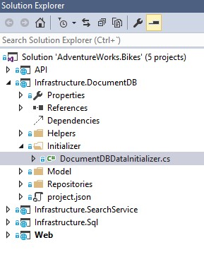
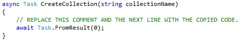

# COLLECTIONS

1. Click on DocumentDBDataInitializer.cs (Infra.DocumentDB>Initializer).	

    > AdventureWorks has four different collections that are created in the Initialize method using the REST API.
    
    

1. Scroll down.

1. Find the CreateCollection method.

    

    > A new collection can be created under the database by executing an HTTPS POST request against the URI resource path colls.

    > AdventureWorks has four different collections that are created in the Initialize method using the REST API. 

    > Right now the method that creates the collections is empty. You will have to complete it so they are properly created.

1. Copy and paste the code inside it.

    ```csharp
            string uri = $"{_EndpointUrl}dbs/{BikesConstants.DatabaseId}/colls";

            using (var _httpClient = new HttpClient())
            {
                _httpClient.DefaultRequestHeaders.Accept.Add(new MediaTypeWithQualityHeaderValue("application/json"));
                _httpClient.DefaultRequestHeaders.Add("x-ms-date", utc_date);
                _httpClient.DefaultRequestHeaders.Add("x-ms-version", "2015-08-06");

                string verb = "POST";
                string resourceType = "colls";
                string resourceLink = $"dbs/{BikesConstants.DatabaseId}/colls";
                string resourceId = $"dbs/{BikesConstants.DatabaseId}";

                string authHeader = DocumentAuthorization.GenerateMasterKeyAuthorizationSignature(verb, resourceId, resourceType, _Key, "master", "1.0", utc_date);
                _httpClient.DefaultRequestHeaders.Remove("authorization");
                _httpClient.DefaultRequestHeaders.Add("authorization", authHeader);

                var content = JsonConvert.SerializeObject(new { id = collectionName });
                //string[] paths = { "/city" };
                //var content = JsonConvert.SerializeObject(
                //    new
                //    {
                //        id = collectionName,
                //        partitionKey = new
                //        {
                //            paths = paths,
                //            kind = "Hash"
                //        }
                //    }
                //);
                var response = await _httpClient.PostAsync(uri, new StringContent(content, Encoding.UTF8, "application/json"));
                response.EnsureSuccessStatusCode();
            }	
    ````

1.  Your method should look as shown in the image.

    

1. POST https://{databaseaccount}.documents.azure.com/dbs/{db-id}/colls		

    > The {databaseaccount} is the name of the DocumentDB account created under your subscription. 

    > The {db-id} value is the user generated name/id of the database where the collection will be created (not the system generated id (rid) of the database).

1.  Update the DocumentDB database.

1. 	Run the application	

<a href="5.Documents.md">Next</a>

 
