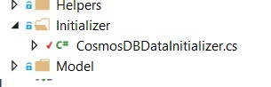
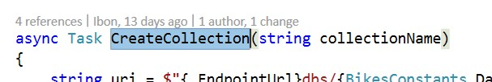
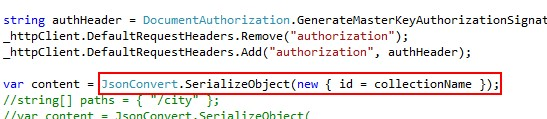
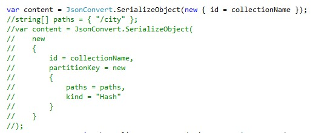

# PARTITION SCALE

Collections are logical resources and can span one or more physical partitions or servers.

The number of partitions is determined by Cosmos DB based on the storage size and the provisioned throughput of the collection. Every partition in Cosmos DB has a fixed amount of SSD-backed storage associated with it, and is replicated for high availability. Partition management is fully managed by Azure Cosmos DB, and you do not have to write complex code to manage your partitions. Cosmos DB collections are practically unlimited in terms of storage and throughput.

Partitioning is completely transparent to your application.

### How it works

When you create a collection in Cosmos DB, there's a partition key property configuration value that you can specify.

Cosmos DB will hash the partition key value and use the hashed result to determine the partition in which the JSON document will be stored. 

All documents with the same partition key will be stored in the same partition.

Adventure Works has a total of four stores. Each of these stores has its products. It would be a good idea to have the products related to each store on a different partition, using the Store as the partition key, and the store location as the partition key value. This way we could store unlimited products in our store (as we could request the necessary partitions we need), as well as having a much higher troughput, allowing lots of customers to retrieve product details without huge impact in our application.

1. Click in the DocumentDBDataInitializer.cs (Infra.CosmosDB>Initializer).	

    

1. Go to the CreateCollection method.	

    

1. Scroll down.	

    > By default, the request only includes the collection id.

    

    > The request can include the partitionkey configuration.

    > Path: An array of paths using data within the collection can be partitioned. Paths must not contain a wildcard or a trailing slash. 

    > For example, the JSON property “City” is specified as “/City”. The array must contain only a single value.

    > Kind: The algorithm used for partitioning. Only Hash is supported.

    ```json
    {
      "id": "stores",
      "partitionKey": {
        "paths": [
          "/City"
        ],
        "kind": "Hash"
      }
    }
    ```
	  

1. When you were in the Collections section, you had to fill the code so the method could properly work.

    

1. Uncomment the commented lines.
1. Comment the previous content property.	There were a few lines commented.

     

    > Uncomment them, to enable the partition key property configuration, and thus, enabling the partitioning.

1. Update the Cosmos DB database.

1. Run the application.	

    > When you remove the database and run the app, the index will be created using the new partition key.

<a href="8.RegionDatabases.md">Next</a>


 
