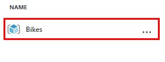
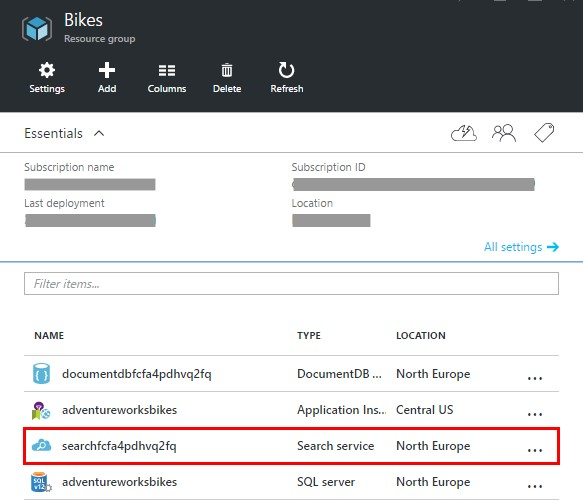
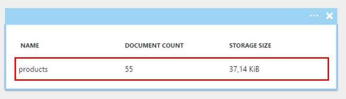
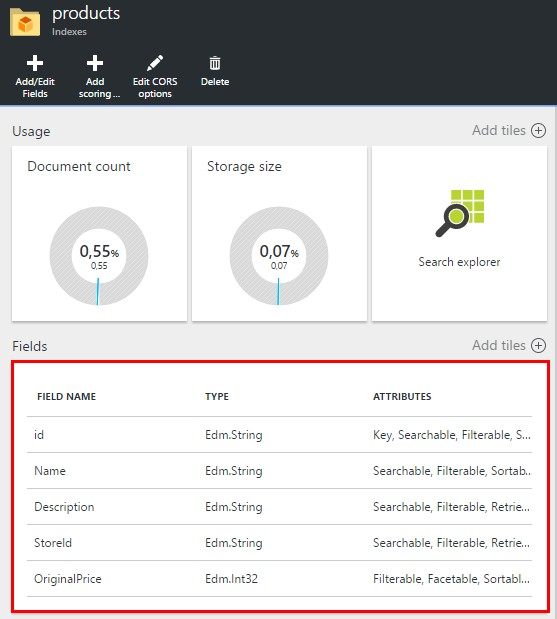
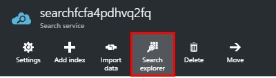
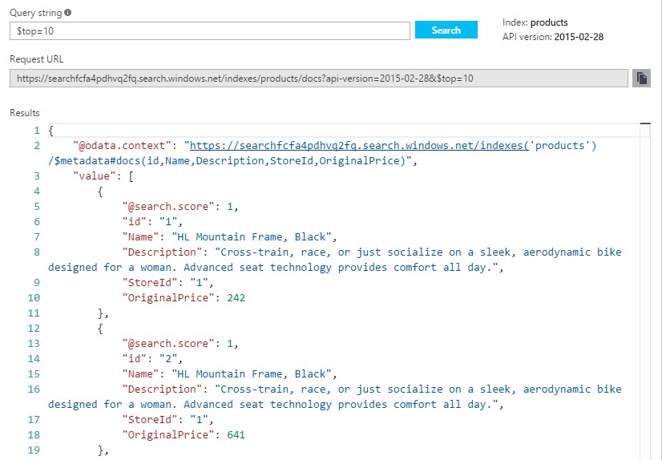
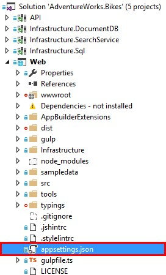
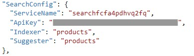
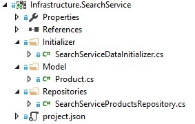

# GET STARTED

1.	Click on the Resource Group created.	

    

1.	Click on the Search Service.	

	

1.	Click on Products.	

	

	> There is an index created, called Products. An index is a persistent store of documents and other constructs used by an Azure Search service. When we submit queries to Azure Search, we submit them to a specific index.

	> In AdventureWorks we maintain a product index within Azure Search. Contained within this index we store everything to show the products on this home page.
	
	

	> Every index has several fields that determine how data is stored in the index and how they can be used.
	
	> Each field has:
	> -	Type: Classifies data in the index.
	> -	Attributes: Specify how the field is used.

	> For example, we have a StoreId with the following attributes:
	> -	Searchable: People can make searches based on the id of the store.
	> -	Retrievable: The StoreId can be returned as a search result.
	> -	Filterable: People can filter results by the StoreId.
	> -	Sortable: People can sort results by the StoreId.

	> There are also two more attributes that fields can have:
	> -	Facetable: Allows a field to be used in faceted navigation. For example, it could be used in a presentation of search results that includes count by category.
	> -	Key: Every index must have an unique field that marks the field as containing unique identifiers for documents within the index.

1.	Click on Search Explorer.

	

	> Let’s explore how we can submit requests to the service, so we can test our index. 

	> The search explorer is very useful when developing our application, because it helps us to define the structure of our queries.
	
	

	> As we can see, the search explorer has a field in which we are going to build the parametrized query. 

	> The base URL for searching in the index is already provided by the explorer, so we only have to focus on the parametrized part, therefore when we have the desired results, we only have to copy and paste the request URL in our application.

	> In this image, we are retrieving only the top 10 results of the search. We are not searching any specific text, just retrieving 10 results.

1. Open a Windows command line, go to the **c:\source** directory and restore the project dependencies.

    ```shell
    cd c:\source
    dotnet restore
    ```
	
1. Open Visual Studio.

1. Open the AdventureWorks.Bikes solution. (source\AdventureWorks.Bikes directory)

	

	> <span style="color:red">**NOTE:**: If Visual Studio shows this message "An item with the same key has already been added", remove the project.lock.json file from the project that generates the message and try again.</span>

1.	Open appsettings.json.	

	

	> In the application, in order to connect to our Azure Search service, we have to modify our appsettings.json.
	
	> Look for the “SearchConfig” section and paste both the ServiceName and ApiKey of your service.

	

1.	Expand Infrastructure.SearchService.	

	> The solution contains a project to develop those features related to Azure Search.

	

<a href="2.BindingAzureSearch.md">Next</a>
 
