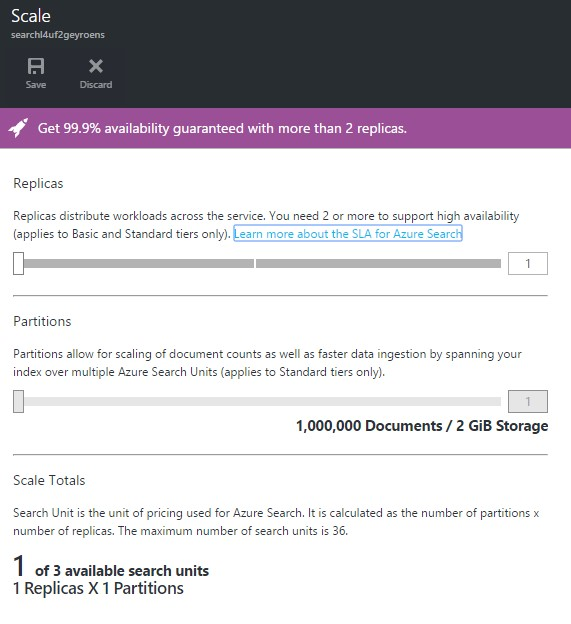

# SCALE

You can scale in or out our service as need, to ensure we get the best performance and availability in every moment.

When you add capacity via resource, the service uses them automatically. No further action is required on your part, but there will be a slight delay before the impact of the new resource is realized. It can take 15 minutes or more to provision the additional resources.

1.	Click on the Resource Group created.	

	> AdventureWorks is in the middle of the previously planned summer sale and many customers across the United States are looking for bargains available in our store. It is a good idea to scale our search engine so they can all search bikes without losing performance!

    

1.	Click on the Search Service.

    	

1.	Click All settings.

    	

1.	Click on Scale.	

	

1.	Slide the replicas bar	Increasing queries per second (QPS) or achieving high availability is done by adding replicas. 

	> Each replica has one copy of an index, so adding one more replica translates to one more index that can be used to service query requests. Currently, the rule of thumb is that you need at least 3 replicas for high availability.

	> Most service applications have a built-in need for more replicas rather than partitions, as most applications that utilize search can fit easily into a single partition that can support up to 15 million documents.For those cases where an increased document count is required, you can add partitions if you signed up for Standard service. Basic tier does not provide for additional partitions.

	

<a href="conclusion.md">Next</a>

 
