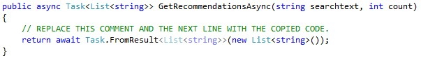
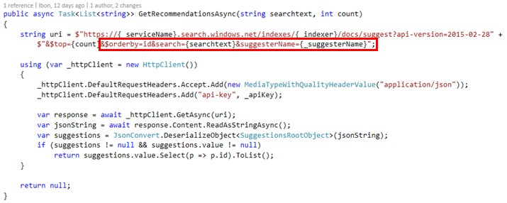

# SUGGESTORS

For many mobile applications and web sites, search is the main way for the users to find what they are looking for.  As a result, the search box needs to be effective in helping users find content quickly.  One way to do this is called suggestions or auto-complete. Let’s see how we can add suggestions to our Bikes website, so we can help users accurate their searches.

Mike, our previous customer, is searching bikes in our store, but he hasn’t decided yet which one he will be acquiring. However, he is clear about what features his bike must meet.


We want to show him related bikes to the ones he is looking for, so he can find easily a bike with similar features.

This can be done using suggestions. When clicking on a desired bike, our application will submit a request to find bikes with a similar description, and show it on the related bikes section.

1.  Open SearchServiceProductsRepository.

    

1.	Find the GetRecommendationsAsync method.	

    > Right now, the method doesn’t return anything. Let’s change that.

    

1.	Copy and paste the code inside the method.

    ```csharp
            string uri = $"https://{_serviceName}.search.windows.net/indexes/{_indexer}/docs/suggest?api-version=2015-02-28" +
                $"&$top={count}&$orderby=id&search={searchtext}&suggesterName={_suggesterName}";

            using (var _httpClient = new HttpClient())
            {
                _httpClient.DefaultRequestHeaders.Accept.Add(new MediaTypeWithQualityHeaderValue("application/json"));
                _httpClient.DefaultRequestHeaders.Add("api-key", _apiKey);

                var response = await _httpClient.GetAsync(uri);
                var jsonString = await response.Content.ReadAsStringAsync();
                var suggestions = JsonConvert.DeserializeObject<SuggestionsRootObject>(jsonString);
                if (suggestions != null && suggestions.value != null)
                    return suggestions.value.Select(p => p.id).ToList();
            }
            return null;
    ``` 

    > Let’s explain how the request works.

    

    > First of all, we have to make a request to the suggest endpoint, as we can see in the image.

    > The $top, $orderby are parameters to order the response and only get a determined number of results.

    > The most important parameter here is the suggesterName. We use it to search suggestions based on a suggester that we have declared when we created our index.

1.	Open index.json.	

    

1.	Add this code after the fields object.	

    > Here we are creating the suggesters. In this case, it’s just one, and it is called products. 

    > This way we have a suggester which returns suggestions based only on the name and description fields, ignoring the rest of the fields.

    > The searchMode is the strategy used to search for candidate phrases, but only analyzingInfixMatching is available at the time of creating this document.

    ```json
    "suggesters": [
      {
        "name": "products",
        "searchMode": "analyzingInfixMatching",
        "sourceFields": ["Name", "Description"]
      }
    ]	
    ``` 


1.	Update the index following the same steps that you did in the previous topic.

    > Go to the Azure Portal and remove the search service product index and run again the application to create it again. 

<a href="6.Facets.md">Next</a> 
