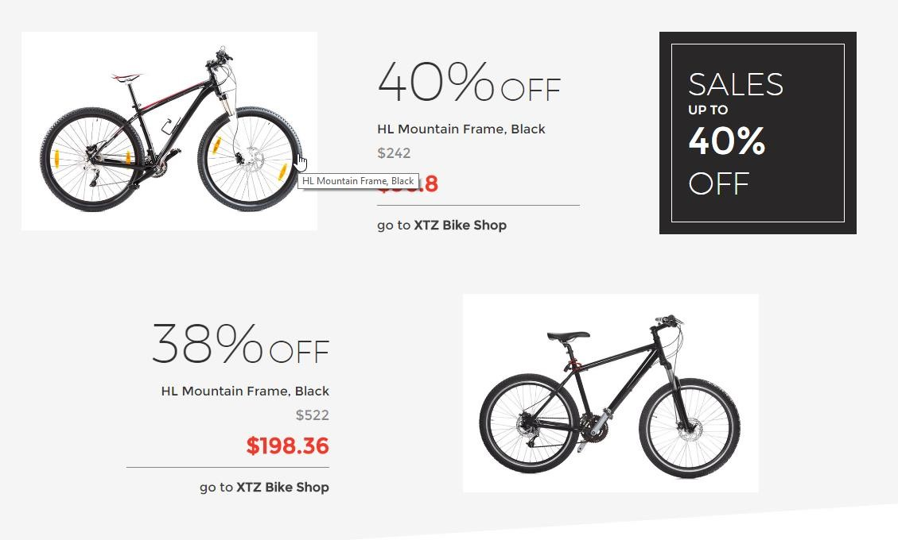
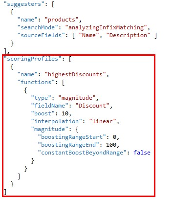
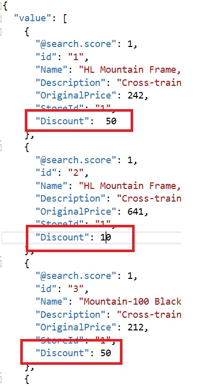
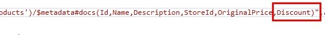
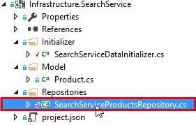
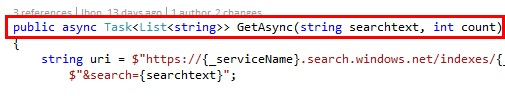
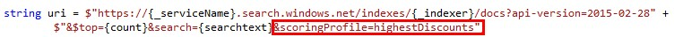
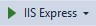
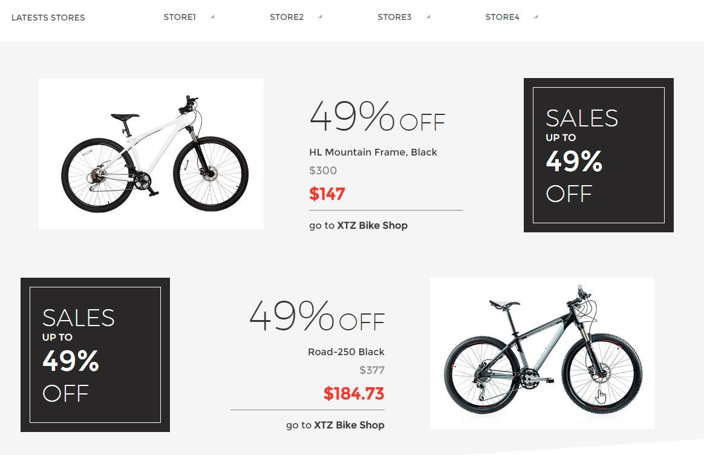

# SCORING PROFILE

Scoring refers to the computation of a search score for every item returned in search results. The score is an indicator of an item relevance in the context of the current search operation. The higher the score, the more relevant the item. In search results, items are rank ordered from high to low, based on the search scores calculated for each item.

Azure Search uses default scoring to compute an initial score, but you can customize the calculation through a scoring profile. Scoring profiles give you greater control over the ranking of items in search results.

AdventureWorks needs a way to control when they want to place more priority on certain products over others, so that during the summer sales that they are planning they can target specific products and they can, for example, boost results with a higher discount in the front page.

A scoring profile would be a good option in this case.

**NOTE:** For this part we’ll need to update the index.

1. Open the frontpage and see how it currently looks, showing two random bikes on it.

    

1.	Open index.json.	

	

1.	Create a new field called Discount, as it is shown in the image.	

	```json
	{
	"name": "Discount",
	"type": "Edm.Int32",
	"searchable": false,
	"filterable": true,
	"sortable": false,
	"facetable": false,
	"key": false,
	"retrievable": true,
	"analyzer": ""
	}
	```

1.	Add the scoring profile.	

	> Our scoring profile won’t impact on the results depending on the search text, but just depending on the discount of the results retrieved. Therefore, we use a function to do this.

	```json
	"scoringProfiles": [
		{
			"name": "highestDiscounts",
			"functions": [
			{
				"type": "magnitude",
				"fieldName": "Discount",
				"boost": 10,
				"interpolation": "linear",
				"magnitude": {
					"boostingRangeStart": 0,
					"boostingRangeEnd": 100,
					"constantBoostBeyondRange": false
				}
			}
			]
		}
	]
	```

	

	> There are several types of functions. In our case, we use a magnitude type because we want to boost based on how high or low the discount is.

	> Lastly we have to define the range. Fromn 0 to 100 means that those results with higher values will be boosted.

	> constantBoostBeyondRange must be false. Why? Setting it to. true would mean that if there are any bikes with higher discount than 100, they would be boosted too. We don’t want to lose money, so better make sure this param is false (and fix that discount!).

1.	Open data.json.	

	

1.	Add data for the new field.	

    > Id 1 and 3 must have 50% off.

	

1.	Update the @odata.context field, adding the new created field.	

	

1.	Update the index following the same steps that you did in the previous topics.

    > Go to the Azure Portal and remove the search service product index and run again the application to create it again.

1.	After running the app to create again the index open  the SearchServiceProductsRepository class.

	

1.	Go to the GetAsync method.

		

1.	Modify the uri parameter, to use the recently created scoring profile when searching.	

	```
	&ScoringProfile=highestDiscount
	``` 
	

1.	Run the application.	

	

	> Now we can see the two bikes tied with the highest discount on the frontpage. This is because they have the highest score search of all, due to our scoring profile, and therefore they are retrieved in first place.

	

 <a href="8.LanguageSupport.md">Next</a>  
