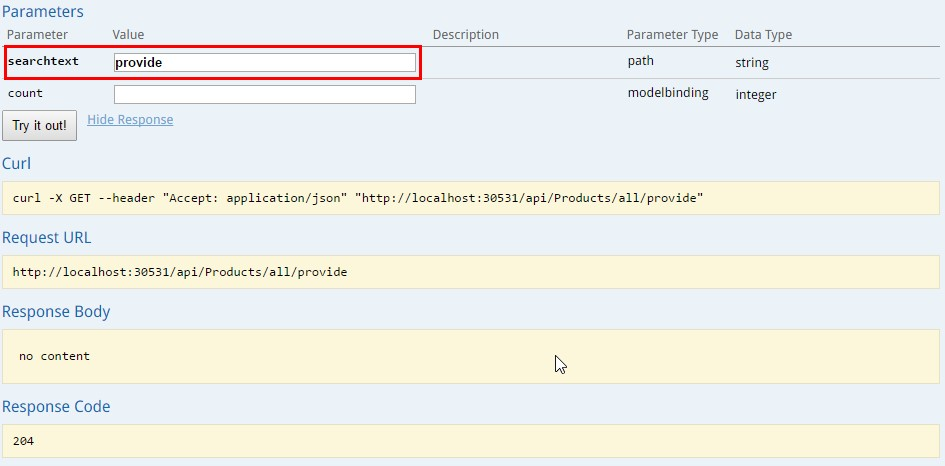
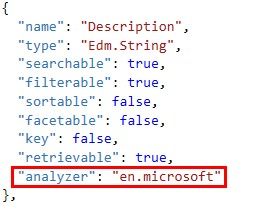
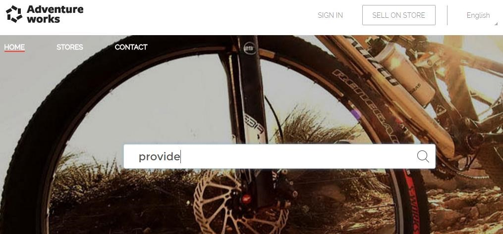
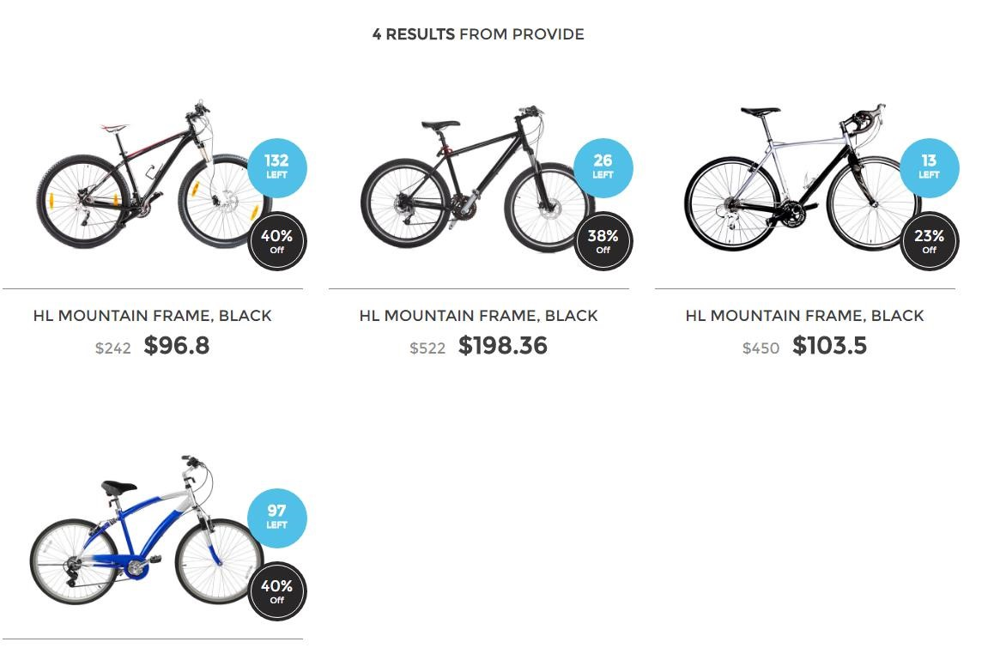

# LANGUAGE SUPPORT

Searchable fields undergo analysis that most frequently involves word-breaking, text normalization, and filtering out terms. By default, searchable fields in Azure Search are analyzed with the Apache Lucene Standard analyzer (standard lucene) which breaks text into elements following the "Unicode Text Segmentation" rules. Additionally, the standard analyzer converts all characters to their lower case form. Both indexed documents and search terms go through the analysis during indexing and query processing.

Azure Search supports a variety of languages. Each language requires a non-standard text analyzer which accounts for characteristics of a given language. For example, the Lucene analyzer for English extends the standard analyzer. It removes possessives (trailing 's) from words, applies stemming as per Porter Stemming algorithm, and removes English stop words.

Mike have noticed that some searches are not retrieving results, but others with similar words are. It’s a good idea to improve the search engine.

Right now our application is capable of searching words without having into account the language of the search.

Let’s add support for the English analyzer, and see how results differ from using the standard analyzer.

We’ll use the Description file of our products index to implement this feature.

**NOTE:** For this part we’ll need to update the index.

Performing a search of the term “provide” with the current analyzer (Apache Lucene Standard, by default), does not retrieve results at all.

1.	Open index.json.	

	

1.	Modify the Description field, using the English analyzer from Microsoft.	

	

	> Let’s change the analyzer, using the one Microsoft provides for the English language.

	> There is a list of all the analyzers currently supported available in the following link:	https://msdn.microsoft.com/library/dn879793.aspx

1.	Update the index following the same steps that you did in the previous topic.

    > Go to the Azure Portal and remove the search service product index and run again the application to create it again. 

1.	Open the web application and search the term “provide”.	

	

	> Now we can see some results.

	

	> This happened because we have the word “provides” in some of the bikes descriptions.

	> When using the standard analyzer, it looks for search terms that matches the exact word. So “provide” does not retrieve any results.

	> However, the English analyzer can understand that “provides” is just the third person of “provide”, and it’s very probable the user expects results using any of those words.

 <a href="9.HighLighting.md">Next</a>  

 
