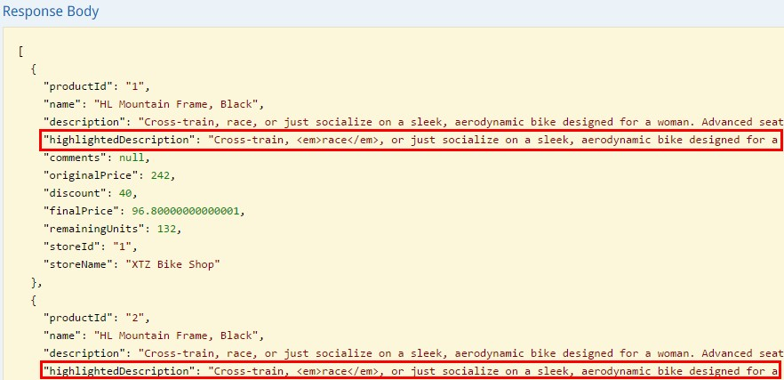
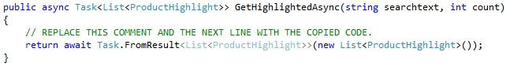

# HIGHLIGHTING

Hit highlighting allows users to see the snippet of text in each result that contains the matches for their query. You can pick and choose which fields return highlighted snippets. 
	
Mike is looking for a Mountain bike, so he would like to look for any results containing the text mountain.

Let’s highlight those search words that the user entered in the results.



Here we can see an example of the results. Beside the product itself, we can see how the words entered by the user are highlighted in the description field.

1.	Open SearchServiceProductsRepository. 	

    

1.	Find the GetHighlightedAsync method.

    

1.	Copy the code and paste inside it.	

    ```csharp
        string uri = $"https://{_serviceName}.search.windows.net/indexes/{_indexer}/docs?api-version=2015-02-28&" +
                    $"top={count}&$orderby=id&search={searchtext}&highlight=Description";

        using (var _httpClient = new HttpClient())
        {
            _httpClient.DefaultRequestHeaders.Accept.Add(new MediaTypeWithQualityHeaderValue("application/json"));
            _httpClient.DefaultRequestHeaders.Add("api-key", _apiKey);

            var response = await _httpClient.GetAsync(uri);
            var jsonString = await response.Content.ReadAsStringAsync();
            var products = JsonConvert.DeserializeObject<RootHighightObject>(jsonString);
            if (products != null && products.value != null)
                return products.value.ToList();
        }

        return null;		
    ```
    
    > We have to add the highlight parameter to the request. Its value is the index field we want to highlight text from.

    

    > We could also indicate what tags we want to use to highlight text. We can configure it with the optional highlightPreTag and highlightPostTag parameters.

    > **Note:** To allow highlighted results, the fields must be Searchable.

 <a href="10.Scale.md">Next</a>  

 
