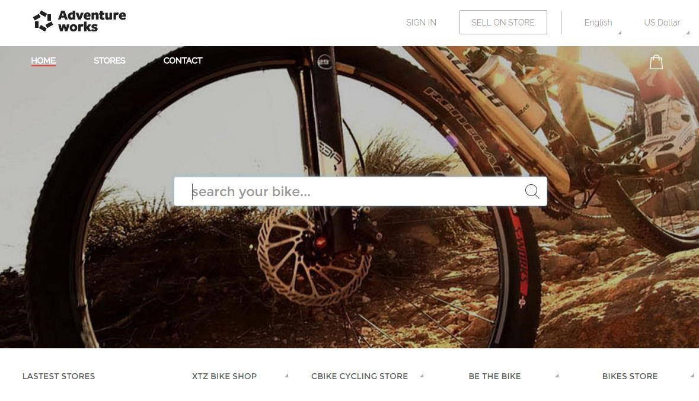

# OVERVIEW

AdventureWorks Bikes is an ecommerce SaaS platform focused on helping bikes stores run better in the "cloud"—without the headaches and inefficiencies of disconnected and costly in-house IT systems for finance, order and inventory management, ecommerce and more.
As the customer point of view the Bike Stores aggregates the information of all the stores to provide a unified shopping experience.

AdventureWorks needs to provide a rich and fluid search experience to make it simple for its customers while looking to purchase products. We want to enable a user of the site to have a consistent, reliable and fast experience through the process of initially searching for a bike, narrowing that search down to product discovery and purchase.

The public web portal uses Search Service to provide the best experience for the customer.

**NOTE:** Before starting this lab you should complete first the Cosmos DB lab.

 
# AZURE SEARCH

Azure Search is a cloud search-as-a-service solution that delegates server and infrastructure management to Microsoft, leaving you with a ready-to-use service that you can populate with your data and then use to add search functionality to your web or mobile application. Azure Search allows you to easily add a robust search experience to your applications using a simple REST API or .NET SDK without managing search infrastructure or becoming an expert in search.

Some of out-of-the-box features provided by Azure Search are:

- Powerful queries that can be formulated using the simple query syntax, which offers logical operators, phrase search operators, suffix operators, precedence operators. Additionally, the Lucene query syntax can enable fuzzy search, proximity search, term boosting, and regular expressions. Azure Search also supports custom lexical analyzers to allow your application to handle complex search queries using phonetic matching and regular expressions.

- Language support that is included for 56 different languages. Using both Lucene analyzers and Microsoft analyzers (refined by years of natural language processing in Office and Bing), Azure Search can analyze text in your application's search box to intelligently handle language-specific linguistics including verb tenses, gender, irregular plural nouns (e.g. 'mouse' vs. 'mice'), word de-compounding, word-breaking (for languages with no spaces), and more.

- Search suggestions that you can enable for autocompleted search bars and type-ahead queries. Actual documents in your index are suggested as users enter partial search input.

- Hit highlighting that allows users to see the snippet of text in each result that contains the matches for their query. You can pick and choose which fields return highlighted snippets.

- Faceted navigation is easily added to your search results page with Azure Search. Using just a single query parameter, Azure Search will return all the necessary information to construct a faceted search experience in your app's UI to allow your users to drill-down and filter search results (e.g. filter catalog items by price-range or brand).

# UPDATE THE WEB APP CONFIGURATION FILE

1. Open the `source\AdventureWorks.Bikes\src\AdventureWorks.Bikes.Web` directory.

1. Open the `appsettings.json` file.

1. Replace the tokens with the right configuration.
    
    - `YOUR_DEFAULT_CONNECTION` 
    - `YOUR_IDENTITY_CONNECTION` 
    - `YOUR_INSTRUMENTATION_KEY` 
    - `YOUR_SEARCH_SERVICE_NAME` 
    - `YOUR_SEARCH_SERVICE_KEY` 
    - `YOUR_COSMOSDB_ENDPOINT` 
    - `YOUR_COSMOSDB_KEY` 

<a href="0.Tour.md">Next</a>