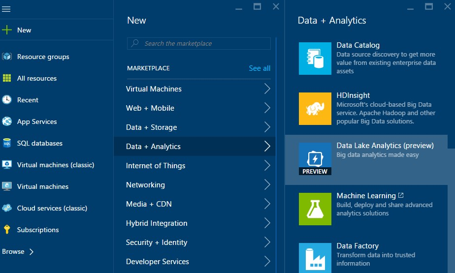
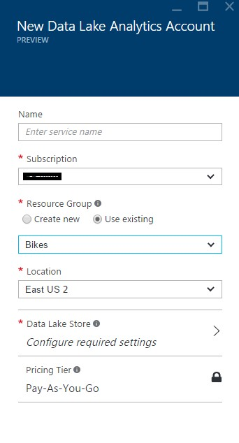
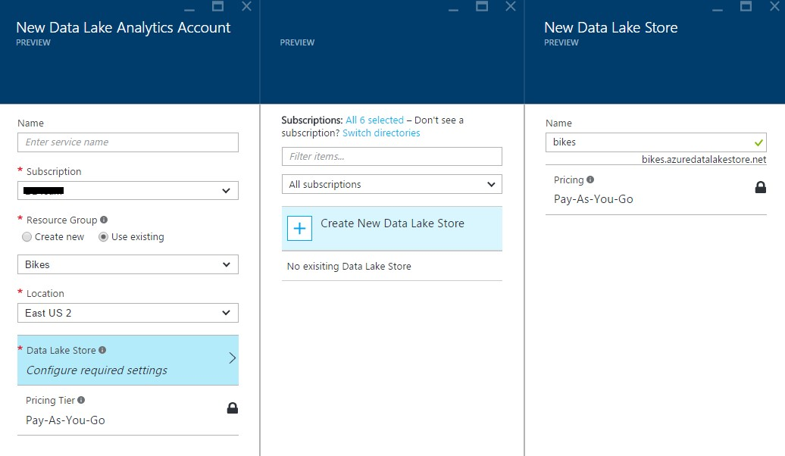
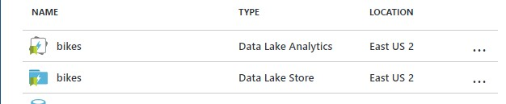
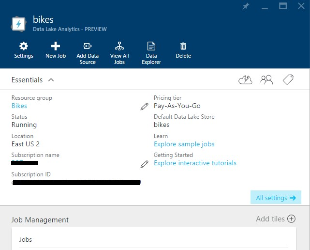

# CREATE DATE LAKE ANALYTICS ACCOUNT

1.	Sign on to the Azure Portal.

1.	Click New, click Data + Analytics, and then click Data Lake Analytics.

    

1.	Type or select the following:

    > **Name:** Name the Analytics account.
    > **Resource Group:** Use the same RG that you already have.

    

 	> Data Lake Store: Each Data Lake Analytics account has a dependent Data Lake Store account. The Data Lake Analytics account and the dependent Data Lake Store account must be located in the same Azure data center. Follow the instruction to create a new Data Lake Store account, or select an existing one.

    

    > We need the Data Lake Store because it is where we are going to place our search logs that will be later processed by Azure Data Lake Analytics.

1.	Click Create.	

    >   It takes a few moments to create a Data Lake Analytics account. When the account is created, the portal opens the account on a new tab on the portal.

    

    

 <a href="2.USQL.md">Next</a>  

	

 
