# AZURE DATALAKE ANALYTICS AND U-SQL

As told at the beginning, Adventure Works Bikes wants to implement an analytics system in order to track the behaviour of the web site visitors. In particular, the following tasks will be performed:

>	See which products generate more resistance, measured in time since they were visited until they were added to the cart.

>	What is the actual conversion rate of each of them, this is, the percentage of products that are added to the cart after being visited.

Let’s see how we can take advantage of U-SQL to accomplish the described above.

1.	Extract the log.zip file (source\AdventureWorks.Bikes\resources directory).	

	> When extracting the compressed file, you’ll find two logs. There are no difference between them more than one has a 2GB size while the other has about 200MB.

	> Choose whatever you want depending on your Internet connection or computation capacity.

1.	Move your chosen log file to the root of the solution, and rename it to “iislog.log”.	

    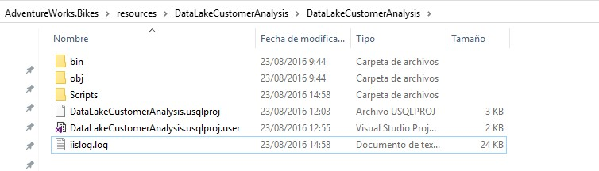

1.	Open the DataLakeCustomerAnalysis solution. (source\AdventureWorks.Bikes\resources directory)

1.	Expand it.	

    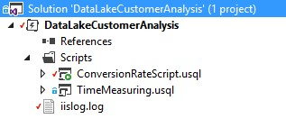

1.	Open the log.	

	> The log file is automatically created by the IIS server in which de web application is running. His log contains data about all the requests made by clients to such server.

	> Open it. You will see data like the request made, date and time of such request, parameters, IP…

	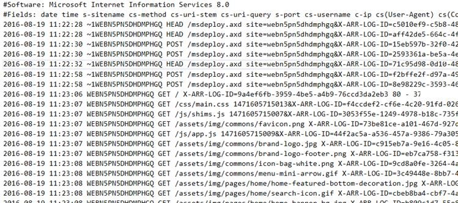

1.	Open the Azure Portal.

1.	Go to the resource group.

1.	Click on the Data Lake Store.

	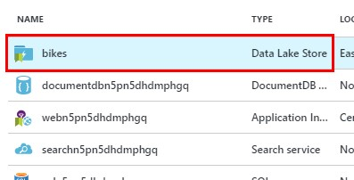

	> First of all, we are going to upload it to Azure Data Lake Store, so you can learn how data can be manually uploaded to the service. However, this could be automated, so you don’t have to upload manually all the files each time they are generated by the application.

	> Why do we need to do this? When we were creating the Azure Data Lake Analytics account, it asked for a source of data. We indicated that this source was going to be an Azure Data Lake Store. This is where Azure Data Lake Analytics is going to find all the files that will be processed by the scripts.

1.	Click on Data Explorer.	

	

1.	Click on upload.	

	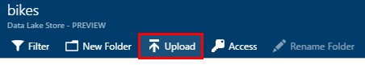

1.	Click to select the files to be uploaded.	

	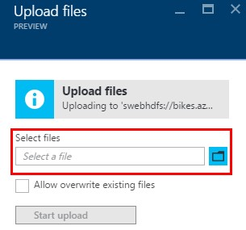

1.	Click on Start upload.	

	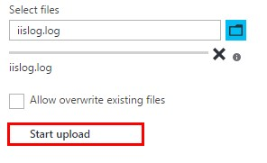

1.	If all goes well, you should find the new file.	

	> Now that the raw log is uploaded, it’s time to process it.

	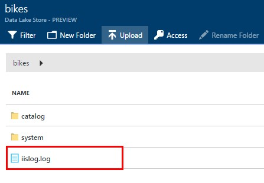

1.	Upload the `resources\DataLakeCustomerAnalysis\DataLakeCustomerAnalysis\products.txt` file following the same steps. You will use it later.

1.	Open the DataLakeCustomerAnalysis solution.

	> Remember that [Azure Data Lake Tools for Visual Studio 2015](https://www.microsoft.com/en-us/download/details.aspx?id=49504) must be installed. 

1.	Expand the Scripts folder.

1.	Open ConversionRateScript.usql.	

	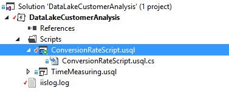

	> Let’s analyze the syntax of the U-SQL scripts. Both of them have a pretty similar syntax, with a few different statements to achieve the task they are supposed to do.
 
 	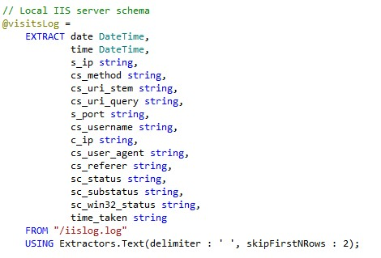

	> First of all, we have to extract the file. As we have seen previously, the logs generated by the server are unstructured files. The U-SQL EXTRACT clause gives you the ability to define a schema on read. The schema is specified by a column name and C# type name pair per column. We use the Extractors.Text() extractor to extract the log from the text file. We also specify the delimiter, and tell to skip the first two rows of the file, since we do not want to process them (they are just comments).

	> We store the result of the extraction in @visitsLog, which is a rowset variable. Rowset variables allows to assign each query expression that produces a rowset to them. They start with @.

	> Finally, we specify the path to the file we want to read. These can be absolute or relative paths. In our case, the files will be located in the root of the Data Lake Store previously configured.

	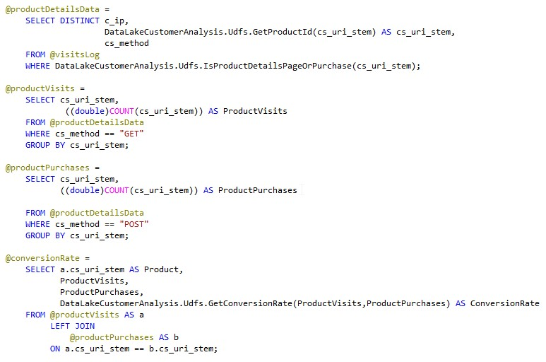

	> The rest of the code will look familiar to you, as it is common SQL statements. In U-SQL, you can use these statements to make transformations to the data, using the rowset variables as sources.

	> As you can see, what this script do is count the unique product visits and count the unique product purchases, so we can obtain the conversion rate.

	> However, there is also one more thing.

1.	Expand ConversionRateScript.usql.

1.	Open ConversionRateScript.usql.cs.	

	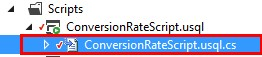

	> As you can see there are functions such as GetProductId, IsProductDetailsPageOrPurchase, and GetConversionRate which don’t belong to the default set of U-SQL functions.

	> These are called User Defined Functions. UDFs allows us to add user-specific code written in C#. In order to be able to refer to the functions in U-SQL, the classes have to be defined as public and the objects need to be defined as static public.

	> UDFs are preferred for more complex functions, if the logic of the function requires the full set of C# capabilities, such as procedural logic or recursion.

	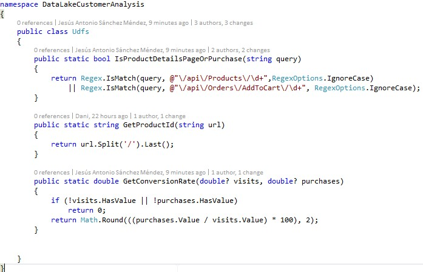

 	> The script finishes outputting the result of the aggregations to a new file.

	> In this case, the results of unique product visits, unique product purchases and the conversion rate.

	> The new file will be stored in Azure Data Lake Store as well, in a folder called output. Similarly to the extracting process, we can store the file as with text, CSV or TSV format.

	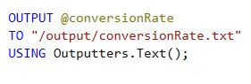

1.	Right click on ConversionRateScript.usql.

1.	Click on Submit Script	

	> It’s time to test the script.

	> Let’s see how well AdventureWorks Bikes products are selling.

	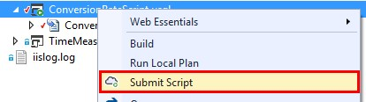

1.	Choose your Azure Data Lake Analytics account previously created.

	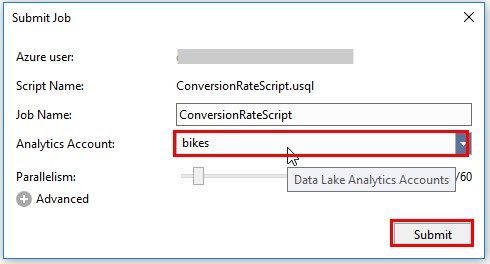

1.	Click on Submit. 

	> After completing the job, the `Job View` will be similar to this screenshot:

	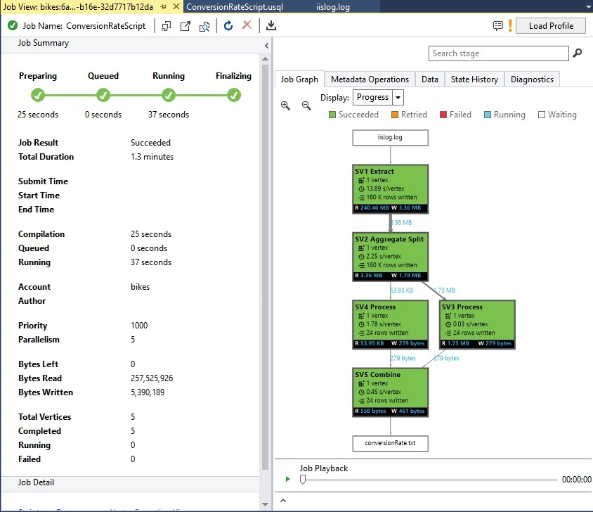

1.	Go to the Azure Portal. 

	> It also shows the job status and its information, the same information that Visual Studio can show.

1.	Click on the resource group.

1.	Click on the Azure Data Lake Analytics account.	

	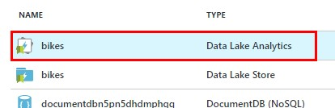

1.	Click on More.

1.	Click on View All Jobs.

	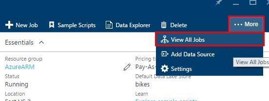	

1.	Click on the submitted Job.	

	> You will see a list of the jobs that has been submitted to the Azure Data Lake Analytics account.

	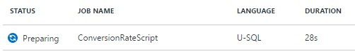

	> In this case our job is the U-SQL script that measures the conversion rate.
 	> You can see the steps the job goes through when it is submitted.

	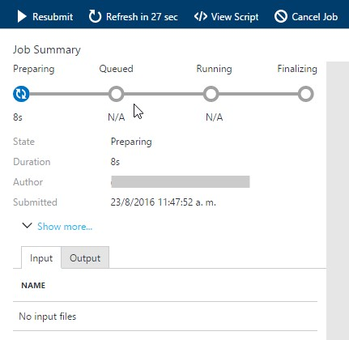

1.	Click on Output.

1.	Click on conversionRate.txt.

	> When it is done, there will be a file generated with the aggregated data generated.

	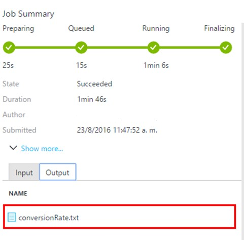

	> Here we can see the results from processing the original IIS log file.

	> We can see a list of the products that AdventureWorks Bikes users have been visiting, but also which of them have been added to the cart. 

	> This will help the company to focus on poorly sold products and take actions to try to sell more of them.

	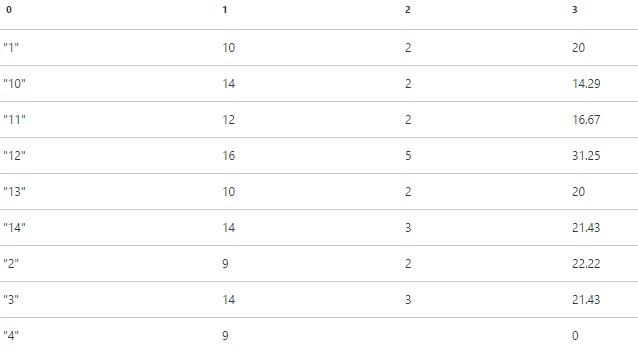

1.	Open TimeMeasuring.usql.

	> It’s time to create the script that will let AdventureWork Bikes know which products generate more resistance, measured in time since they were visited until they were added to the cart.

	> With this, the company can see the average time customers spend thinking about purchasing a product, and determine which of them are the most popular.

	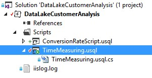

 	> You will find that the code has to be completed in order to achieve the task.

	> So, all hands on deck to build the script!

	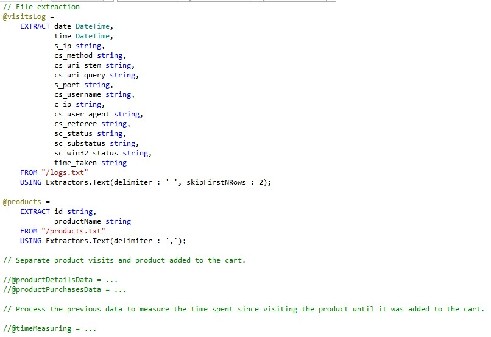

1.	Copy and paste the code below.

	> **NOTE:** Separate product visits and product added to the cart.

	```sql
	@productDetailsData =
		SELECT c_ip,
			DataLakeCustomerAnalysis.Udfs.GetProductId(cs_uri_stem) AS cs_uri_stem,
			cs_method,
			MIN(DataLakeCustomerAnalysis.Udfs.GetFullDate(date, time)) AS date
		FROM @visitsLog
		WHERE DataLakeCustomerAnalysis.Udfs.IsProductDetailsPageOrPurchase(cs_uri_stem) AND cs_method == "GET"
		GROUP BY c_ip, cs_uri_stem, cs_method;

	@productPurchasesData =
		SELECT c_ip,
			DataLakeCustomerAnalysis.Udfs.GetProductId(cs_uri_stem) AS cs_uri_stem,
			cs_method,
				MAX(DataLakeCustomerAnalysis.Udfs.GetFullDate(date, time)) AS date    
		FROM @visitsLog
		WHERE DataLakeCustomerAnalysis.Udfs.IsProductDetailsPageOrPurchase(cs_uri_stem) AND cs_method == "POST"
		GROUP BY c_ip, cs_uri_stem, cs_method;
	```

	> This code will filter all the requests related to visits made to products, and, at the same time, all the requests related to products added to the cart. All of them will have the timestamp of the request. 

	> We also strip product the ID from the request, and because the date and time of the requests come in different fields, we join them together to form the timestamp. All of this is made with custom code (User Defined Functions!).

1.	Copy and paste the code below.

	> **NOTE:** Process the previous data to measure the time spent since visiting the product until it was added to the cart.

	```sql
	@timeMeasuring =
		SELECT a.cs_uri_stem,products.productName,
			AVG(DataLakeCustomerAnalysis.Udfs.DateDiff(a.date, b.date)) AS AverageTotalSpentTimeMinutes,
			AVG(DataLakeCustomerAnalysis.Udfs.DateDiff(a.date, b.date))*60 AS AverageTotalSpentTimeSeconds,
			STDEV(DataLakeCustomerAnalysis.Udfs.DateDiff(a.date, b.date)) AS StandardDeviatonOfTotalSpentTime
		FROM @productDetailsData AS a
			JOIN
				@productPurchasesData AS b
			ON a.c_ip == b.c_ip AND a.cs_uri_stem == b.cs_uri_stem
			JOIN @products AS products
			ON products.id == a.cs_uri_stem
		GROUP BY a.cs_uri_stem, products.productName;
	```

	> This part is which takes the timestamp for each product visit and product purchase and calculate the timespan to determine how much time passed since the customer last visited the product details until he decided to add it to the cart.

	> We calculate the average time spent in each product and the standard deviation.

1.	Copy and paste the code below.

	> **NOTE:** Output generation

	```sql
		OUTPUT @timeMeasuring
		TO "/output/timeMeasuring.txt"
		USING Outputters.Text();	
	```

	> Finally we output the results to a new file.

	> Let’s execute it!

	> For doing so, follow the same steps as we did earlier with the conversion rate script.

1.	Click on the job output.	

	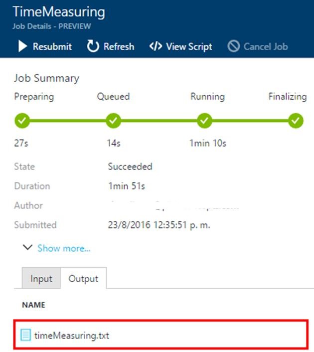
 
 	> We can see how much time each customer spends, in minutes, as well as the standard deviation. With this information, AdventureWorks Bikes can analyze what products are more popular. Products with a low average spent time and a low standard deviation are the most popular, since it means that generally speaking all the customers spend almost the same amount of time before they decide to add the product to the cart.

	> However, products with a high average time and a low standard deviation are less popular or more resistant, because this means that customers spend almost the same amount of time to add the product to the cart, which is a high time. The company will be able to take actions to prevent or minimize this!

	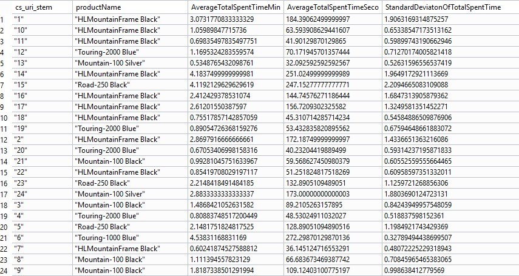

 <a href="conclusion.md">Next</a>  

