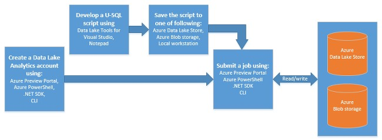

# OVERVIEW

AdventureWorks Bikes is an eCommerce SaaS platform focused on helping bikes stores run better in the "cloud"—without the headaches and inefficiencies of disconnected and costly in-house IT systems for finance, order and inventory management, ecommerce and more.

-	Eliminate manual processes and IT systems maintenance by running your business in the cloud.

-	Manage the customers, orders and all the topics related to the business.

-	Manage store and online business, integrated with the store accounting, inventory, CRM and more.

-	Help grow revenues.

Adventure Works Bikes wants to implement an analytics system in order to track the behaviour of the web site visitors. The system will allow to better understand the navigation patterns and extract information on how well products are sold on the store. The company wants to, specifically:
-	See which products generate more resistance, measured in time since they were visited until they were added to the cart.
-	What is the actual conversion rate of each of them, this is, the percentage of products that are added to the cart after being visited.

For these tasks the company will use the logs generated by the IIS server in which the application is hosted.
We will use Azure Data Lake Analytics and U-SQL to process these logs, since its capabilities allow us to process any type of data but also let us to create custom C# code in case we more complex logic.

##  What is Azure Data Lake Analytics?

Azure Data Lake Analytics is a new service built to make big data analytics easy. This service lets you focus on writing, running and managing jobs rather than operating distributed infrastructure. Instead of deploying, configuring and tuning hardware, you write queries to transform your data and extract valuable insights. 
The analytics service can handle jobs of any scale instantly by simply setting the dial for how much power you need. You only pay for your job when it is running making it cost-effective. 

### U-SQL: simple and familiar, powerful and extensible

Data Lake Analytics includes U-SQL, a query language that extends the familiar, simple, declarative nature of SQL with the expressive power of C#. The U-SQL language is built on the same distributed runtime that powers the big data systems inside Microsoft. Millions of SQL and .NET developers can now process and analyze all of their data with the skills they already have.
U-SQL’s scalable distributed runtime enables you to efficiently analyze data in the store and across SQL Servers in Azure, Azure SQL Database and Azure SQL Data Warehouse.
 
### The basic Data Lake Analytics process

1.	Create a Data Lake Analytics account.
1.	Prepare the source data. Data Lake Analytic jobs can read data from either Azure Data Lake Store accounts or Azure Blob storage accounts.   
1.	Develop a U-SQL script.
1.	Submit a job (U-SQL script) to the Data Lake Analytics account. The job reads from the source data, process the data as instructed in the U-SQL script, and then save the output to either a Data Lake Store account or a Blob storage account.

 <a href="0.Tour.md">Next</a>  

 

 
