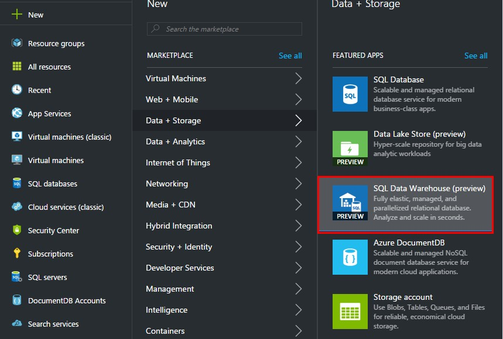

# CREATING A AZURE SQL DATA WAREHOUSE ACCOUNT

1.	Sign in to the Azure Portal.

1.	Click New.

1.	Click Data + Storage.

1.	Click SQL Data Warehouse.	

    > AdventureWorks is generating files with plain-text about all the transactions made in its stores. During the summer sales, a lot of transactions are being made and it turns out to be necessary to review these transactions in a more sophisticated way, such as PowerBI or another visual tool.

    

1.	Fill the Database name and select the existing resource group.

1.	Select a Blank database.

1.	Select the server already created in the resource group.

	> Compute usage in Azure SQL Data Warehouse is measured by using Azure SQL Data Warehouse Units (DWUs). DWUs are a measure of underlying power that your data warehouse has, and are designed to ensure that you have a standard amount of performance associated with your warehouse at any given time.

    > For the purpose of this guide, you can set the performance at 100 DWU, it will be enough.

    

1.	Click on Create.	

    > It takes a few moments to create a Data Warehouse account.

    

 <a href="2.CreateBlobContainer.md">Next</a>  

 
