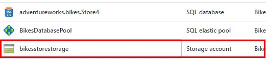
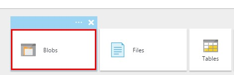
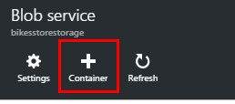
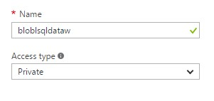

# CREATING A BLOB CONTAINER

1.	Click on the storage account created with your resource group.	

    > All the text files generated by AdventureWorks will be the data source for consuming all the information. 

    > We’ll need a container for these files, which Azure SQL Data Warehouse can access. For this purpose we’ll create a blob container in the storage account.

    

1.	Click on blobs.	

    

1.	Click on Add container.

    

1.	Provide a name for the container.

1.	Set the access type as private.

    	

1.	Click Create.

1.	Write down the blob endpoint.

    	

 <a href="3.MoveSampleData.md">Next</a>  	

 
