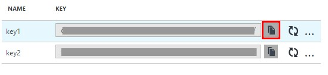
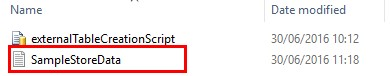
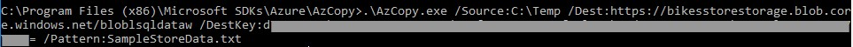
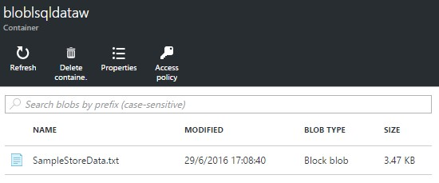

# MOVING SAMPLE DATA TO AZURE STORAGE

1.	Click on the storage account created with the resource group.

	> You need to the get its endpoint URL and access key to copy the sample data.

	> The blob endpoint URL should be very similar to **https://youraccount.blob.core.windows.net/yourcontainer**
1.	Click on All settings.

1.	Click on Access keys.	

	> It’s time we move our store transactions file to the storage account.

	

	> We’ll use the AZCopy to do that

1.	Copy the primary key	

	

1.	Open a Windows command prompt

1.	Introduce the command and go to the AzCopy directory.

	```shell
	cd /d "%ProgramFiles(x86)%\Microsoft SDKs\Azure\AzCopy"
	```	
	
	- [Download AzCopy](http://aka.ms/downloadazcopy)

1.	Copy the SampleStoreData to a folder, such as C:\Temp	

	

1.	Introduce the command and replace the **<blob endpoint URL>** and **<azure_storage_account_key>** with the values of your Azure Storage. 

	> The blob endpoint URL should be very similar to **https://youraccount.blob.core.windows.net/yourcontainer**

	> You can go to the Azure Portal and get the values again if you don´t have the information.

	```shell
	.\AzCopy.exe /Source:<Source folder> /Dest:<blob endpoint URL> /DestKey:<azure_storage_account_key> /Pattern:SampleStoreData.txt
	```	

	

1.	Go back to the blob container and check the file is uploaded correctly.	

	

 <a href="4.UsingPolybase.md">Next</a>  	

 
