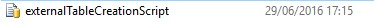
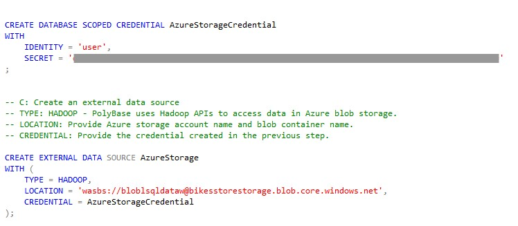
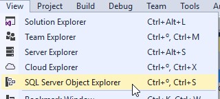
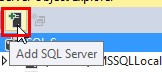
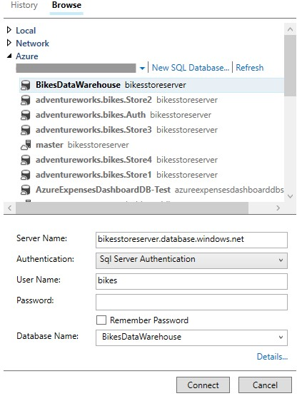
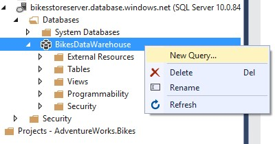
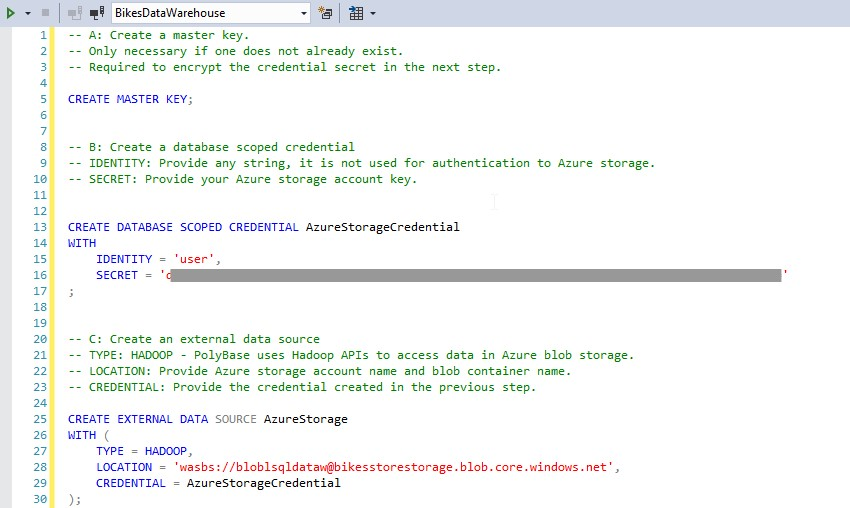
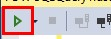
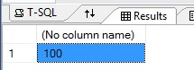

# USING POLYBASE TO SURFACE YOUR DATA

1.	Open externalTableCreationScript.sql

    > In this section we create an external table that shapes the sample data. Why? Because AdventureWorks generate the files in plain-text, separated by commas. We’ll need to shape that information.

    > All we are doing here is defining column names and data types, and binding them to the location and format of the Azure blob storage files. The definition is stored in Azure SQL Data Warehouse and the data is still in the Azure Storage Blob.

    

1.	Edit it with your values:
    - You Azure Storage key
    - The blob container name (NOT the entire endpoint, just the name you gave it when it was created)
    - Storage account name (again, just the name, not the endpoint)	What we are doing in the script is, first of all, creating a master key, required to encrypt the credential secret.

1. Creating a master key, required to encrypt the credential secret.

    > After this, we create an external source from which we will retrieve the data. This source is the previously created blob container.
    > Then, we specify the type of file stored in the blob. We declare that it is a delimited text file, and its is a comma. 
    > Finally, we create the external table.  We define the columns of the table, in the same order that the formatted text file, and we specify the data source, file format and location of the data files.

    

1.	Open Visual Studio

1.	Click on View>SQL Server Object Explorer.	

    

1.	Click on Add SQL Server.	

    

1.	Select the Azure SQL Data Warehouse created.

    

1.	Fill the username and password fields:

    > Username: bikes
    > Password: P2ssw0rd

1.	Click Connect.	

    

1.	Expand it.

1.	Right click on the warehouse.

1.	Click New query…	

    

1.	Copy all the contents from externalTableCreationScript.sql.	

    

1.	Run the query.	

    

    > If the script ran correctly, you should see a count as a result.

    > This means that we have our external table properly created, so it’s time to load the data in the data warehouse itself

    

 <a href="5.InsertingData.md">Next</a>  	

 
