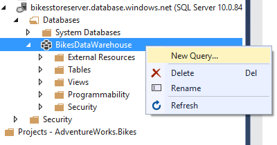
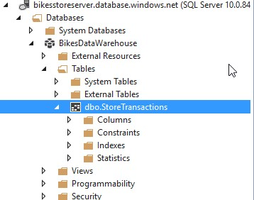
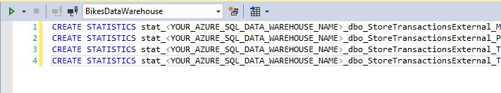
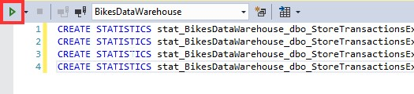
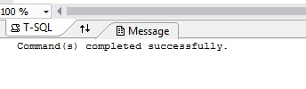

# INSERTING DATA INTO AZURE SQL DATA WAREHOUSE

1.	Right click on the warehouse.

	> The external table we created allows to read files from the storage and format the information. But data is not really stored in that table.

	> To insert this data into the SQL Database of the SQL Database Warehouse, we need to run a last command.

1.	Click New query.

	

1.	Copy and run the query.

	```sql
	CREATE TABLE dbo.StoreTransactions
	WITH
	(
	CLUSTERED COLUMNSTORE INDEX,
	DISTRIBUTION = ROUND_ROBIN
	)
	AS
	SELECT * FROM [dbo].[StoreTransactionsExternal];
	```

	> This command will create a table based on the results returned from the external table, loading data from Azure blob storage and saving it in a table inside of your database. 
	> Now we’ll have the data on our database, rather than Azure Storage. And it is as easy as submitting a Select query to the external table.

	> If everything went right, we should see the new table created! 

	

1.	Right click on the warehouse.

	> Now, we only need one more step. Because of Azure SQL Data Warehouse manages lots of data, it is important to have an optimal performance when executing queries against this data.

	> Azure SQL Data Warehouse achieves this query optimization, is by collecting statistics about your data. Having metrics on your data is one of the most important things you can do to optimize your queries. Statistics help Azure SQL Data Warehouse create the most optimal plan for your queries.

	

1.	Click New query.

1.	Copy the contents of StatisticsScript in the query window of Visual Studio.

1.	Replace the parameter `<YOUR_AZURE_SQL_DATA_WAREHOUSE_NAME>` with your Azure SQL Data Warehouse name.

	

1.	Run the query.	

	

1.	If everything went well, you should see a success message.

	> Now we have our Azure SQL Data Warehouse complete, and we could connect it to a service such as PowerBI to have a good overview about how well our stores are doing!

	

 <a href="conclusion.md">Next</a>  


