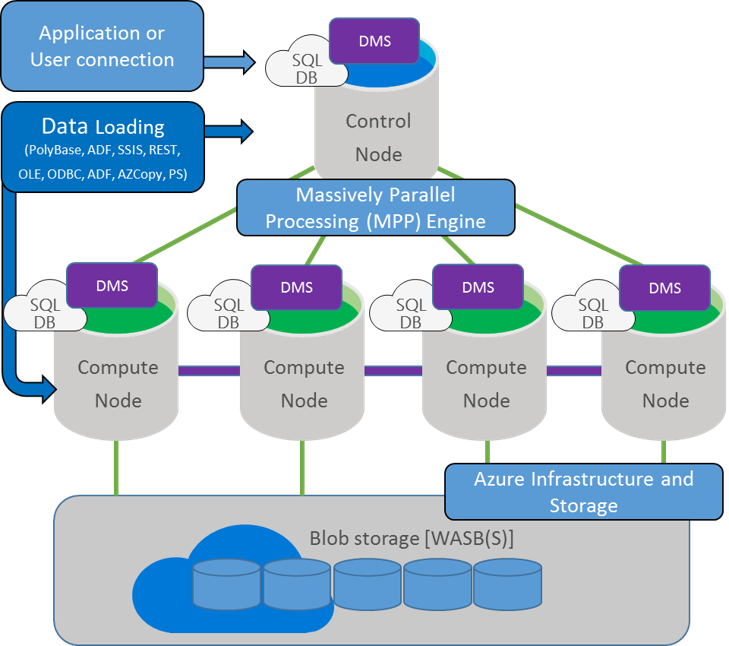
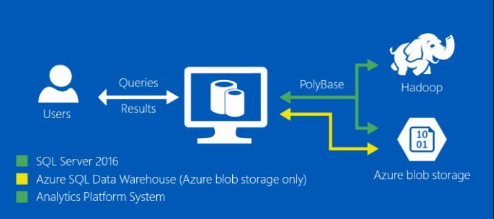

# OVERVIEW

AdventureWorks Bikes is an eCommerce SaaS platform focused on helping bikes stores run better in the "cloud"—without the headaches and inefficiencies of disconnected and costly in-house IT systems for finance, order and inventory management, ecommerce and more.

-	Eliminate manual processes and IT systems maintenance by running your business in the cloud.

-	Manage the customers, orders and all the topics related to the business.

-	Manage store and online business, integrated with the store accounting, inventory, CRM and more.

-	Help grow revenues.

In this tutorial, you will process company transactions with Azure SQL Data Warehouse. After this, Azure SQL Data Warehouse would be ready to be connected to a service such as PowerBI, providing a good view to see how the bikes sell and which models are the most demanded, what is the average price of the bikes sent, and other useful data.

# What is Azure SQL Data Warehouse?

Azure SQL Data Warehouse is a cloud-based, scale-out database capable of processing massive volumes of data, both relational and non-relational. Built on our massively parallel processing (MPP) architecture, Azure SQL Data Warehouse can handle your enterprise workload.

-	Combines the SQL Server relational database with Azure cloud scale-out capabilities. You can increase, decrease, pause, or resume compute in seconds. You save costs by scaling out CPU when you need it, and cutting back usage during non-peak times.

-	Leverages the Azure platform. It's easy to deploy, seamlessly maintained, and fully fault tolerant because of automatic back-ups.

-	Complements the SQL Server ecosystem. You can develop with familiar SQL Server Transact-SQL (T-SQL) and tools.
 
#  Azure SQL Data Warehouse architecture

Azure SQL Data Warehouse uses the Microsoft massively parallel processing (MPP) architecture, designed to run some of the world's largest on-premises data warehouses.
By combining MPP architecture and Azure storage capabilities, Azure SQL Data Warehouse can:

-	Grow or shrink storage independent of compute.

-	Grow or shrink compute without moving data.

-	Pause compute capacity while keeping data intact.

-	Resume compute capacity at a moment's notice.

**Control node:** The Control node manages and optimizes queries. It is the front end that interacts with all applications and connections. In Azure SQL Data Warehouse, the Control node is powered by SQL Database, and connecting to it looks and feels the same. Under the surface, the Control node coordinates all of the data movement and computation required to run parallel queries on your distributed data

**Compute nodes:** The Compute nodes serve as the power behind Azure SQL Data Warehouse. They are SQL Databases that store your data and process your query. When you add data, Azure SQL Data Warehouse distributes the rows to your Compute nodes. The Compute nodes are the workers that run the parallel queries on your data.

**Storage:** Your data is stored in Azure Blob storage. When Compute nodes interact with your data, they write and read directly to and from blob storage. Since Azure storage expands transparently and limitlessly, Azure SQL Data Warehouse can do the same.

**Data Movement Service:** Data Movement Service (DMS) moves data between the nodes. DMS gives the Compute nodes access to data they need for joins and aggregations.

# Using Polybase to load data

PolyBase is a technology that accesses and combines both non-relational and relational data, all from within SQL Server. It allows you to run queries on external data in Hadoop or Azure blob storage. The last one is our case, since Azure SQL Data Warehouse uses Azure Blob storage. PolyBase uses external tables to access data in Azure Blob storage.

By simply using Transact-SQL (T-SQL) statements, you can import and export data back and forth between relational tables in SQL Server and non-relational data stored in Hadoop or Azure Blob Storage. You can also query the external data using a T-SQL query and join it with relational data.

 <a href="0.Tour.md">Next</a>  
 
