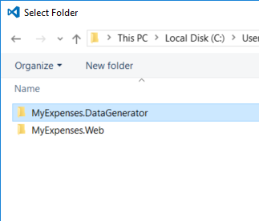
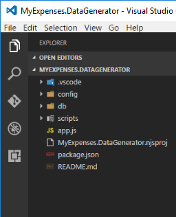
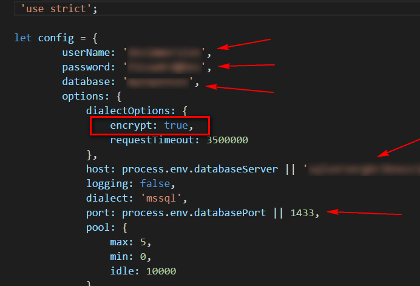
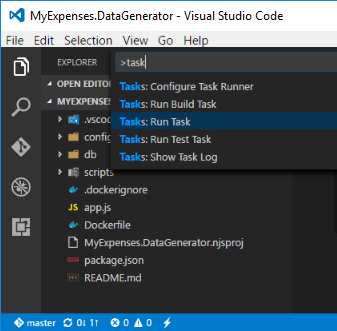
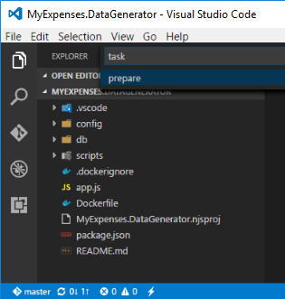
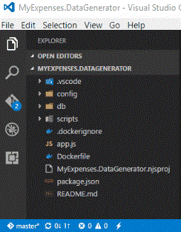
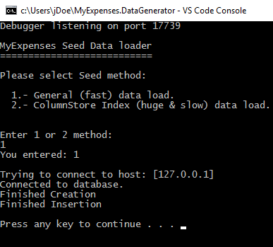

# POPULATE DATA IN YOUR AZURE DATABASE

1. Open ``Visual Studio Code``.

1. Go to menu ``File``->``Open Folder...`` and click on it.

1. Open the ``MyExpenses.DataGenerator`` folder.  

    

    

1. Now, update the connection data to use SQL Database. 

1. Click on the ``./config/db.config.js`` file. 

    

1. Update the connection data .  

    As you can see in the image below, ``UPDATE`` the keys marked with arrows and ``INSERT`` a new line with the key:  

    ```json
    encrypt: true,
    ```

    >| Key | Action | Value | Description |
    >|---|---|---|---|
    >| **userName** | UPDATE | devimmersion | | 
    >| **password** | UPDATE | P2ssw0rd@Dev | |
    >| **database** | UPDATE | myexpenses | Specify a database we can connect to create our own NEW database |
    >| **encrypt** | INSERT | true | Create the new line with the indicated key |
    >| **host** | UPDATE | YOUR_AZURE_SQL_SERVER | Substitute our ``localhost`` value with your SQL Server url |
    >| **port** | UPDATE | 1433 | Substitute our ``localhost`` value with your SQL Server port |

    This is an example how your connection settings will be edited with your Azure connection settings data:  

    

1. Save your changes.

1. Now, restore the npm packages before running the application.
    
1. Press ``CTRL+SHIFT+P`` or ``F1`` key in Visual Studio Code.  

1. Write ``task`` and select **``Tasks``**``: Run Task``:  

    

1. Then select ``prepare`` task and press ``enter`` to execute it:  
    
    

    > The process starts executing the task and after a short time, you can see it finished:  
    
    

1. Click ``F5`` on ``Visual Studio Code`` to run the application.

    

1. Click on the option *``1``* to choose the ``General (fast) data load.`` 

1. Wait to finish to be sure that the data is populated.

<a href="2.LaunchApplicationConnectedToAzure.md">Next</a>


