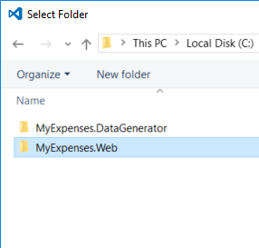
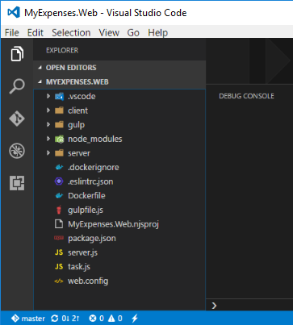
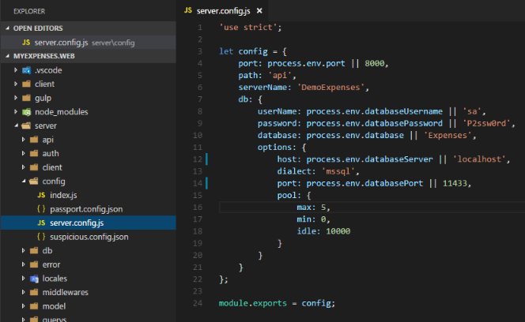
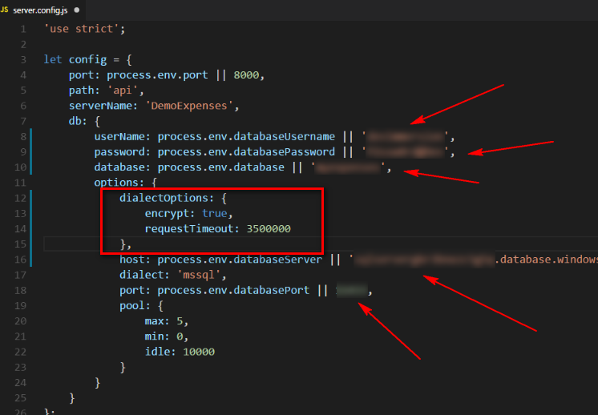
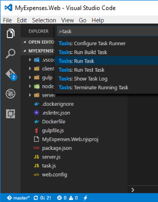
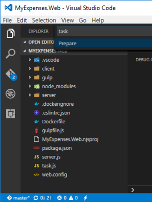

# RUN ``MyExpenses``

1. Go to menu ``File``->``Open Folder...`` and click on it.

1. Open the ``MyExpenses`` folder.  

    

1. Once opened, you can see this folder structure in your ``Visual Studio Code`` window.  

    

1. Click on ``./server/config/server.config.js`` file to check the connection string.

    

1. Update your connection data to use your SQL database.  

    As you can see in the image below, ``UPDATE`` the keys marked with arrows and ``INSERT`` a new line with the key:  

    ```json
    encrypt: true,
    ```

    >| Key | Action | Value | Description |
    >|---|---|---|---|
    >| **userName** | UPDATE | devimmersion | | 
    >| **password** | UPDATE | P2ssw0rd@Dev | |
    >| **database** | UPDATE | myexpenses | Specify a database we can connect to create our own NEW database |
    >| **encrypt** | INSERT | true | Create the new line with the indicated key |
    >| **host** | UPDATE | YOUR_AZURE_SQL_SERVER | Substitute our ``localhost`` value with your SQL Server url |
    >| **port** | UPDATE | 1433 | Substitute our ``localhost`` value with your SQL Server port |
    
    This is an example how your connection settings will be edited with your Azure connection settings data:  

        

1. Save your changes.

1. Now, restore the npm packages before running the application.
    
 1. Press ``CTRL+SHIFT+P`` or ``F1`` key in Visual Studio Code.  

 1. Write ``task`` and select **``Tasks``**``: Run Task``

    

1. Execute ``prepare`` procedure on application  
    
    

    The process starts executing the task and after a short time (about 2 minutes), you can see it finished:

    [](img/vscode_executing_task.gif)

1. Click ``F5`` on ``Visual Studio Code`` to run the application. 

1. Open your browser and go to the url:  

    [http://localhost:8000](http://localhost:8000)

1.  Click on ``SIGN IN`` to check that the app shows the information.
  
    

<a href="conclusion.md">Next</a>


