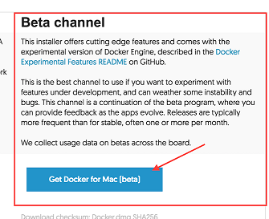
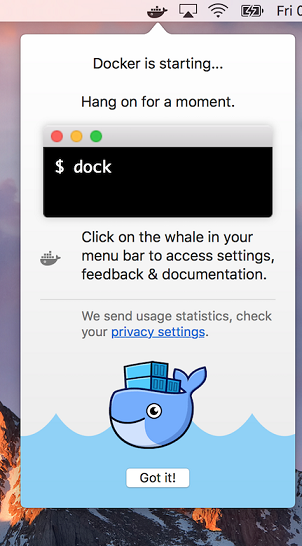
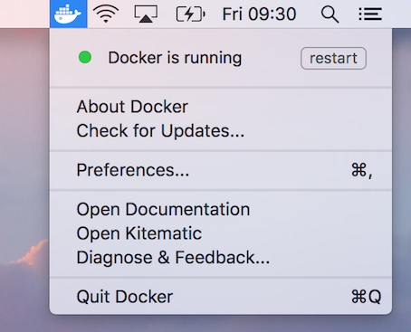
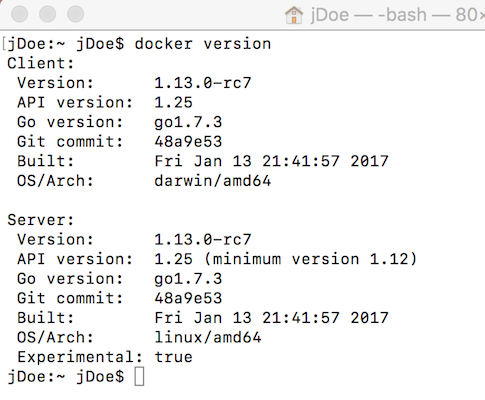
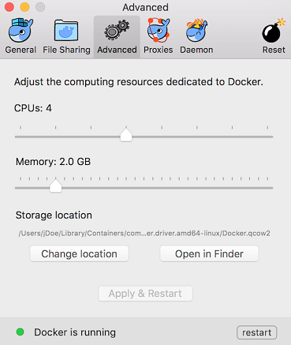
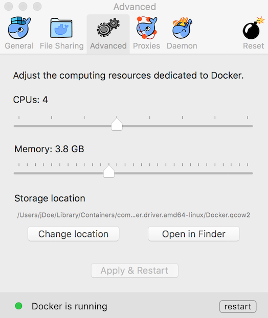
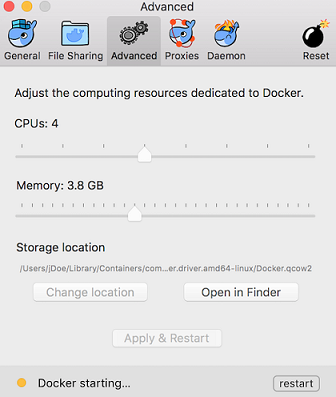

# DOCKER FOR MAC

## Install Docker

1. Go to [Docker for Mac Download](https://docs.docker.com/docker-for-mac/install/) page.

1. Select the **Stable Channel** to download.   

    

1. Double click on the Docker downloaded file.

1. Follow the installation wizard to accept the license, authorize and proceed with the install.

1. This window is shown the first time Docker is started:  

    

1. Once docker has been started, you can see the Docker *whale* icon on the trayicon.  

    

1. Try to right click it and see menu options.  

    

## Check Installed Docker 

1. Open a new terminal window.

1. Check your docker installation  
1. Docker is already installed so you can start typing any Docker command, in this example we will check the installed Docker version:  
    
    ```cmd
        docker version
    ```
    

    > This tell us Docker is really up and running!!

## Configure your installation

SQL Server on Linux needs, at least, ``3.8 GB of RAM`` available. So we need to make sure we assign this amount of RAM to our Docker configuration.

1. Right click on the Docker whale icon. 

    

1. Click on the ``Settings`` menu option.

1. Go to Advanced option  
      
    
    > As you can see Docker, by default, set ``2 GB of RAM`` to be available for containers. So we need 
    to change this value to get the minimum necessary to run the SQL Server on Linux.

1. Increase amount of memory available for Docker containers.  

      

    > In the screenshot we are showing you is the minimum memory needed to start up SQL Server 2016 on Linux
    > but we recommend giving it more RAM if it is available.

1. Click ``Apply & Restart`` button.  
    Docker will reinitialize with the new configuration values.  You must wait a bit until Docker
    applies the changes and restarts again with the updated values.  
    
      

<a href="2.RunSql2016onLinux.md">Next</a>
