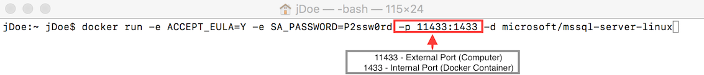
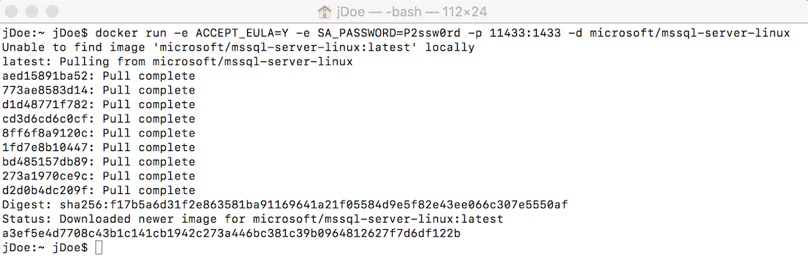
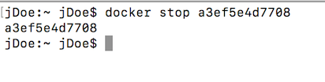

# RUN SQL LINUX ON A DOCKER CONTAINER

Once we have Docker already installed, we can run the ``SQL Server 2016 on Linux`` Docker image on our Windows machine.

1. Open a terminal.  

1. Execute this command:  

    ```cmd
    docker run -e ACCEPT_EULA=Y -e SA_PASSWORD=P2ssw0rd -p 11433:1433 -d microsoft/mssql-server-linux
    ```
    > You can find complete information for all parameters in the Docker hub [microsoft/mssql-server-linux Docker image page](https://hub.docker.com/r/microsoft/mssql-server-linux/). 

    

1. We have set the ``-p`` parameter to let the SQL Server 2016 on Linux listen on its default
    SQL Server port (``1433``) inside the Docker container **_but listen_** onto a different port (``11433``) in host computer.

    > This is done in this way to avoid problems because the port ``1433`` is the standard SQL Server port
    > and perhaps you already have this port occupied by another local SQL Server installation.

    > **NOTE:** If you have this _external_ ``11433`` port already occupied on your computer you have to change it to another free one

1. The first time you run this command, Docker must download the image from the Docker hub repository and you can see this result:  

    > It is telling you that your docker image does not exists _locally_ and it is pulled from the remote image.
    > After that, it runs locally and gives you the ''Id' of the container running:

    

1. Now, We are going to verify our container is running on our new Docker installation.

1. Run this command to see all containers running or exited.

    ```cmd
     docker ps -a
    ```

    > **NOTE**:  
    > If you want to see _only_ containers running, you can enter the same command without the ``-a`` option.  
    > In this HOL we are going to use the ``-a`` option because it also shows the stopped containers.

1. The results will seem like this one but they will have different data information in your installation:  

    

## Stop the docker container

1. You can stop the docker container with this command:

    ```cmd
     docker stop <CONTAINER_ID>/<NAME>
     ```  

1. So if you want to stop it, you must know the ``CONTAINER_ID`` or ``NAMES``.

1. Run this command to see your container and get the containerId and name. 

    ```cmd
     docker ps -a
    ```

1. Run this command to stop the container using the container_Id.

    ```cmd
    docker stop <YOUR_CONTAINER_ID>
    ```

1. Run this command to stop the container using the name.

    ```cmd
    docker stop <YOUR_NAME>
    ```

1. Any of the previous commands will have the same result stopping the container.  

    


## Start a stopped container again

To follow the next steps of this Hand-On-Lab, you need the container running.

You can start a stopped container or run a new one:

1. To start a stopped container
   ```cmd
     docker start <CONTAINER_ID>/<NAME>
     ```  
     
1. To run a new container from an existant image  
    Use the ``docker run`` command we have seen in the first section.

<a href="3.PopulateSqlServerWithBasicData.md">Next</a>
   