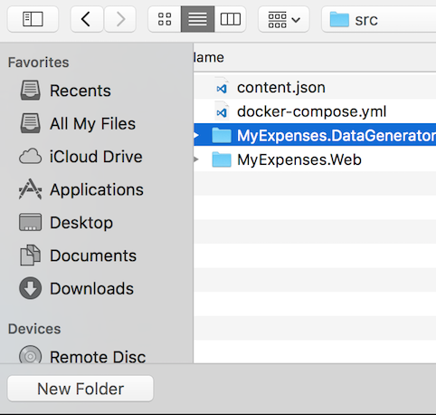
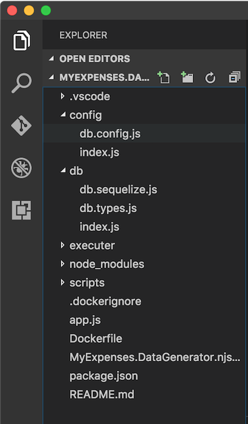
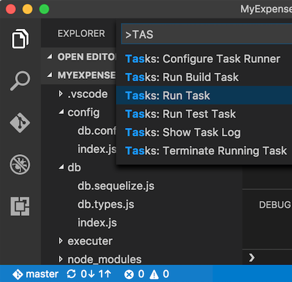
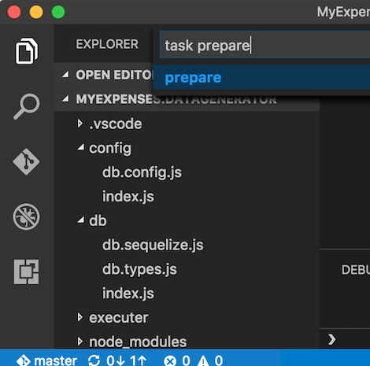

# POPULATE DATA

Before executing the ``MyExpenses.web`` node.js application, we need to populate the database with data.  To do
this, we are going to connect to our ``SQL Server 2016 on Linux`` that we already have up and running.

You can find the demo app in the `source\Expenses.SQLLinux` directory. 

First of all, make sure SQL Server 2016 on Linux is running.  

1. Check that it is executing this command on a terminal window:

    ```cmd
    docker ps -a
    ```

    > You must get a result like the below image telling you the **STATUS** is **Up**:  

    

    > **IMPORTANT:** If you stopped the ``SQL Server 2016 on Linux`` Docker container, you must start up it again
    > with the [instructions we already saw](2.RunSql2016onLinux.md).

1. Open ``Visual Studio Code``

1. Go to menu ``File``->``Open Folder...`` and click on it.

1. Open the ``MyExpenses.DataGenerator`` folder.  

    

    

    > **NOTE:** If you want to use the icons in the same way we are showing you in this lab, you need to
    > install the [vscode-icons extension](https://marketplace.visualstudio.com/items?itemName=robertohuertasm.vscode-icons)
    > and enable the extension as you can read in the extension web page instructions.

1. Now, restore the npm packages before running the application.
    
 1. Press ``CTRL+SHIFT+P`` or ``F1`` key in Visual Studio Code.  

 1. Write ``task`` and select **``Tasks``**``: Run Task``:  

    

 1. Then select ``prepare`` task and press ``enter`` to execute it:  
    
    

    > The process starts executing the task and after a few minutes, you can see it finished:  
    
    


1. Now, update the connection data to use the SQL Linux that runs on the Docker container on the ``./config/db.config.js`` file. 

    

    > **Note**: you must update the port if you have not used the default one.

1. Clik ``F5`` on ``Visual Studio Code`` to run the application.

    

1. Click on the option *``1``* to choose the ``General (fast) data load.`` 

1. Wait to finish to be sure that the data is populated.

    > **NOTE:** If you stop your the Docker container, you must complete these steps again.

<a href="4.ConnectMyExpensesToSql.md">Next</a>
