# CONNECT TO ``SQL Server 2016 on Linux``

We are going to connect the ``MyExpenses`` application with the _Dockerized_ ``SQL Server 2016 on Linux``.

In this lab, we show you how to connect to the database using two different approaches: 

- Run MyExpenses on your local computer connecting to the _dockerized_ database.  

    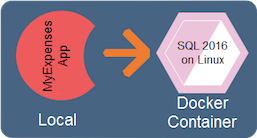

- Run MyExpenses in a docker container and connect to the _dockerized_ database.

    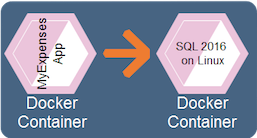

## Steps

1. First, be sure SQL Server 2016 on Linux is running. 

    ```cmd
    docker ps -a
    ```
1. You must get a result like the below image telling you the **STATUS** is **Up**:  

    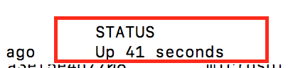

1. Open ``Visual Studio Code`` 

1. Go to menu ``File``->``Open Folder...`` and click on it.

1. Open the ´´MyExpenses`` folder.  

    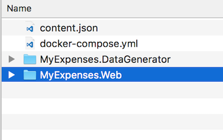

1. Once opened, you can see this folder structure in your ``Visual Studio Code`` window.  

    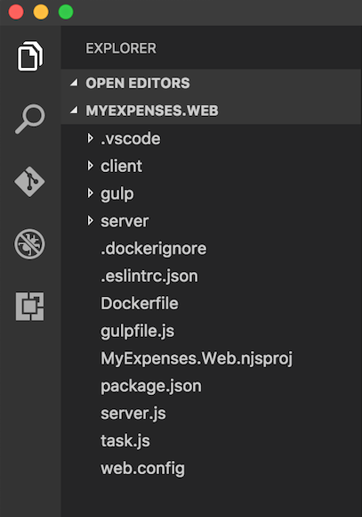

1. Now, restore the npm packages before running the application.
    
 1. Press ``CTRL+SHIFT+P`` or ``F1`` key in Visual Studio Code.  

 1. Write ``task`` and select **``Tasks``**``: Run Task``

    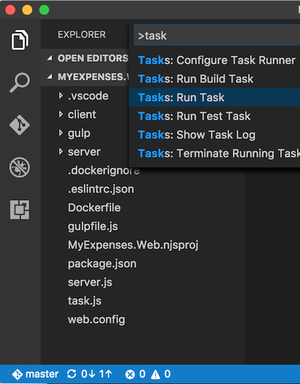

1. Execute ``prepare`` procedure on application  
    
    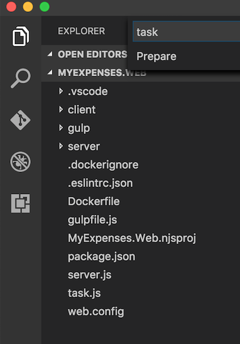

    The process starts executing the task and after a short period (about 2 minutes), you will see it finished:

    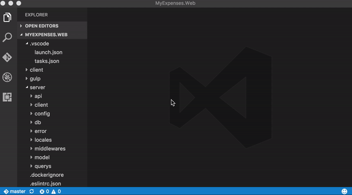

## Run ``MyExpenses`` in your local enviroment

1. Click on ``./server/config/server.config.js`` file to check the connection string.

    

    > **Note**: you must update the port if you have not used the default one.

1. Click ``F5`` on ``Visual Studio Code`` to run the application. 

    > You can see it executing and listening on port 8000:
    
    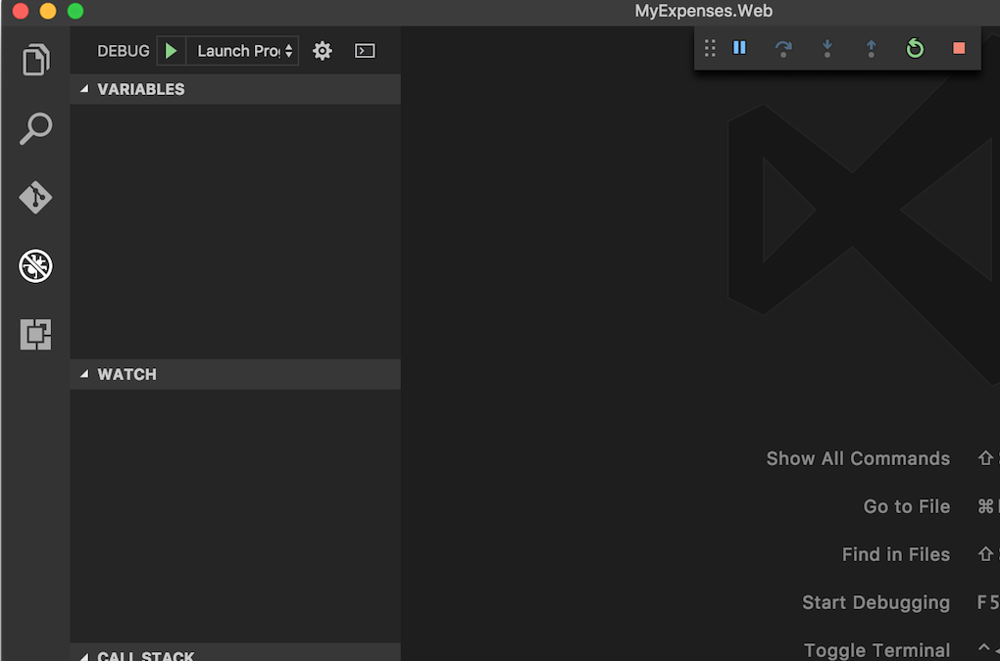
    
1. Open your browser and go to the url:  

    [http://localhost:8000](http://localhost:8000)

    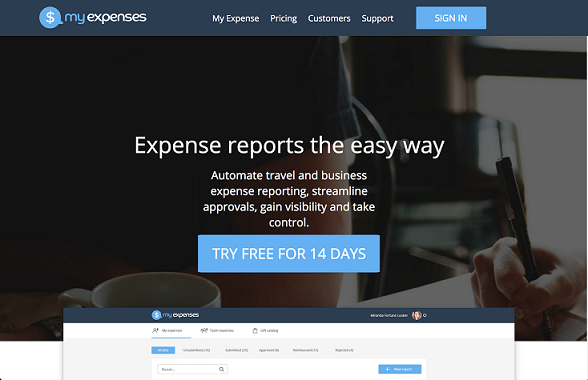

1.  Click on ``SIGN IN`` to check that the app shows the information.
  
    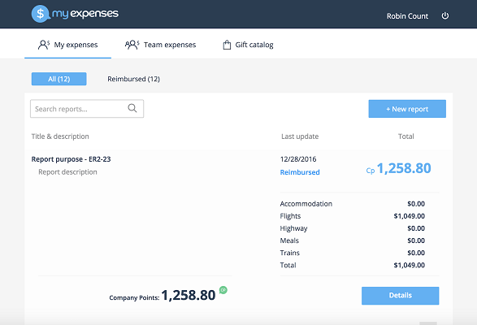

    > **NOTE**: The application is not authenticated.

## Run ``MyExpenses`` in a Docker container

Compose is a tool for defining and running multi-container Docker applications. 
With Compose, you use a Compose file to configure your application’s services. Then, using a single command, you create and start all services from your configuration.

You can learn more about all the features of Compose [here](https://docs.docker.com/compose/)

1. Open the directory where you have downloaded the Expenses application.

    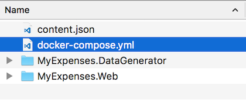

1. Open MyExpenses.Web\Dockerfile file

    > A Dockerfile is a text document that contains all the commands a user could call on the command line to assemble an image. 

1. Open the docker-compose.yml file.

    > It's a YAML file that defines services, networks and volumes.

1. Open a new command prompt in the docker-compose.yml directory.

1. Stop your ``SQL Server`` container from the previous step.
    
    ```cmd
     docker stop <CONTAINER_ID>
     ```  
    > **IMPORTANT**  
    > Be sure your previous container is stopped before continuing or the port used will be occupied
    > and the new container _in the same port_ will not start correctly.

1. Run the docker-compose up and compose will start and run your entire app.

    ```cmd
    docker-compose up
    ```

    > The docker-compose up command aggregates the output of each container. 
    > When the command exits, all containers are stopped. Running docker-compose up -d starts the containers in the background and leaves them running.

1. After finishing, you will see that the ``MyExpenses.DataGenerator`` app and the ``SQL Server`` containers are up and running:   

    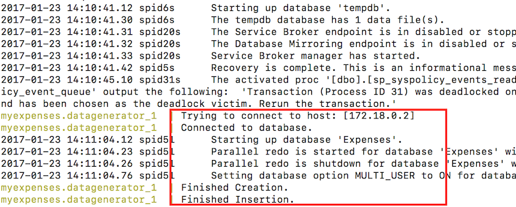

1. Your can also see the ``MyExpenses.Web`` application is running and listening on port 8080:      

    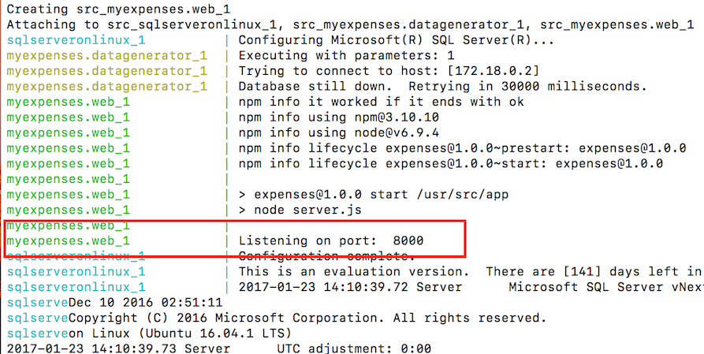

1. Open your browser and go to the url:  

    [http://localhost:8000](http://localhost:8000)

    

1.  Click on ``SIGN IN`` to check that the app shows the information.
  
    

    > **NOTE**: The application is not authenticated.

1. Open another command prompt windows to check the containers are running.  

1. Run the following command to list the existing images:

    ```cmd
    docker images
    ```  

    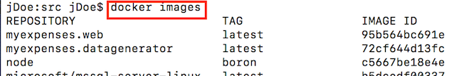
    
1. Run the following command to list the existing containers:

    ```cmd 
    docker ps -a
    ```  

    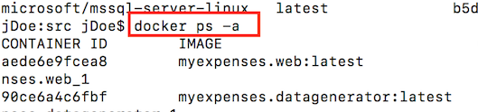

1. Open a terminal in the docker-compose.yml directory to stop the containers.  

    ```cmd
    docker-compose down
    ```

    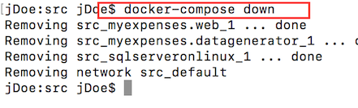

<a href="conclusion.md">Next</a>
