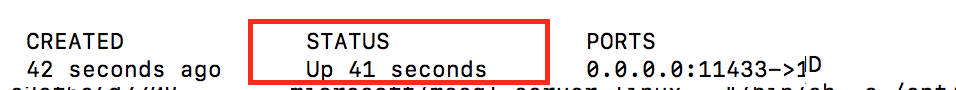
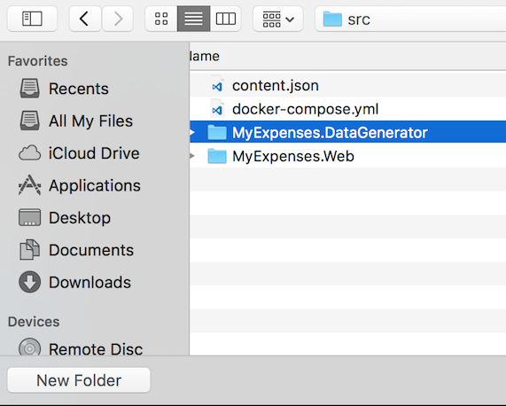
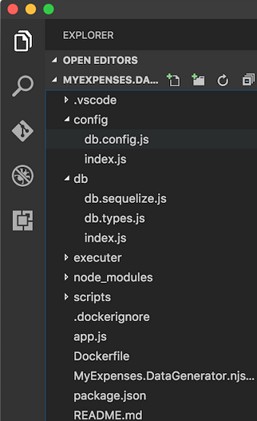
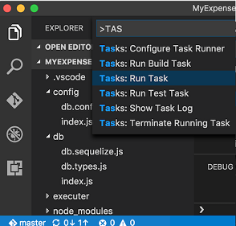
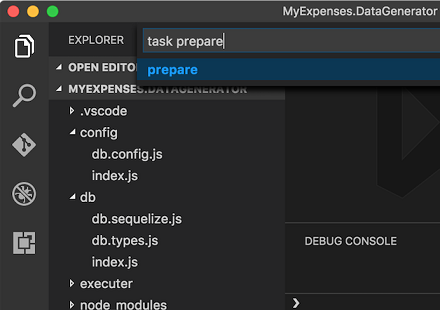
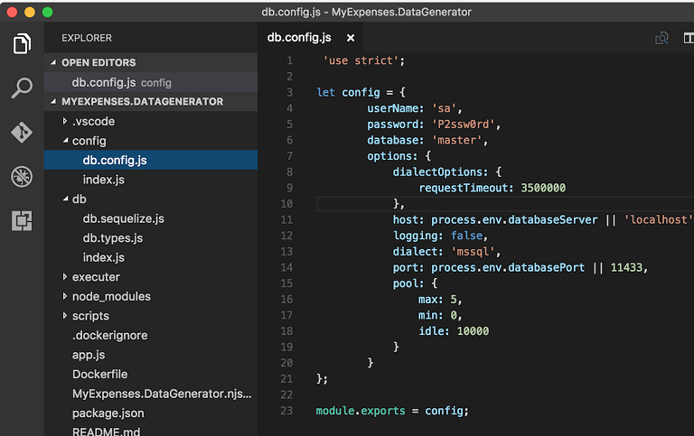
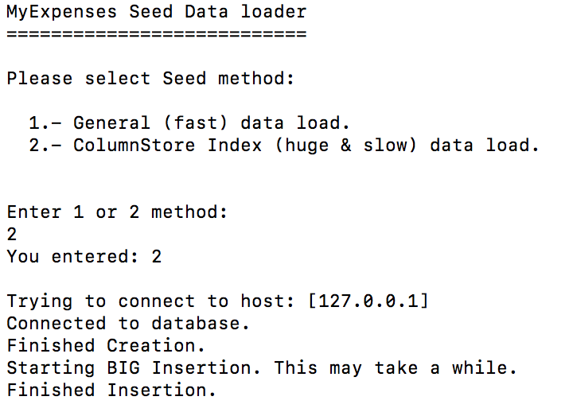

# POPULATE ``SQL Server 2016 on Linux`` WITH HUGE DATA

Before continuing with this lab, we need to populate the database with big data.  To do
this, we are going to connect to the ``SQL Server 2016 on Linux`` that we already have up
and running.

## Steps

1. First of all, you must be sure that SQL Server 2016 on Linux is running.  Please, check it executing
this command on a terminal window:

    ```cmd
    docker ps -a
    ```

    You must get a result like the below image telling you the **STATUS** is **Up**:  

    

    > **NOTE**:  If it is not running, start up the container with the instructions we saw in previous steps.

1. Open ``Visual Studio Code``

1. Go to menu ``File``->``Open Folder...`` and click on it.

1. Open the ``MyExpenses.DataGenerator`` folder.  

    

    

1. Now, restore the npm packages before running the application.
    
1. Press ``COMMAND+SHIFT+P`` or ``F1`` key in Visual Studio Code.  

1. Write ``task`` and select **``Tasks``**``: Run Task``:  

    

1. Then select ``prepare`` task and press ``enter`` to execute it:   
    
    

    > The process starts executing the task and after a short time, you can see it finished:  
    
    

1. Now, update the connection data to use SQL Linux that runs in the Docker container. 

1. Click on the ``./config/db.config.js`` file. 

    

    > **Note**: you must update the port if you have not used the default one.

1. Clik ``F5`` on ``Visual Studio Code`` to run the application.

    

1. Click on the option *``2``* to choose the ``ColumnStore Index (huge & slow) data load.`` 

1. Wait to finish to be sure that the data is populated.

<a href="2.ConnectToSqlWithVsCode.md">Next</a>
