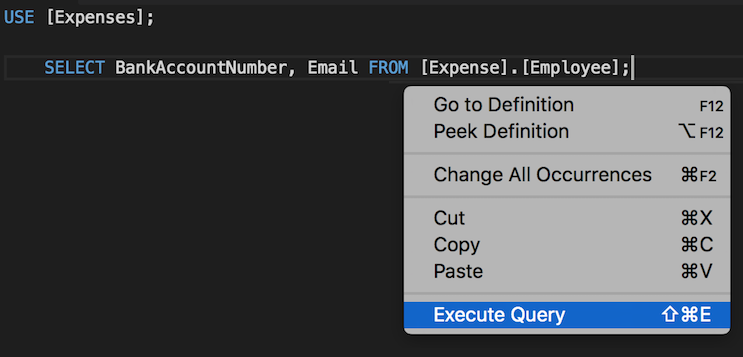
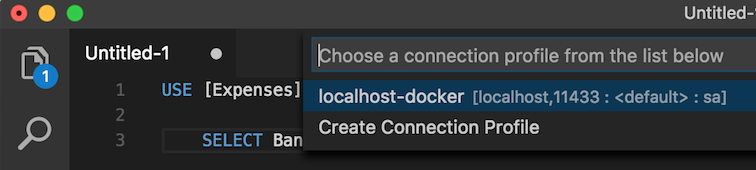
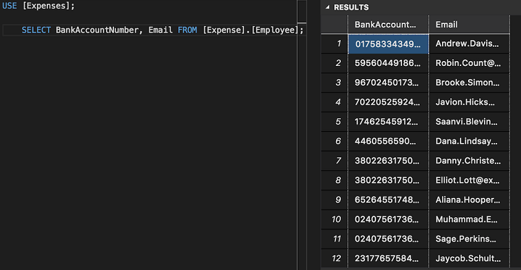
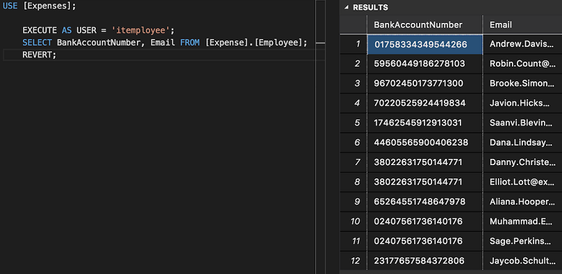
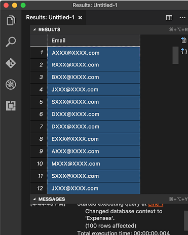
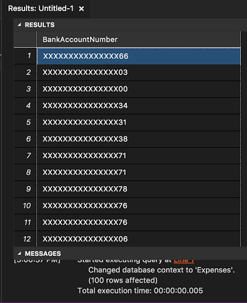

# DYNAMIC DATA MASKING

``Dynamic Data Masking`` or ``DDM`` can be defined on a per-column basis, indicating the level of obfuscation that will be applied to each one of them:

- Default masking, which fully masks the original value 
- Partial masking, which allows a custom masking to be applied 
- Random masking, which replaces a numeric value with a random one within a specified range
- Email masking, which exposes only the first character of the email and keeps its format

Check this [link](https://msdn.microsoft.com/en-us/library/mt130841.aspx) for further information about the Dynamic Data Masking feature.

In MyExpenses, we have a few fields that contain sensitive information: the employee email address and their account number. Right now, any IT employee who connects to the MyExpenses database can access this information, and we want to ensure that this is not the case anymore. Applying DDM will allow us to hide emails and account numbers from non-privileged users, while keepping them available for users with the proper permissions. Let’s see which steps we need to follow in order to get it done.

## Checking how the data is currently stored

We'll start by checking how the fields BankAccountNumber and Email are being shown at the moment for all users.

1. Open a new SQL window in Visual Studio Code.  

    Remember to open a new window: ```COMMAND+N``` and change the window type: ```COMMAND+K,M```, then select ``SQL``.

1. Enter the next SQL statements  .

    ```sql
    USE [Expenses];

    SELECT BankAccountNumber, Email FROM [Expense].[Employee];
    ```
1. Execute it with ```COMMAND+SHIFT+E```  

    You can press the indicated key combination or right-click with your mouse and select the same option to select both the ``BankAccountNumber`` and ``Email`` fields for all the users.

    

    > *Tip*  
    > If you want to execute only part of a SQL sentence, select it before ```COMMAND+SHIFT+E```

    At this point ``Vs Code`` will ask you for the SQL connection profile to use.

    

1. Check the results, and see how all the information is available. This is what we need to avoid.

    

    Since ``DDM`` is applied to specific database users, we'll create a new non-privileged user for the IT team
    which will see only masked data in sensitive fields. 

1. Create a new login, that will be used for the IT department.

    Nobody in IT needs to see the unmasked email or account number of the users when troubleshooting an
    issue in the application, but without DDM, that's not what happens.  
    
    Execute the following SQL sentences to create the new itemployee user.

    ```sql
    CREATE LOGIN itemployee WITH password='P2ssw0rd'; 
    CREATE USER itemployee FROM LOGIN itemployee;
    ```

1. Grant the newly created user read-only access to the database.

    ```sql
    EXEC sp_addrolemember 'db_datareader', 'itemployee'; 
    ```

1. Execute the same SQL statement but as the newly created user.
    
    ```sql
    USE [Expenses];

    EXECUTE AS USER = 'itemployee';
    SELECT BankAccountNumber, Email FROM [Expense].[Employee];
    REVERT;
    ```

1. Check the results again, and see how all the information is available, just as before.

    

## Dynamic data masking on ``Email`` field

1. The first step we’ll take is securing the Email field using Dynamic Data Masking. Execute the following SQL statement

    ```sql
    USE [Expenses];

    ALTER TABLE [Expense].[Employee]
    ALTER COLUMN Email ADD MASKED WITH (FUNCTION = 'email()');
    ```

    This will modify the Employee table to include DDM in the Email column, using the default filter for an email. Let’s see if you can spot the difference.

1. Execute the following SQL statement to select the Email field for all the users, when logged in as an administrator.

    ```sql
    USE [Expenses];

    SELECT Email FROM [Expense].[Employee];
    ```

1. Check the results and see how, even after applying the mask, the email is not encrypted.      

    

    This is because you’re logged in as an administrator (user ``sa``), and they are considered privileged users. Let’s try it with a read-only user

1. Connect as our newly created user or use that identity to execute the SQL statement.  

    > To avoid connecting with a different user, we will execute the sql statement getting the identity of the newly
    created user ``itemployee``.

    ```sql
    USE [Expenses];

    EXECUTE AS USER = 'itemployee';
    SELECT Email FROM [Expense].[Employee];
    REVERT;
    ```

1. Check the results again, and see how the email is encrypted.  

    You can only see the first letter of the email, and the email format (XXXXX@XXXXX.com) is kept.

    

## Dyanmic data masking on ``BankAccountNumber`` field

1. The second step we’ll take is securing the BankAccountNumber field using Dynamic Data Masking. Execute the following SQL statement

    ```sql
    USE [Expenses];

    ALTER TABLE [Expense].[Employee]
    ALTER COLUMN BankAccountNumber ADD MASKED WITH (FUNCTION = 'partial(0,"XXXXXXXXXXXXXXX",2)');
    ```

    This will modify the Employee table to include DDM in the BankAccountNumber column, using a custom
    partial filter that will show only the last two digits of the account number and keep the usual format.
    
    To the eyes of the user, it’ll look like we’ve just replaced all digits besides the last two with the letter X.
    Let’s see if we can spot the difference.

1. Execute the following SQL statement to select the BankAccountNumber field for all the users, when logged in as an administrator.

    ```sql
    USE [Expenses];

    SELECT BankAccountNumber FROM [Expense].[Employee];
    ```

1. Check the results and see how, even after applying the mask, the account number is not encrypted.

    

    As you saw with the email masking, this is because you’re logged in as an administrator (``sa`` user), and they are considered privileged users. Let’s try it with the read-only IT user

1. Connect as our newly created user or use that identity to execute the SQL statement.  

    > To avoid connecting with a different user, we will execute the sql statement getting the identity of the newly
    created user ``itemployee``.

    ```sql
    USE [Expenses];

    EXECUTE AS USER = 'itemployee';
    SELECT BankAccountNumber FROM [Expense].[Employee];
    REVERT;
    ```

1. Check the results again, and see how the account number is encrypted.   

    You can only see the last two digits of the account number, and all other digits are replaced by the letter X.  

    

## Granting and revoking masking permissions

You’ve seen how privileged users can still access the data in the original unmasked form, while a standard user
cannot. 

Now you’ll see how to grant unmasking permissions to any user.

1. Execute the following SQL statement.

    ```sql
    USE [Expenses];

    GRANT UNMASK TO itemployee;
    ```

    This will modify the permissions of the ``itemployee`` so any queries against the Employee table
    (or any other in the database) will show the unmasked values. 

    To check it, execute the previous statements as the user ``itemployee`` and see results.

1. To revoke the unmask permissions granted to a user, execute the next statement.

    ```sql
    USE [Expenses];

    REVOKE UNMASK TO itemployee;
    ```
    
    This will once again modify the permissions of the itemployee, revoking the unmask grant and preventing sensitive data from being snooped.

## Removing masking

If you want to remove a mask from a column you can do it by dropping a mask from that column.

1. Execute the following SQL statement .

    ```sql
    USE [Expenses];

    ALTER TABLE [Expense].[Employee]
    ALTER COLUMN BankAccountNumber DROP MASKED;
    ```

    This will modify the Employee table to remove the mask applied to the ``BankAccountNumber`` column. You can do the same with the ``Email`` column.    

<a href="4.InMemoryColumnStoreIndex.md">Next</a>