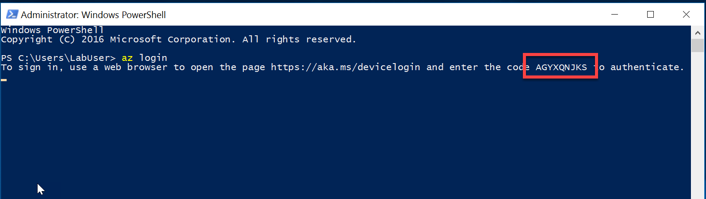

# Provision MySQL Server 

## Create a database using Azure CLI

1. Open a PowerShell command prompt, you can find a shortcut on the desktop, and run:

    az login

1. When the prompt window instructs your to open [https://aka.ms/devicelogin](https://aka.ms/devicelogin) and enter the code shown in the console window  
    

1. Sign in with your Azure username and password

1. You now have an Azure CLI session open against the Azure Subscription hosting your lab

1. You will now use the CLI to provision an Azure Database for MySQL. In the open PowerShell  prompt, use the following command to provision an new Azure Database for MySQL:
    > Note: It would be best to provision this in the Resource Group created using the Azure Deploy tool.

      az mysql server create --resource-group [MyResourceGroupName] --name [mysqlDatabaseName] --location westus --admin-user mysqlAdminUser --admin-password mysqlAdminPassw0rd! --performance-tier Basic --compute-units 50 --ssl-enforcement Disabled

1. By default the database is completely locked down and cannot be accessed, so we need to add a firewall rule to allow us to connect to the database server. The rule we're creating here allows all traffic, in production scenarios the rule would be much more restricted.

    az mysql server firewall-rule create --resource-group [MyResourceGroupName] --server [mysqlDatabaseName]--name AllowAllIps --start-ip-address 0.0.0.0 --end-ip-address 255.255.255.255

1. Congratuations. You now have somewhere to store your data.

