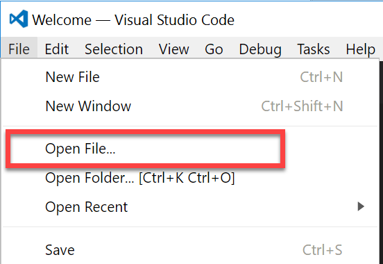
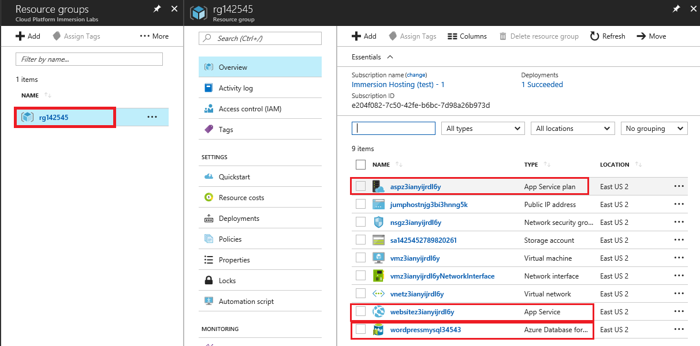
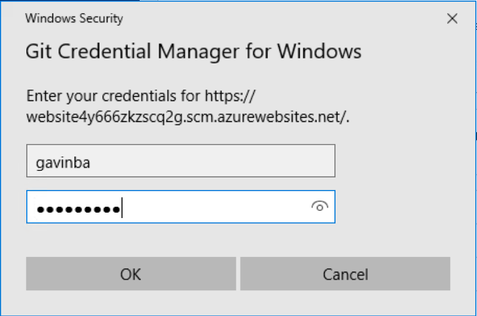

## Deploy the website

We now need to change some configuration code for the WordPress website so that it is able to consume data from the database which we have just provisioned. Once we have updated the code we'll deploy it to an Azure App Service which has already been provisioned.

1. First we need to acquire a copy of the code for the website. To do this we will clone it from an existing GitHub repository. In the open PowerShell command prompt run the following commands:

     cd \  
     mkdir code  
     cd code  
     git clone https://github.com/gavinbarron/bikeshop.git

1. Next we need to set some git configuration values so that we can push any changes which are made to remote repositories. To do this run the following commands in the command prompt:

     cd bikeshop  
     git config user.name "holuser"  
     git config user.email "me@me.net"  

1. Now we need to update the code to use the MySQL databse which was previously provisioned. To do this, Open Visual Studio Code

1. Using the file menu choose Open File
    

1. Open the `wp-config.php` file at `C:\code\bikeshop\`

1. On line 44 replace `[Username]` with **mysqlAdminUser@[mysqlDatabaseName]**, the value of the username for your database administrator account [previously provisioned](1.md)

1. On line 47 replace `[Password]` with **mysqlAdminPassw0rd!**, the value of the password for your database administrator account [previously provisioned](1.md)

1. On line 51 replace `[Servername]` with **[mysqlDatabaseName]**, the server name for your database [previously provisioned](1.md)
   

1. Save the changes

1. To deploy this code to the website that has been provisioned you will need to set up some deployment credentials for your user account. To do this, switch back to the open PowerShell prompt

1. Execute this command to set your deployment username and password:
    > Note that the username here needs to be globally unique for all of Azure, so you do need to choose your own values.

     az webapp deployment user set --user-name [myDeploymentUserName] --password [MyGitDeployPassw0rd!]

1. Next we need the URL for the git repository which is configured for the website which will host the WordPress code. Open [https://portal.azure.com](https://portal.azure.com)

1. Open the Resource Groups blade and then open the resource group you provisioned to during the initial set up for the lab.

1. Verify that there are:
    - An Azure Database for MySQL
    - An Azure App Service
    - An App Service Plan
   

1. Open the App Service blade

1. In on the overview section copy the **Git clone url**
   

1. Now we need to configure the local git repository to know about the website. To do this we will add a new remote to the repository:

     git remote add website [copiedGitUrl]

1. Commit your changes to the local git repository:

     git add .  
     git commit -m "Updating config to point at new Azure Database for MySQL"

1. Deploy your changes to the Azure App Service:

     git push website

1. In the pop-up enter the deployment credentials password that you set previously and click OK
    

1. Wait for the push to the website to complete

1. The website is now updated and just needs data

