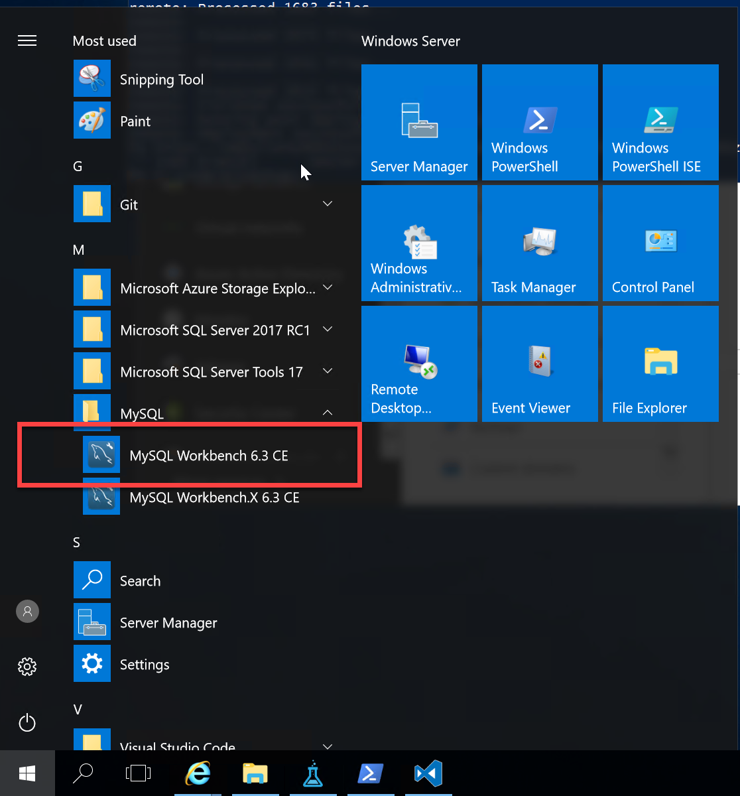
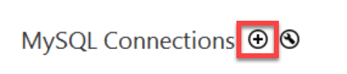
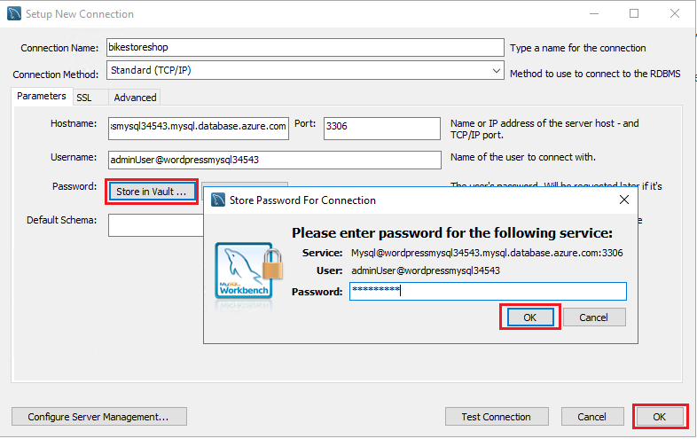
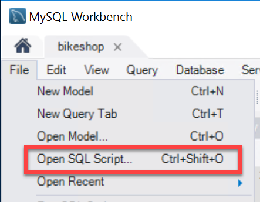
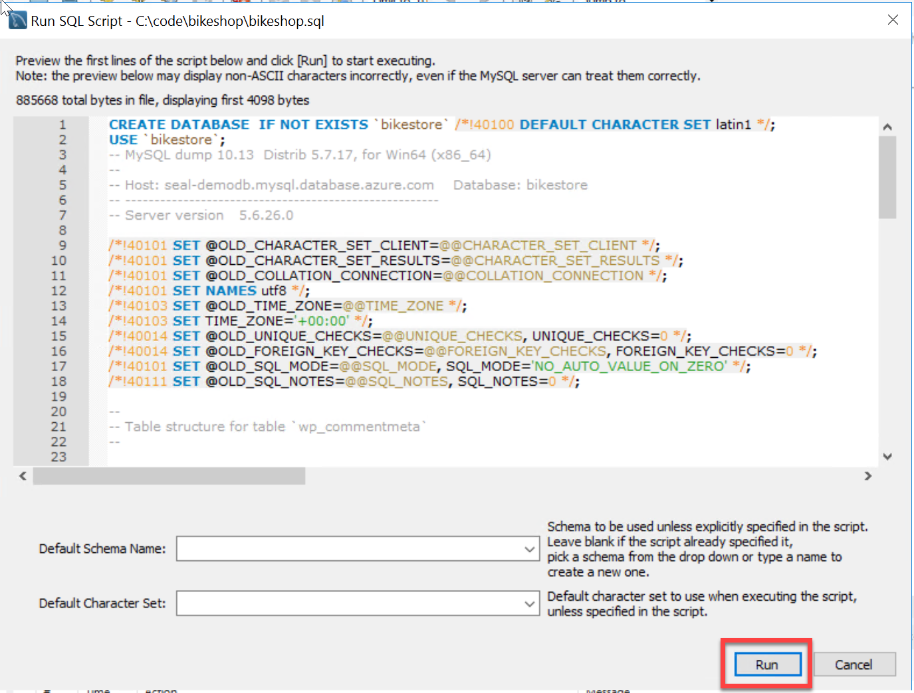
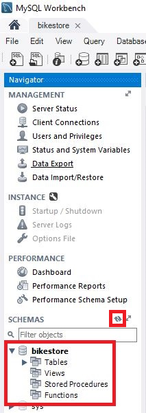
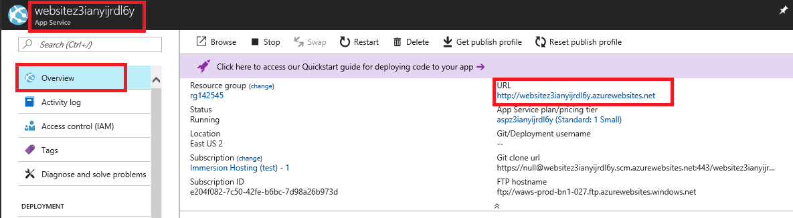
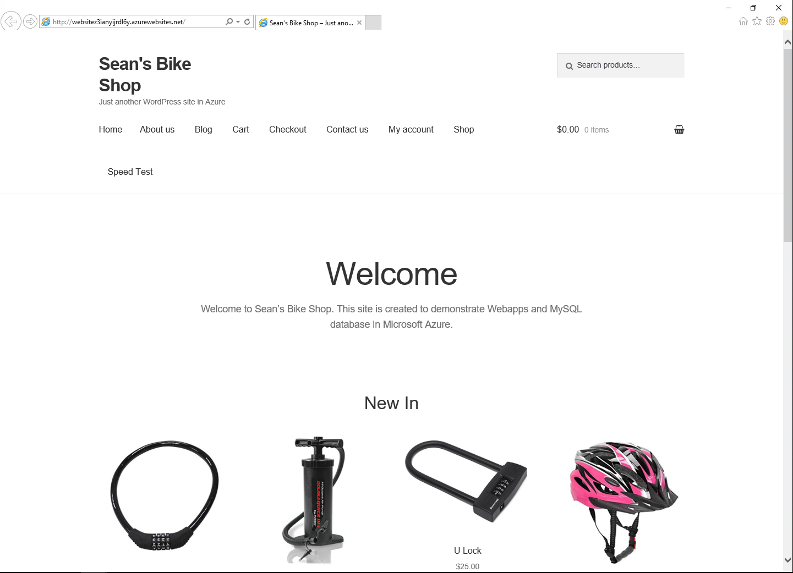

## Populate Data

Before our WordPress website will work we need to populate the database with data.  To do this, we are going to use The MySQL Workbench to connect to our ``Azure Database for MySQL`` that we already have up and running and use a script to restore data into the database.

1. Open MySQL Workbench  
    

1. Click OK and ignore the unsupported operating system warning

1. Click on the + icon to add a new MySQL Connection  
    

1. Setup the new connection to MySQL using the server name, username, and password [previously provisioned](1.ProvisionServer.md)

1. Click on "Store in Vault..." to enter password, then click OK  
   

1. Click on Test Connection to verify that you have configured the connection correctly. If you have issues check that you have provided the all of the details correctly. Once the test connection action succeeds click on OK

1. Double click on the connection name to open a session against your MySQL database  
   

1. Choose **File > Run SQL Script**  
    

1. Open the sql file from `C:\code\bikeshop\bikeshop.sql` and click the Run  
   

1. Once the script has been executed the database schema "bikestore" will have been created, click the Close button

1. Click the refresh icon to see it listed in the set of availble schema  
   

1. Return to Azure portal and in the App Service blade click on the URL for the website  
   

1. The website should be up and running  
   
