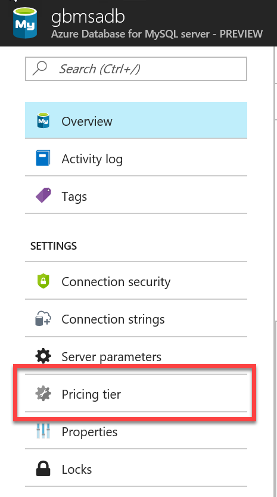
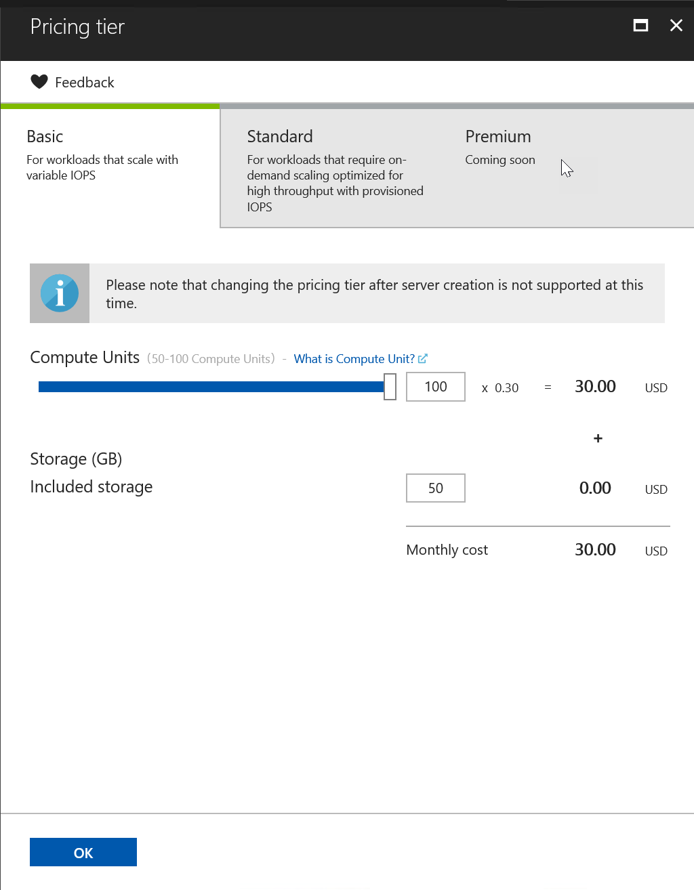
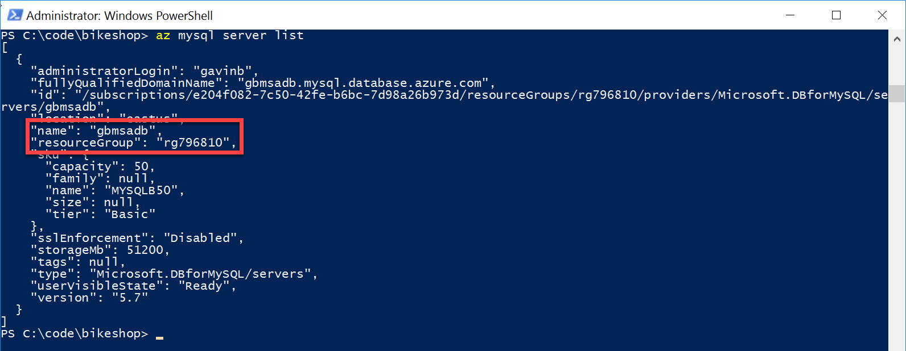

## Scale Up Azure Database for MySQL

Microsoft Azure offers a variety of pricing tiers for the Azure Database for MySQL service. In the earlier stages of this hands on lab, the lowest priced teir was used. In the real world, there may be times the application which relies upon your MySQL database will come under heavy load. In turn, this load may consume all of the resources available to your MySQL database instance, causing degraded performance. Scaling up your Azure Database for MySQL will help to noticeably improve performance in many of these cases, allowing you to keep processing your data efficiently.

Refer to these documentation articles for more infomation on [Pricing Tiers](https://docs.microsoft.com/en-us/azure/mysql/concepts-service-tiers) and [Compute Units](https://docs.microsoft.com/en-us/azure/mysql/concepts-compute-unit-and-storage) should you want to get more information on scaling your MySQL databases.

There are two options to scale up or scale down the Azure Database for MySQL service, either using the portal or via CLI.

### Using the Azure Portal

1. Open [https://portal.azure.com](https://portal.azure.com)

1. Open All Resources blade and click on the MySQL database that you want to scale

1. Click **Pricing Tier** option  
    

1. Change the **Compute Units** up or down as need and click OK to save changes.
    > Note that currently only the Basic level at either 50 or 100 compute units is available  

    

### Using the Azure CLI 2.0

1. Using the PowerShell prompt that you have open and connected to the Azure subscription

1. Using Azure CLI get information about the MySQL databases that you have access to:

     az mysql server list

1. The cli will provide a list of your MySQL databases, there should only be one. Note the resourceGroup and name values  
    

1. On the command prompt, run below command to scale up to 100 compute units

     az mysql  server update --resource-group [MyResourceGroupName] --name [mysqlDatabaseName] --compute-units 100

1. Run below command to scale down to 50 compute units

     az mysql  server update [MyResourceGroupName] --name [mysqlDatabaseName] --compute-units 50
