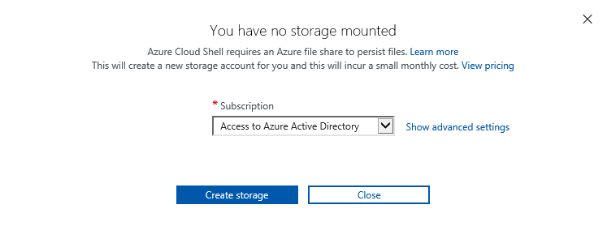
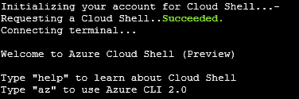
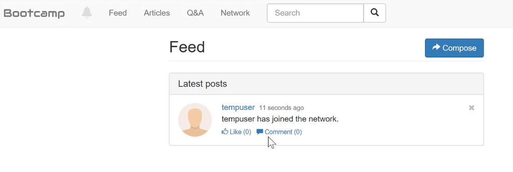

##### Developing apps with Azure Database for PostgreSQL


### Start Lab   


An **Azure Resource Group** is a logical container into which Azure resources are deployed and managed. A **Resource Group** and a **Storage Account** must exist before any virtual machines can be created. 
In this example, a resource group named **rg123456** (where **123456** is the number in your username) is created in the southcentralus or any region you have chosen to delploy the resources to. You will need to create adn use this group name when creating your Database and Server.

Throughout this lab, we will use the **Azure Command Line Interface** or Azure CLI using the Cloud Shell feature in the Azure Portal.   

**Sign in to the Azure portal**

1. [Click here to open the Azure portal](https://portal.azure.com) and maximize the browser window
2. In the **Email or phone** field, enter <span style="color:blue">**<inject key="AzureAdUserEmail" />**
3. In the **Password** field, enter <span style="color:blue">**<inject key="AzureAdUserPassword" />**
4. Click **Sign in**
5. You _may_ encounter a popup entitled **Welcome to Microsoft Azure** with buttons for **Start Tour** and **Maybe Later** - Choose **Maybe Later**

**Create a storage account and Initialize the Azure CLI** 

1. To launch the **Azure Cloud Shell**, click the Cloud Shell button on the menu in the top menu bar of the Azure portal.
  
      
    
    > The button launches an interactive shell that you can use to run all of the steps required to create and manage an Ubuntu Linux VM.

2. Once the shell launches, you will see **"Welcome to Azure Cloud Shell"**.  Click on the **Bash (Linux)** option at the bottom
   

3. In the **"You have no storage mounted"** tab, click **Show Advanced Settings**
4. In the **Advanced Settings** tab, use the existing **Resource Group** and enter a unique name for the **Storage Account** and **File Share**
5. Click **Create Storage** 
6. Once the storage gets created, your **Cloud Shell** will initialize and very shortly be ready to use

          
    
    > Note: the Resource Group name, the Storage Account, and the File Share you created are displayed in the CLI while it initializes.
    > 
    > You may enlarge the shell by dragging the border or clicking on the **maximize button** on ht etop right of the shell.

#### Create an Azure PostGreSQL Database Server

1. A server contains a group of databases. You can create an **Azure Database for PostgreSQL server** using the **az postgres server create** command.  

    > **Note: You will need to change the name of the instance and also include your existing resource group.

    Type or copy and paste the following into the Azure command line:

     <span style="color:blue"> az postgres server create --resource-group [ResourceGroupName] <inject story-id="story://Content-Private/content/dfd/SP-OSS/postgresql/ossexperience1/story_a_postgresql" key="resourceGroupName" /> --name [PostGreSQLName]<inject story-id="story://Content-Private/content/dfd/SP-OSS/postgresql/ossexperience1/story_a_postgresql" key="resourceGroupName" /> --location southcentralus --admin-user pgsqluser --admin-password P@ssword1 --performance-tier Basic --compute-units 50 --version 9.6

    > **Note:** Be sure to remember your **user name** and **password** as you will need to use it later for your connection information.

2. Hit **Enter**
3. Create an Azure PostgreSQL server-level firewall rule with the **az postgres server firewall-rule create** command. A server-level firewall rule allows an external application, such as psql or PgAdmin to connect to your server through the Azure PostgreSQL service firewall.
    
     <span style="color:blue"> az postgres server firewall-rule create --resource-group [ResourceGroupName]<inject story-id="story://Content-Private/content/dfd/SP-OSS/postgresql/ossexperience1/story_a_postgresql" key="resourceGroupName" /> --server postgresql<inject story-id="story://Content-Private/content/dfd/SP-OSS/postgresql/ossexperience1/story_a_postgresql" key="resourceGroupName" /> --name AllowAllIps --start-ip-address 0.0.0.0 --end-ip-address 255.255.255.255      
  
4. Hit **Enter**
5. Now let's get the connection information for your new PostGreSQL Azure Database Server. To connect to your server, you need to provide host information and access credentials.
    
    <span style="color:blue"> az postgres server show --resource-group [ResourceGroupName]<inject story-id="story://Content-Private/content/dfd/SP-OSS/postgresql/ossexperience1/story_a_postgresql" key="resourceGroupName" /> --name [PostGreSQLName]<inject story-id="story://Content-Private/content/dfd/SP-OSS/postgresql/ossexperience1/story_a_postgresql" key="resourceGroupName" />
  
6. Hit **Enter**

    The result is output to the screen in JSON format as shown in the example below. Make a note of the **administratorLogin** and **fullyQualifiedDomainName**.
    > **Note:** Your **fullyQualifiedDomainName** will be **<inject story-id="story://Content-Private/content/dfd/SP-OSS/postgresql/ossexperience1/story_a_postgresql" key="resourceGroupName"/>.postgres.database.azure.com**
```
  {
  "administratorLogin": "pgsqluser",
  "fullyQualifiedDomainName": "postgresqlrg123456.postgres.database.azure.com",
  "id": "/subscriptions/00000000-0000-0000-0000-000000000000/resourceGroups/myresourcegroup/providers/Microsoft.DBforPostgreSQL/servers/mypgserver-20170401",
  "location": "southcentralus",
  "name": "postgresqlrg123456",
  "resourceGroup": "rg123456",
  "sku": {
    "capacity": 50,
    "family": null,
    "name": "PGSQLS2M50",
    "size": null,
    "tier": "Basic"
  },
  "sslEnforcement": null,
  "storageMb": 51200,
  "tags": null,
  "type": "Microsoft.DBforPostgreSQL/servers",
  "userVisibleState": "Ready",
  "version": "9.6"
  }
```
#### Create and connect to your PostgreSQL database using psql
1. Type the following **psql** cmmand in **Azure Cloud Shell** and hit **Enter:**
    
    <span style="color:blue"> psql --host=postgresql<inject story-id="story://Content-Private/content/dfd/SP-OSS/postgresql/ossexperience1/story_a_postgresql" key="resourceGroupName"/>.postgres.database.azure.com --port=5432 --username=pgsqluser@postgresql<inject story-id="story://Content-Private/content/dfd/SP-OSS/postgresql/ossexperience1/story_a_postgresql" key="resourceGroupName" />  --dbname=postgres

2. You will be prompted for a password.  Type **P@ssword1** at the prompt and hit **Enter**.

    > Note: the **psql prompt** will not echo what you type.

3. Once you are connected to the server with **psql**, create a blank database for your Python app to use. At the prompt, type the following command and hit **Enter:**

    <span style="color:blue"> create database bootcamp;
4. The Bootcamp database is now created. To connect to it and confirm it was created, type the following command and hit **Enter**:

    <span style="color:blue"> \c bootcamp;
5. Exit **psql** and return to the **Azure Cloud Shell** prompt. Type the following command and hit **Enter:**

    <span style="color:blue"> \q

#### Create an Azure VM running Ubuntu Server        
1. Create a virtual machine with the az vm create command. When creating a virtual machine, several options are available such as operating system image, disk sizing, and administrative credentials. In this example, a virtual machine is created with a name of myVM running Ubuntu Server.
    
   <span style="color:blue"> az vm create --resource-group <inject story-id="story://Content-Private/content/dfd/SP-OSS/postgresql/ossexperience1/story_a_postgresql" key="resourceGroupName" /> --name myubuntu  --vnet-name myvnet --image ubuntults --generate-ssh-keys    

2. Hit **Enter**

    > **Note:** Once the VM has been created, the Azure CLI outputs information about the VM. Take note of the publicIpAddress, this address can be used to access the virtual machine.. 

    ```
    {    
     "fqdns": "",
     "id": "/subscriptions/d5b9d4b7-6fc1-0000-0000-000000000000/resourceGroups/myResourceGroupVM/providers/Microsoft.Compute/virtualMachines/myVM",
     "location": "southcentralus",
     "macAddress": "00-0D-3A-23-9A-49",
     "powerState": "VM running",
     "privateIpAddress": "10.0.0.4",
     "publicIpAddress": "xxx.xxx.xxx.xxx",
     "resourceGroup": "rg123456"
    }
    ```

    > **Note:** If you should get a **"Cloud Shell timed out"** in the **Azure Bash Shell**, select **reconnect**.  Once the shell provisions again, you may continue with your next step.

    > **Note:** To find the **public IP address** for the **Ubuntu Server** go to the Azure Portal and Select **Virtual Machines** from the **resource Blade**.
    > 
    >Select **MyUbuntu** from the **Virtual Machine List**.
    > 
    >Highlight **Overview** and view the **Public IP address** on the right side.

3. By default, only SSH connections are allowed into Linux **virtual machines** deployed in Azure. This **VM** is going to be a webserver, so you need to open a port from the Internet. Use the **az vm open-port** command to open the desired port.
    
    <span style="color:blue"> az vm open-port --port 8000 --resource-group <inject story-id="story://Content-Private/content/dfd/SP-OSS/postgresql/ossexperience1/story_a_postgresql" key="resourceGroupName" /> --name myubuntu   
        
4. Hit **Enter**
5. Connect to the **VM** using SSH in the **Azure CLI**
   
      <span style="color:blue"> ssh [publicIpAddress]

    > **Note:** Replace [publicIpAddress] with the IP address of your server (without brackets) noted in the previous step (2).

6. Hit **Enter**

7. When prompted to continue, type <span style="color:blue">**yes** </span>and hit **Enter**

#### Configure the Bootcamp Application
1. Now you are at the shell of your new Ubuntu VM. Let's update the package index in Ubuntu, so that we have a recent list of the package repository

2. In your shell, type the following command and hit **Enter:**

     <span style="color:blue"> sudo apt update

3. Now let's install the Python Package Index. Type the following command and hit **Enter:**

     <span style="color:blue"> sudo apt install python3-pip

    > **Note:** When prompted to provide a y/n, answer **y**.

4. We are now ready to install our Bootcamp application that we will use with PostgreSQL. We will need to download a copy from GitHub.

5. To connect to GitHub and pull the code for Bootcamp, type the following command and hit **Enter**:

     <span style="color:blue"> git clone https://github.com/vitorfs/bootcamp.git
 
    > **Note:** Feel free to browse to Github and have a look at the Bootcamp repo to learn about what the application does: https://github.com/vitorfs/bootcamp.git

6. In your shell, type the following and hit **Enter**:

      <span style="color:blue"> cd bootcamp
7. Now we will install the Django Framework requirements for the Python app.  Type the following command and hit **Enter**:

      <span style="color:blue"> pip3 install -U -r requirements/local.txt

8. Now install Django
	
      <span style="color:blue"> sudo pip3 install django==1.11
	  
9. To list the files in the ../bootcamp directory, use the ls command. 

    > **Note:** You will need to run some of these commands as root. To do this, type "sudo" then the command you wish to run.

   Type the following command and hit **Enter**:

      <span style="color:blue"> sudo ls -la
    
    > **Note:** the manage.py script that was installed when we cloned the Git repository.         
   
10. While still in the ../bootcamp directory, type the following command and hit **Enter**:

      <span style="color:blue"> vim .env

11. Enter the following lines to create your database connection environment file:

    > **A:** You are now in the **VIM Editor**. Type <span style="color:blue">**i** </span> to enter **INSERT** mode.
    >     
    > **B:** Copy and paste the following into the **vim editor**
    >
     
      <span style="color:blue">DEBUG=True<br>SECRET_KEY='mys3cr3tk3y'<br>DATABASE_URL='postgres://pgsqluser@postgresql<inject story-id="story://Content-Private/content/dfd/SP-OSS/postgresql/ossexperience1/story_a_postgresql" key="resourceGroupName" />:P@ssword1@postgresql<inject story-id="story://Content-Private/content/dfd/SP-OSS/postgresql/ossexperience1/story_a_postgresql" key="resourceGroupName" />.database.windows.net:5432/bootcamp'<br>ALLOWED_HOSTS = "*"

	> **Note:** If you look at the credentials closely, you will notice we are using the new Azure Database for PostgreSQL service to connect to this app, and we have pre-populated the connection string.

12. On the Terminal, to come out of the editing mode-
    	
    > **A:** Press the **ESC** key
    >	    
    >
    > **B:** Type <span style="color:blue">**:wr** </span>and hit **Enter**. This writes the file .env and saves it
    > 
    >
    > **C:** Type <span style="color:blue">**:q** </span>and hit **Enter** to leav **VIM**

13. To run migration and serve the app, type the following command and hit **Enter**:

      <span style="color:blue"> python3 manage.py migrate
        
14. Let's bring the server up - Type the following command and hit **Enter**:

      <span style="color:blue"> python3 manage.py runserver 0.0.0.0:8000

15. Now, open a new web browser window, enter the following URL, and hit **Enter**:

      <span style="color:blue"> http://[publicIpAddress]:8000/
    > **Note:** Replace [publicIpAddress] with the IP address of your server (without brackets) from **Create an Azure VM running Ubuntu Server-Step 3**.

16. With the bootcamp app open in your browser, sign up for the bootcamp.

    > **Note:** Enter a username; provide an email address; create a password; then create your account 
 
    > **Note:** The next screen you would see after successful creation of the account is this:
 
     

17. Let's go to the database and query it directly. Return to **Azure Cloud Shell** where you have the SSH session and hit **Ctrl-C** to terminate the web server.

18. Next, let's terminate our SSH session to Ubuntu. Type the following command and hit **Enter**:

    <span style="color:blue"> exit

19. Now, let's connect to the **Azure PostgreSQL** database. Type the following and hit **Enter**:

	<span style="color:blue"> psql --host=postgresql<inject story-id="story://Content-Private/content/dfd/SP-OSS/postgresql/ossexperience1/story_a_postgresql" key="resourceGroupName"/>.postgres.database.azure.com --port=5432 --username=pgsqluser@postgresql<inject story-id="story://Content-Private/content/dfd/SP-OSS/postgresql/ossexperience1/story_a_postgresql" key="resourceGroupName" /> --dbname=bootcamp 
        
20. If prompted for a password, type **P@ssword1** at the prompt and hit **Enter**.

    > Note: the **psql shell** will not echo what you type.

21. Type in the following command and hit **Enter**

      <span style="color:blue"> SELECT * FROM feeds_feed;

You should now see the username you registered in Bootcamp in this table.
 

