<page title="Globally distributed application for experiencing low latency"/>

## Scenario 1: Globally distributed application for experiencing low latency


### Part A - Accessing the Azure Portal

  > _We'll start with accessing **Azure Portal**. For creating resources, you need to **Sign in** to **Azure Portal**. The steps to do the same is given below:_

1. Click on the link [Azure Portal](launch://launch_azure_portal) to open **Azure Portal** and maximize the browser window.
1. Sign in with your **Azure username** and **password**:
    - Username: **<inject key="AzureAdUserEmail" />**
    - Password: **<inject key="AzureAdUserPassword" />**
1. Click on **Sign in** button. 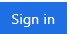
1. If you see the **Stay signed in?** screen next, select the **Yes** button to continue.
1. You may encounter a popup entitled **Welcome to Microsoft Azure** with options to **Start tour** and **Maybe later** Choose **Maybe later**. [Ignore the Step no. 5, if didn't get the popup message]

   > _Great! You are now logged in to the Azure Portal._

### Part B - Deployment of Resources Through Ansible Playbooks

   > _Here, first of all, we will see how we can deploy resources such as Azure Cosmos DB Account through Ansible Playbooks._
   
   > **NOTE**: In case you face any problem with deploying resources through ansible or wants to skip this part, go to the [Workaround section](#workaround).

   > To know more about **Ansible**, visit the offical site https://www.ansible.com.
1. Minimize the browser window and navigate to the **Desktop**.
1. Now, click on the **Bash on Ubuntu on Windows** shortcut available on **Desktop**. This will launch the bash shell. <br/>
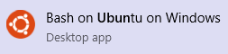
1. Follow the given steps to install **Ubuntu on Windows**. Press **y** to continue. This process may take some time. If your screen is not updated for a long time, say 2-3 minutes, then hit the **enter** button on keyboard to refresh the screen. <br/>

1. Once it asks you to **Enter new UNIX username:**, ignore it and close the **Bash on Ubuntu on Windows** window.
    > **Note:** In our case, we would need to execute all the commands with the `root` user only. So we don't require any UNIX user.
1. Now, relaunch the **Bash on Ubuntu on Windows** by clicking **Bash on Ubuntu on Windows** shortcut available on **Desktop** and continue with the below steps.
    > **Note:** If you have created the UNIX user accidentally, the to switch to the `root` user run below command and provide the UNIX user password provided while creating the user. 
    ```cmd
    sudo su -
    ```
1. Execute the following command in **Ubuntu bash** to install **Ansible**.
   ```cmd
   apt-get update && apt-get install -y libssl-dev libffi-dev python-dev python-pip && pip install ansible[azure]
   ```
   > **Note:** This will take some time to install the ansible packages in the system. If your screen is not updated for a long time, say 2-3 minutes, then hit the **enter** button on keyboard to refresh the screen.

1. Execute below command to create the folder and then navigate into the newly created folder.
   ```cmd
   mkdir ansible
   cd ansible
   ```
1. Now create the `ansible_playbook.yml` file using `vi editor`.   
   ```cmd
   vi ansible_playbook.yml
   ```
   > **Playbooks** are Ansible’s configuration, deployment, and orchestration language. To know more about Ansible Playbook, visit [Ansible official site](http://docs.ansible.com/ansible/latest/playbooks.html).

1. Copy the playbook content given below.
   
   ```yml
   - hosts: localhost
     vars:
         ad_user: "your user email address"
         password: "your password"
         subscription_id: "your subscription id"
     tasks:
       - name: Get facts for one resource group
         azure_rm_resourcegroup_facts:
             ad_user: '{{ ad_user }}'
             password: '{{ password }}'
             subscription_id: '{{ subscription_id }}'
         register: result

       - name: Create Azure Deploy
         azure_rm_deployment:
             ad_user: '{{ ad_user }}'
             password: '{{ password }}'
             subscription_id: '{{ subscription_id }}'
             #state: present
             template_link: 'https://raw.githubusercontent.com/Microsoft/developer-immersion-data/master/labs/sp-gda/gdaexpericence1/story_a_gda_using_cosmosdb/devops/template.json'
             parameters_link: 'https://raw.githubusercontent.com/Microsoft/developer-immersion-data/master/labs/sp-gda/gdaexpericence1/story_a_gda_using_cosmosdb/devops/parameters.json'
             resource_group_name: '{{ result.ansible_facts.azure_resourcegroups[0].name }}'
             location: "southcentralus"
   ```
1. Now, move to **Ubuntu Bash** and press **I** button from the keyboard to enable **INSERT** mode in **vi editor**. <br/>
   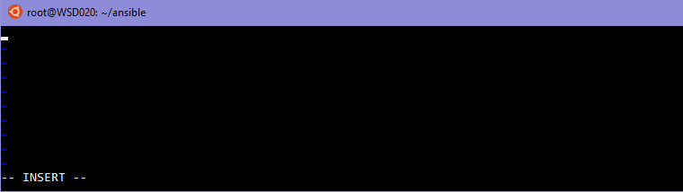
1. Paste the content copied in **step 9** in the **ansible_playbook.yml** file by right click on the **Ubuntu Bash** then select **Edit** -> **Paste**.
1. Provide the **ad_user**, **password** and **subscription_id** as given below against respective keys in the **ansible_playbook.yml**.

   - ad_user: **<inject key="AzureAdUserEmail" />**
   
   - password: **"<inject key="AzureAdUserPassword" />"**

   - subscription_id: **<inject story-id="story://Content-Private/content/dfd/SP-GDA/gdaexpericence1/story_a_gda_using_cosmosdb" key="subscriptionId"/>**

    > **NOTE**: Make sure to wrap the **password** value in the quotes.

1. Press **Esc** key and then press **:wq** to save and exit the file in vi editor.
1. Once the playbook file is saved execute the given command to run the **Ansible playbook** in **Ubuntu Bash**.
   ```cmd
   ansible-playbook ansible_playbook.yml
   ``` 
   > It may take some time to successfully execute Ansible Playbook.
1. Now go to **Azure Portal** launched in the browser and click on **Resource groups** named **<inject story-id="story://Content-Private/content/dfd/SP-GDA/gdaexpericence1/story_a_gda_using_cosmosdb" key="myResourceGroupName"/>** present in the **Resource groups** panel. 
1. Notice that, the new Cosmos DB **<inject story-id="story://Content-Private/content/dfd/SP-GDA/gdaexpericence1/story_a_gda_using_cosmosdb" key="cosmosDBWithSQLDBName"/>** is deployed through **Ansible playbook**.
   > Great! Just now you learned how to deploy resources through Ansible playbooks.

### Part C Configure your Nodejs application to connect with Cosmos DB

   > _In this part, you will learn how to configure your Node.JS application to connect with Cosmos DB._

   > **NOTE:**
   > For this scenario, Cosmos DB Account **<inject story-id="story://Content-Private/content/dfd/SP-GDA/gdaexpericence1/story_a_gda_using_cosmosdb" key="cosmosDBWithSQLDBName"/>**  
   is deployed in **South Central US** region under **Resource group <inject story-id="story://Content-Private/content/dfd/SP-GDA/gdaexpericence1/story_a_gda_using_cosmosdb" key="myResourceGroupName"/>**

1. To download the ContosoAir app source code launch the **Command Prompt** by pressing **Win+R** on your keyboard and then, type **cmd** and select the **OK** button.
1. Now, run the below commands to clone the application
   ```cmd
   git clone https://github.com/Click2Cloud/gdaexperience1-story-a c:\source\experience1
   ```
2. Navigate to the **c:\source\experience1** folder using **File Explorer** and double click on **ContosoAir.Website_and_Services.sln** file to load the project into **Visual Studio 2017** IDE.

    **OR**

    Click [here](launch://launch_visual_studio) to launch the solution directly.

    > **NOTE**: If you see **How do you want to open this file?** window, just select the **OK** button to continue. This may take some time to load the project. 

1. If prompted to **Sign in**, click **Sign in** button.
1. In the **Email or phone** field, enter **<inject key="AzureAdUserEmail"/>**
1. In the **Password**, enter **<inject key="AzureAdUserPassword"/>** and click on **Sign in** button.
1. On the **Welcome screen**, click on **Start Visual Studio** button.
    > This may take some time to prepare the user profile. 
1. Now, in the **ContosoAir.Website_and_Services - Microsoft Visual Studio**, double click on the **config.json** from the **Solution Explorer** file to open.<br/>

   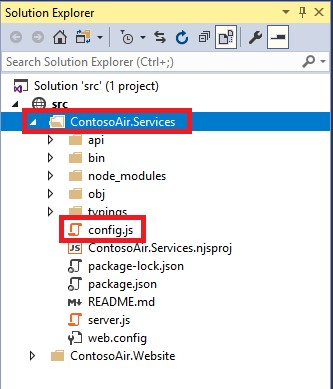

1. In this configuration file, we need to provide the values for **DOCUMENT_DB_ENDPOINT** and **DOCUMENT_DB_PRIMARYKEY**. To get the values, navigate back to **Azure Portal** launched in Part A and then select the resource group **<inject story-id="story://Content-Private/content/dfd/SP-GDA/gdaexpericence1/story_a_gda_using_cosmosdb" key="myResourceGroupName"/>** and click on **Azure Cosmos DB Account** **"<inject story-id="story://Content-Private/content/dfd/SP-GDA/gdaexpericence1/story_a_gda_using_cosmosdb" key="cosmosDBWithSQLDBName"/>"**.
1. Click on **Keys** option present under **Cosmos DB Account** blade, and copy **URI** and **PRIMARY KEY**. <br/>

   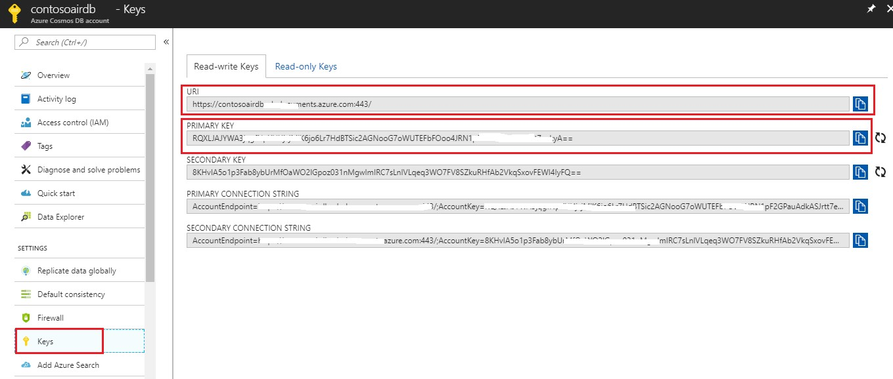

1. Go back to **Visual Studio 2017** IDE and paste the **URI** value against **DOCUMENT_DB_ENDPOINT**, **PRIMARY KEY** against **DOCUMENT_DB_PRIMARYKEY** and **DOCUMENT_DB_DATABASE** as **'contosoairdb'**, given by default in the **config.js**.

   

1. Navigate back to the **Azure Portal's** **Resource groups** option present in the favourites menu on the left side panel and select the resource group **"<inject story-id="story://Content-Private/content/dfd/SP-GDA/gdaexpericence1/story_a_gda_using_cosmosdb" key="myResourceGroupName"/>"** and click on **Azure Cosmos DB Account** **<inject story-id="story://Content-Private/content/dfd/SP-GDA/gdaexpericence1/story_a_gda_using_cosmosdb" key="cosmosDBWithSQLDBName"/>** then, click on **Replicate data globally** option present under **SETTINGS** section in **Cosmos DB Account** blade.
1. Copy the **WRITE REGION** and paste it against **DOCUMENT\_DB\_PREFERRED\_REGION** key in **config.js** file which is already opened in **Visual Studio 2017** IDE and save this file.

   > **NOTE:** When you set the region name in **DOCUMENT\_DB\_PREFERRED\_REGION** key, it will use the same region for all the database operations such as reading and writing data.

1. In the **Solution Explorer** window, right click on "**ContosoAir.Services**" project and click on **Open Command prompt Here...** option.

   

1. Now execute the following commands one by one in command prompt by pressing **enter** key.
   ```cmd
   npm install
   ```
   ```
   node sql_db_flightinsert.js
   ```  
   ```
   node sql_db_insert.js
   ```

1. It will create three different collections named **SeatsCollection**, **DealsCollection** and **BookingsCollection** with sample data.
1. Switch to **Azure Portal** as launched in **Part A**, navigate to **Resource groups** option present in the favourites menu on the left side panel and select the resource group **<inject story-id="story://Content-Private/content/dfd/SP-GDA/gdaexpericence1/story_a_gda_using_cosmosdb" key="myResourceGroupName"/>** then click on **Azure Cosmos DB Account** named **<inject story-id="story://Content-Private/content/dfd/SP-GDA/gdaexpericence1/story_a_gda_using_cosmosdb" key="cosmosDBWithSQLDBName"/>**.
1. Click on **Data Explorer** option. It will display the collection created in **Azure Cosmos DB Account** from **Step 15**.

   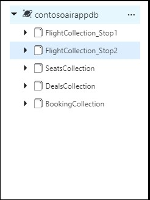

   > _Great Job!! Here you have successfully imported data into Cosmos DB._

### Part D - Creating Azure Functions

  > _Let's create an Azure Function to retrieve data of flight deals._

1. Go to **Resource groups** option 
   present in the favourites menu on the left side panel and select the resource group **<inject story-id="story://Content-Private/content/dfd/SP-GDA/gdaexpericence1/story_a_gda_using_cosmosdb" key="myResourceGroupName"/>** and click on Azure Function named **<inject story-id="story://Content-Private/content/dfd/SP-GDA/gdaexpericence1/story_a_gda_using_cosmosdb" key="azureFunctionName"/>**.
 
1. Hover over the **Functions** under **Functions Apps** and click on **+ sign** besides **Functions**.
  
1. Now, click on the **Custom function** link present at the bottom of the page.

    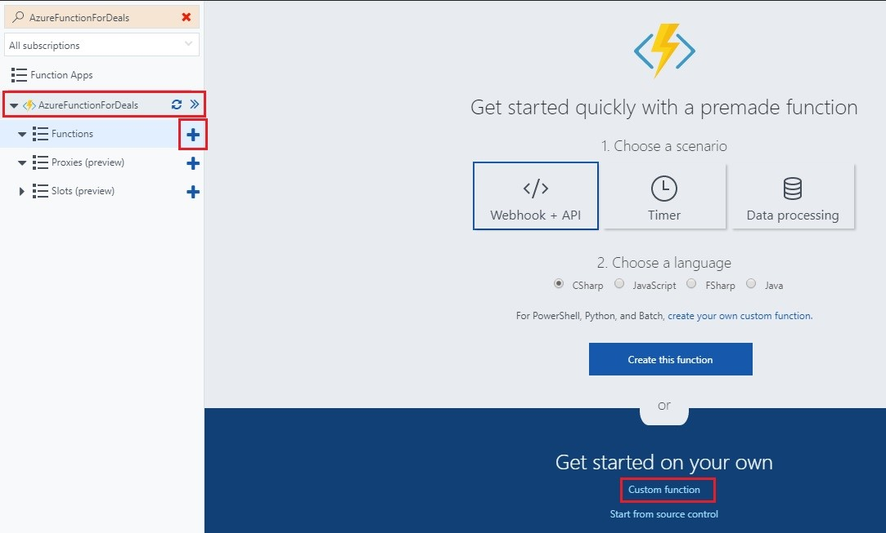

1. Click on **C#** template available in **HTTP trigger** section and name the function as "**FetchDealsData**" in **Name** textbox and click **Create** button.
1. A function with sample default code would get created. Now, replace the sample default code with the code snippet given below.

    ```c#
    using System.Net;
    using System.Linq;

    public static HttpResponseMessage Run(HttpRequestMessage req, TraceWriter log, IEnumerable<dynamic> SelectDealsData)
    {
        return req.CreateResponse(HttpStatusCode.OK, SelectDealsData);
    }
    ```

    > **NOTE:**
    > In above code snippet, **IEnumerable&lt;dynamic> SelectDealsData** is a parameter used to fetch the list of **DealsData** collection from Cosmos DB. This method returns the result fetched from Cosmos DB along with **HttpStatusCode** with the help of **CreateResponse** method.

1. Click on **Save** button. 
1. Now, click on the **Integrate** option listed in **"FetchDealsData"** function in the **Function Apps** blade.

1. Under **Inputs** section, click on **+ New Input** and select **Azure Cosmos DB** then click **Select** button at the bottom of page.

    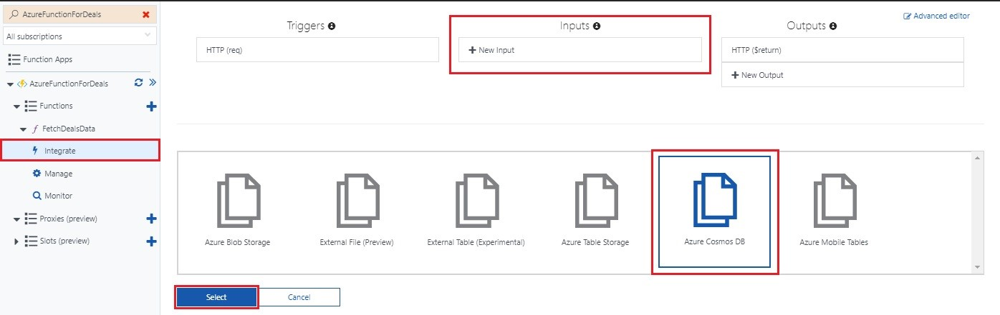

1. Enter **Document parameter name** as **SelectDealsData**, **Database name** as **contosoairdb** and **Collection name** as **DealsCollection** in respective textboxes.
 
1. Copy the **SQL query** given below and paste it into **SQL Query (optional)** textbox.

    ```sql
   select c.id, c.fromName, c.fromCode, c.toName, c.toCode, c.price, c.departTime, c.arrivalTime, c.hours, c.stops, c.since from c
    ```

    > **NOTE:** Above **SQL query** is responsible to get deals details from **DealsCollection** available in Cosmos DB like id, from name, from code, to name, to code, price, depart time, arrival time, hours, stops, since. (Ignore non-mandatory fields)

    

1. To enter **Cosmos DB account connection,** click on the **new** link given beside **Cosmos DB account connection** textbox.
1. You will be redirected to **Document DB Account blade**, select the **Document DB Account** named as **<inject story-id="story://Content-Private/content/dfd/SP-GDA/gdaexpericence1/story_a_gda_using_cosmosdb" key="cosmosDBWithSQLDBName"/>**.
1. Now, click **Save** button  button.
1. To check whether the function is integrated, click on **FetchDealsData** function present under **AureFunctionForDeals** function app blade and click on **Test** option present at the right most corner.

   

1. Select **HTTP method** as **GET** from the dropdown. Then click **Run** button  at the bottom.
1. Status **200 Ok** will be displayed once the test is completed which signifies that the function is integrated successfully.

   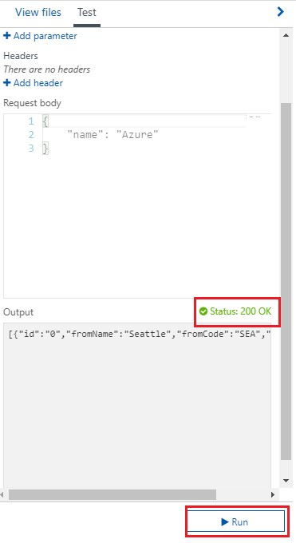

   > _Here you go! You have successfully created Azure Function to_ _retrieve flight deals_ _data from_ **Cosmos DB**_._

1. In the **Functions Apps** blade, click on **FetchDealsData**.
1. You will get navigated to function and will find **</> Get function URL** link in the top right corner of the page. Click on the link .
1. On clicking **</> Get function URL** you will get a popup window with a URL.

    
1. Click on **Copy**  icon to copy the given URL and paste it against **AZURE\_FUNCTION\_DEALS\_URL:** variable in **config.js file** opened in **Visual Studio 2017** IDE and save the file.

   > _Awesome, you have created Azure Function for Deals data._

### Part E Launching ContosoAir Website and Services

   > _In this part, you will learn how to enable the services and launch_ **ContosoAir website**_._

1. To start the ContosoAir app service layer, go to **Command Prompt** which was already launched in **Step 14 of Part C** and type command **npm start** to start the service.
   ```cmd
   npm start
   ```

   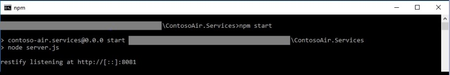

2. You may encounter a popup for **Windows Firewall ...**. Click on **Cancel** button to close the pop up.

1. To run the ContosoAir Website locally, go to **Solution Explorer** window, right click on "**ContosoAir.Website"** project and click on **Open Command Prompt Here...** option.

   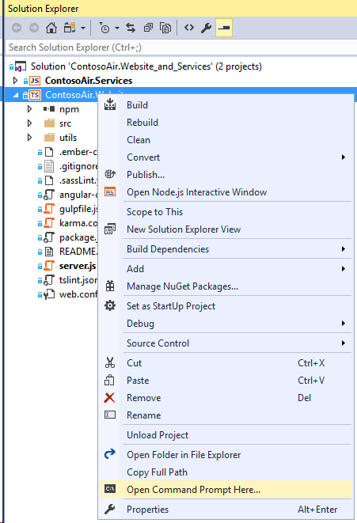

1. Now execute the following commands one by one in command prompt and by hitting enter.
    ```cmd
    npm install -g @angular/cli
    ```
    ```
    npm install
    ```
    ```
    set PATH=%PATH%;%AppData%\npm\
   ```
     > **Note:** This will install angular and all the required packages.

1. Once the above process is completed. Run **ng serve** command.
    ```cmd
   ng serve
    ```
    > **Note:** This process may take some time.

    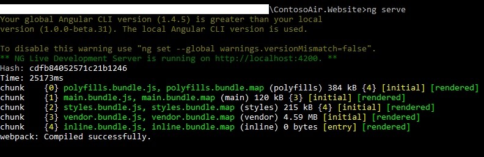

1. Copy the **localhost URL** [http://localhost:4200](http://localhost:4200) from the **Command Prompt** and paste it in **Internet Explorer** browser and press enter.

   

   > **Note:** You should have Microsoft account to access the **ContosoAir** app.

   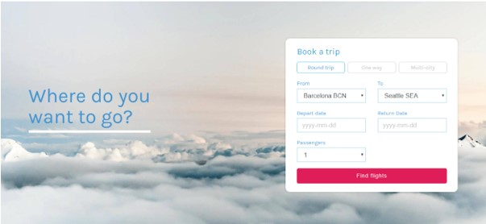

1. Once you get login, you will be redirected to **ContosoAir app**. Enter **Departure date** and **Return date** in **YYYY-MM-DD** format and click **Find Flights** button.

   > **Note:** If the browser refresh continuously then please open the **localhost URL** [http://localhost:4200](http://localhost:4200) in different browser i.e. **Edge browser** <br/>

   

1. It will show the time required to retrieve the flight data from **South Central US** region at the top of the webpage.
1. The time displayed is in the milliseconds.
   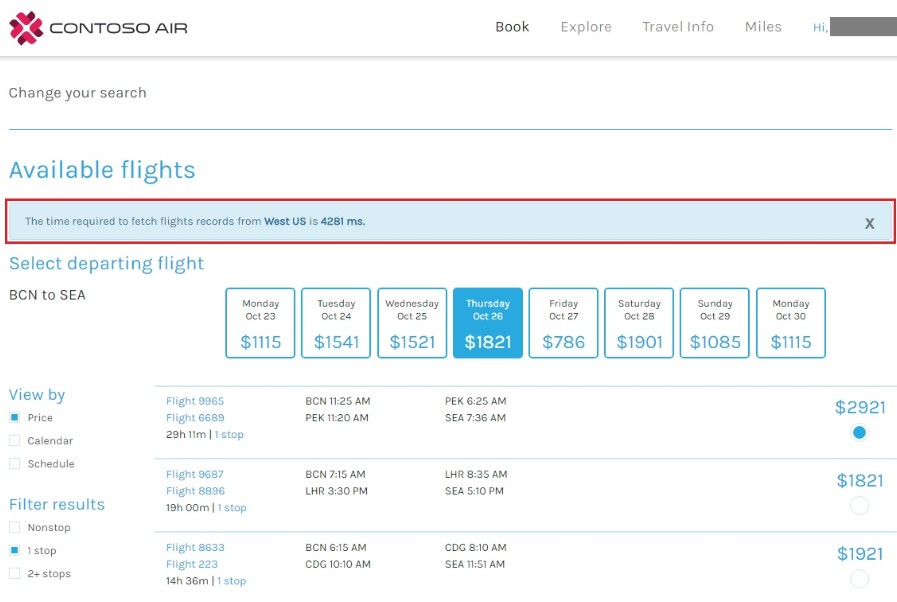
   > **NOTE:**
   > Suppose your current region is **South Central US** and the database is also present in **South Central US** region then it will give you Low Latency, but for the region which is far away from your current region you will face High Latency.
   > The concept of **high** latency will be better understood if your current location is far away from the region where your database is located.

### Part F: Global Database Replication

   > Replication protects your data and preserves your application up-time in the event of transient hardware failures. If your data is replicated to a second data center, it's protected from a catastrophic failure in the primary location.

   > Replication ensures that your storage account meets the  [Service-Level Agreement (SLA) for Storage](https://azure.microsoft.com/support/legal/sla/storage) even in the face of failures. See the SLA for information about Azure Storage guarantees for durability and availability.

   > _To test the above scenario of_ **Part D**, _lets replicate the database into multiple regions. Below is the procedure for the same._

   > **NOTE:** Cosmos DB Account named as "**<inject story-id="story://Content-Private/content/dfd/SP-GDA/gdaexpericence1/story_a_gda_using_cosmosdb" key="cosmosDBWithSQLDBName"/>"** _is already present in the_ **Resource group** _named_ **<inject story-id="story://Content-Private/content/dfd/SP-GDA/gdaexpericence1/story_a_gda_using_cosmosdb" key="myResourceGroupName"/>** _which is present in_ **South Central US.**

1. Go back to **Azure Portal** and navigate to **Resource groups** option  present in the favourites menu on the left side panel and select the resource group **<inject story-id="story://Content-Private/content/dfd/SP-GDA/gdaexpericence1/story_a_gda_using_cosmosdb" key="myResourceGroupName"/>**.
1. Click on **Cosmos DB Account** named **<inject story-id="story://Content-Private/content/dfd/SP-GDA/gdaexpericence1/story_a_gda_using_cosmosdb" key="cosmosDBWithSQLDBName"/>**
1. Click on **Replicate data globally** option present under **Cosmos DB Account** blade.

   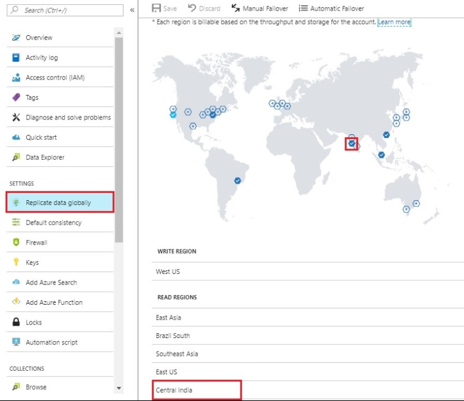

1. Select the **region** or **multiple** regions in which you want to **replicate** the database by clicking on hexagon icon.

   > For experiencing the Latency difference, replicate Azure Cosmos DB
   > - Near to your current location (Low Latency).
   > - Far away from your current location (High Latency).

   > **For e.g.** Select region which is near to your current region i.e. **South Central US** to replicate the database.

1. Click **Save** button. To view the deployment process, click **Notification Icon** 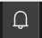.

   > **Note** :
   > - It takes some time near about 8 to 10 mins to complete the deployment of the resources till then let's take you to the concept of Multi-homing API's.

   > - You can distribute your data to any number of Azure regions, with the click of a button. This enables you to put your data where your users are, ensuring the lowest possible latency to your customers.

   > - Using Azure Cosmos DB's multi-homing APIs, the app always knows where the nearest region is and sends requests to the nearest data center. All of this is possible with no config changes. You set your write-region and as many read-regions as you want, and the rest is handled for you for more details click on given link [https://docs.microsoft.com/en-us/azure/cosmos-db/introduction](https://docs.microsoft.com/en-us/azure/cosmos-db/introduction)

1. Click on **Go to resource group** button to view the successfully created resource group.
1. Click on   to close the **notification** window.

   **OR**

1. You can go to **Resource groups** option present in the favourites menu on the left side panel and click on it to check the status of the created **replicated Cosmos DB.**
1. Once the replication process is completed, again switch to **Visual Studio 2017** IDE and open **config.js** file present under project "**ContosoAir.Services"** from the **Solution Explorer**.
1. Now change **DOCUMENT_DB_PREFERRED_REGION**  **'Name of the region where you replicated the database i.e. Read region'** and save the file.

   > For e.g. **Central India**

   

1. Go to **Command Prompt** which was already launched in **Step 14** of **Part C**. Stop the services by typing **CTRL+C** command this will terminate the process. Again, execute the command given below.

   ```cmd
   npm start
   ```
   > **Note:** We are doing this step so that all the changes done in the service will get reflected.

   

1. Go to the browser where you have launched **ContosoAir Website** and refresh the page and enter **Departure date** and **Return date** in **YYYY-MM-DD** format and click **Find Flights** button.
1. Now, you will observe that after replication to the region near your current region it will take **less time to retrieve flight data**. It will show the time required to fetch data on website on the top of page (**Low latency**).

> _Remember you created Azure Function in Part C, now let's check how the Flight deals data is reflected in ContosoAir Website._<br/>

   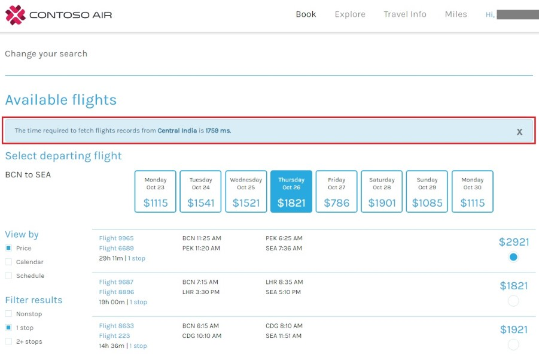

> _Awesome! In this scenario, you learned turnkey global distribution and_ **Low Latency** _feature of_ **Azure Cosmos DB.**

## Workaround

Follow the instructions to install the Cosmos DB SQL API database required to run this lab.

1. Simply open https://portal.azure.com/#create/Microsoft.Template/uri/https%3A%2F%2Fraw.githubusercontent.com%2FMicrosoft%2Fdeveloper-immersion-data%2Fmaster%2Flabs%2Fsp-gda%2Fgdaexpericence1%2Fstory_a_gda_using_cosmosdb%2Fdevops%2Ftemplate.json in **Internet Explorer**. Follow the wizard to create the resources. You may need to login to the Azure Portal. The resources will be deployed to a Resource Group named **<inject story-id="story://Content-Private/content/dfd/SP-GDA/gdaexpericence1/story_a_gda_using_cosmosdb" key="myResourceGroupName"/>**.

1. Once the resource is deployed, go back to [Part C: Configure your Nodejs application to connect with Cosmos DB](#part-c-configure-your-nodejs-application-to-connect-with-cosmos-db)