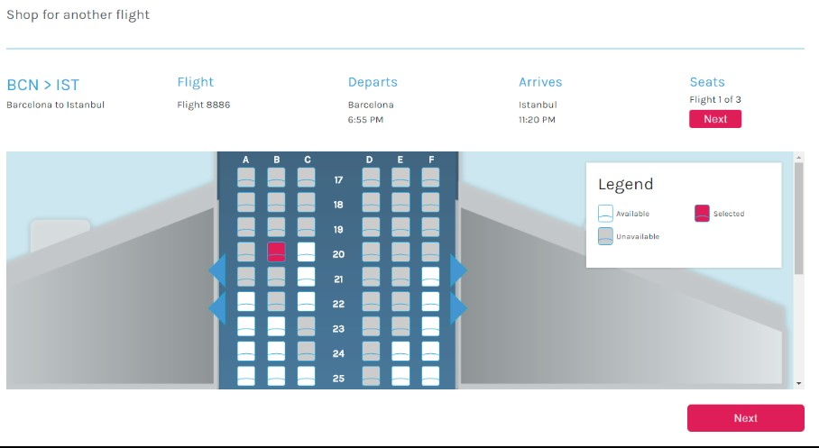
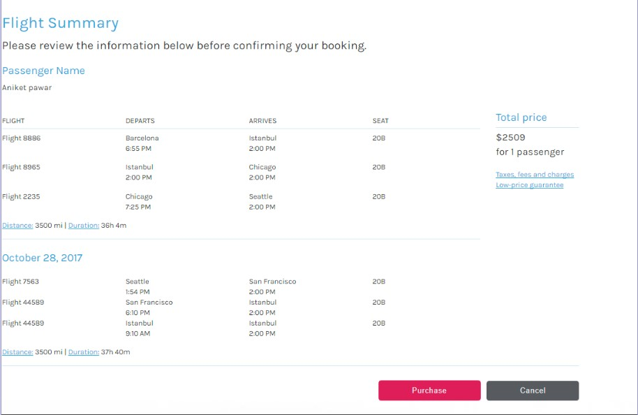
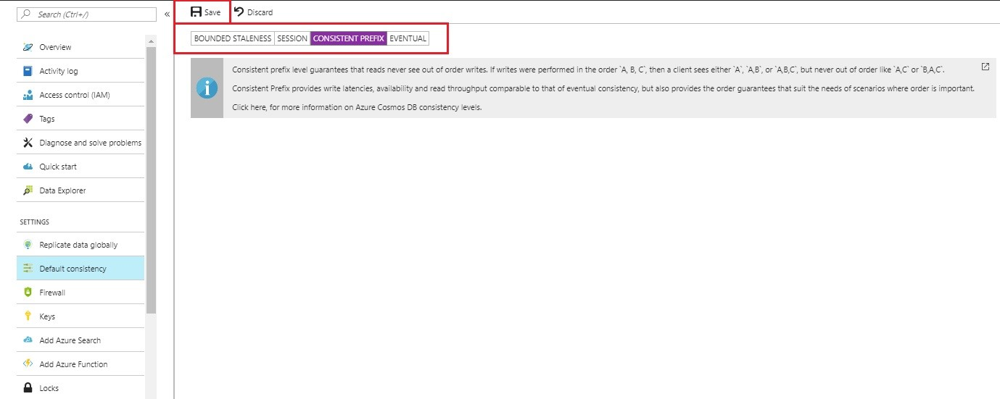

<page title="Consistency"/>

## Scenario 2: Consistency

### Part A Distributed databases and consistency

Data consistency means the data is same across all the regions at any given point of time.

   > Currently, **Azure Cosmos DB** provides five consistency levels: **strong**, **bounded**, **staleness**, **session**, **consistent prefix**, and **eventual**. In this experience, we are using the **SESSION** as a default consistency level.

1. Switch to **Azure Portal** by clicking on the link [http://portal.azure.com](launch://launch_azure_portal) as launched in **Scenario 1**, navigate to **Resource groups** option present in the favourites menu on the left side panel and select the resource group **<inject story-id="story://Content-Private/content/dfd/SP-GDA/gdaexpericence1/story_a_gda_using_cosmosdb" key="myResourceGroupName"/>** and click on Azure Cosmos DB Account **<inject story-id="story://Content-Private/content/dfd/SP-GDA/gdaexpericence1/story_a_gda_using_cosmosdb" key="cosmosDBWithSQLDBName"/>"**.

1. Click on **Replicate data globally** option present under **Cosmos DB Account** blade.

1. As shown in the image below, your write region is **South Central US**. Using this way you can see the write region, all the operations associated to insert, update, delete will get performed in **write region** only.

    

1. Switch to **Visual Studio 2017** IDE and open the **config.js** file present under **ContosoAir.Services** project in **Solution Explorer**.
1. Change the **DOCUMENT\_DB\_PREFERRED\_REGION:** value to **South Central US** and save file.

   > **NOTE:** Here your default write region is South Central US. The purpose of setting DOCUMENT\_DB\_REGION parameter in the config.js file is to fetch the updated data from that write region only.

1. Go to **command prompt** window of **ContosoAir.Services** application which you launched in Scenario 1 and then stop the services by pressing **CTRL+C** keys and again start the services by executing the command
   ```cmd
   npm start
   ```
   > **Note:** We are doing this step so that all the changes done in the service will get reflected.

   

1. Now switch to the **ContosoAir Website** which is already launched in the browser in Scenario 1, refresh the page and enter **Departure date** and **Return date** in **YYYY-MM-DD** format and click **Find Flights** button.

   

1. Flights details will be displayed, then select one flight by selecting the **radio button** present at the leftmost end and click **Next** button at the bottom of the page.

   

1. Select the seat you want to book and note the seat number, click on **Next** button to navigating to the next page.

   

1. Click on **Purchase** button to purchase the flight ticket.

   

1. Now again switch to **Visual Studio 2017** IDE and open the **config.js** file present under **ContosoAir.Services** project in **Solution Explorer** window.
1. Change the **DOCUMENT\_DB\_PREFERRED\_REGION** : **'Name of the read region which is far away from write region'** save the **config.js**

   > **NOTE:** Here the data is getting fetched from the region stated in **config.js** file.

1. Repeat the steps from **6 to 10**, you will observe that the seat you booked previously is marked with gray color which notifies that the seat is unavailable. 

   > **NOTE:**
   > - Here you will experience the **Session** Consistency of **Azure Cosmos DB**, which is the default consistency level.
   > - Though the preferred region is set to the region which is far away from write region, you will experience that the changes done in one database will get reflected quickly in another database too.
   > - On executing the step no. 13, you will observe that the seat which you booked earlier is unavailable and marked with grey color. This show that, even if you change the preferred region, the read and write operations performed in the database will be reflected at the same moment in all the regions.
1. Now Switch to **Azure Portal** by clicking on the link [https://portal.azure.com](https://portal.azure.com/) as launched in **Scenario 2**, navigate to **Resource groups** option present in the favourites menu on the left side panel and select the resource group **"<inject story-id="story://Content-Private/content/dfd/SP-GDA/gdaexpericence1/story_a_gda_using_cosmosdb" key="myResourceGroupName"/>**" and click on **Azure Cosmos DB Account** **<inject story-id="story://Content-Private/content/dfd/SP-GDA/gdaexpericence1/story_a_gda_using_cosmosdb" key="cosmosDBWithSQLDBName"/>**.

1. Click on  option present under **Azure Cosmos DB account** blade.

   

1. You can change the consistency levels from the options available **STRONG**, **BOUNDED STALENESS, SESSION, CONSISTENT PREFIX, EVENTUAL** as shown in above image and follow the **Steps 1 to 13** to observe the behavior of Cosmos DB using **ContosoAir** website and click **Save** button to save the changes.

> _Awesome! You deep dived into Multiple, well-defined consistency levels of Azure Cosmos DB. That was not that tough at all._

> _Refer the given link for further understanding on_ [_Consistency Levels_](https://docs.microsoft.com/en-us/azure/cosmos-db/consistency-levels)[_._](https://docs.microsoft.com/en-us/azure/cosmos-db/consistency-levels)