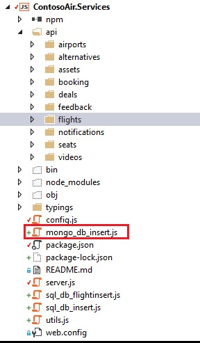
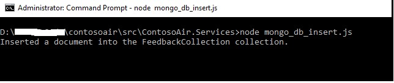
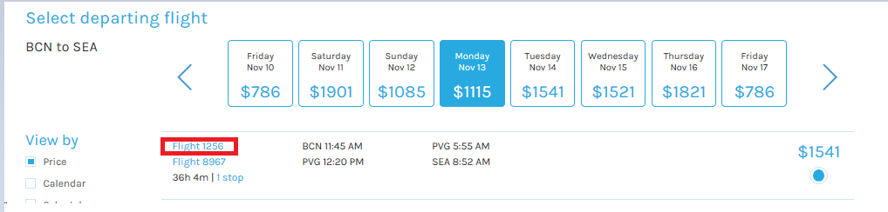
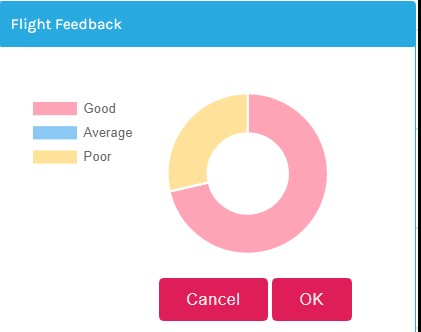
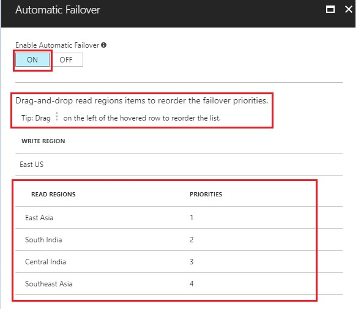
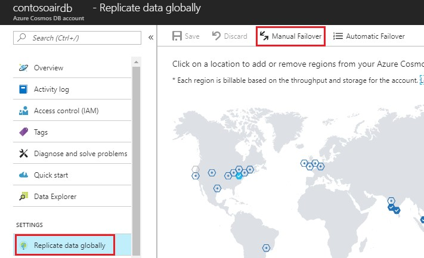
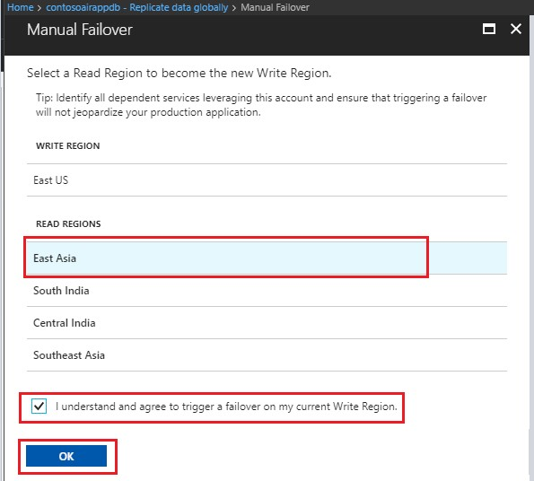

<page title="Multi-model API"/>

## Scenario 3: Multi-model API

   Till now you have used the SQL DB API of Azure Cosmos DB to store and fetch Flights, Deals, Seats and Booking data in ContosoAir Website.

   But Azure Cosmos DB is not only limited to SQL DB. You can select from the MongoDB API, Graph DB API and Table API based on your application requirement.

   > Let's see how we can use the different types of database in a single application.

### Part A - Integrating Mongo DB with ContosoAir Website

   > _Here you will perform the steps to connect your Mongo DB with ContosoAir app to fetch flights feedback data which will be displayed in graphical format._

1. On the **Azure Portal**, go to **Resource groups** option present on the favourites menu bar present at the left then, click on **<inject story-id="story://Content-Private/content/dfd/SP-GDA/gdaexpericence1/story_a_gda_using_cosmosdb" key="myResourceGroupName"/>**.
1. Click on **Mongo DB Account** named **<inject story-id="story://Content-Private/content/dfd/SP-GDA/gdaexpericence1/story_a_gda_using_cosmosdb" key="cosmosDBWithMongoDBName"/>** which is already present in the same resource group.
1. Click on **Connection String** option present under **<inject story-id="story://Content-Private/content/dfd/SP-GDA/gdaexpericence1/story_a_gda_using_cosmosdb" key="cosmosDBWithMongoDBName"/>** blade and copy **PRIMARY CONNECTION STRING** URL by clicking on  icon.
1. Now, switch to **Visual Studio 2017** IDE and open to **config.js** file present in **ContosoAir.Services** project in **Solution Explorer**.
1. Paste the **MONGO_DB_CONNECTION_STRING** URL in **config.js** file and save the changes.
   
   > _Good work! You now created connection between your database and ContosoAir app._

### Part B - Inserting collections in Mongo DB Account.

Let's import data in an existing Mongo DB Account named **<inject story-id="story://Content-Private/content/dfd/SP-GDA/gdaexpericence1/story_a_gda_using_cosmosdb" key="cosmosDBWithMongoDBName"/>** available in resource group named **<inject story-id="story://Content-Private/content/dfd/SP-GDA/gdaexpericence1/story_a_gda_using_cosmosdb" key="myResourceGroupName"/>**.

1. Go to **Visual Studio 2017** IDE and open **"mongo_db_insert.js"** file present under **ContosoAir.Services** project by double clicking on it in **Solution Explorer**

   

   > In this **mongo_db_insert.js** file, you will see how to insert the data in Mongo DB. Please go through the code and read the comments for better clarity.

1. Go to **command prompt** window of **ContosoAir.Services** application which you launched in Scenario 1 and then stop the services by pressing **CTRL+C** keys 

1. Now, execute the following command in command prompt and press enter to import flights feedback data into the Mongo DB Account named **<inject story-id="story://Content-Private/content/dfd/SP-GDA/gdaexpericence1/story_a_gda_using_cosmosdb" key="cosmosDBWithMongoDBName"/>.**
   ```cmd
   node mongo_db_insert.js
   ```
   

1. Switch to the **Azure Portal** and navigate to **Resource groups** from the option present in the favourites menu on the left side panel and select the resource group **"<inject story-id="story://Content-Private/content/dfd/SP-GDA/gdaexpericence1/story_a_gda_using_cosmosdb" key="myResourceGroupName"/>**".
1. Now, click on MongoDB Account named **"<inject story-id="story://Content-Private/content/dfd/SP-GDA/gdaexpericence1/story_a_gda_using_cosmosdb" key="cosmosDBWithMongoDBName"/>**".
1. Go to **Data Explorer** option present under **<inject story-id="story://Content-Private/content/dfd/SP-GDA/gdaexpericence1/story_a_gda_using_cosmosdb" key="cosmosDBWithMongoDBName"/>**. Then go to your collection named **flightfeedback** which was imported through previous steps and click on it to expand.
1. Click on **Documents** option, Json data with ID's will appear on left side panel.

1. Now, we will see how we can fetch the Mongo DB data and SQL data from the database in our ContosoAir app.
1. Expand the **api** folder under **ContosoAir.Services** and then **flights** folder. Double click on **flights.controller.js** file to open it in Visual Studio.
1. Go to line number **106** and go through the declared function **getFlightFeedback** code and read the comments for better clarity.

    > **NOTE:** 
    In this Nodejs code you will see how you can fetch the data from **Mongo DB API**. Please go through the code and read the comments for better clarity.

1. Next, to see, how to fetch data from SQL API, go to the line number **44** where **get** method is defined. Go through the code and read the comments for better clarity

   > **NOTE:**
   In this Nodejs code you will see how you can fetch the data from **SQL API**.  Please go through the code and read the comments for better clarity.

   > _Congratulations! Your Mongo DB data is imported successfully into your Mongo DB Account._

### Part C - Launching ContosoAir website to see flights feedback data

 In this part, you will learn how to enable the services and launch ContosoAir app to see how the data is retrieved.

1. Go to **command prompt** window of **ContosoAir.Services** application and then run below command to start the service 
   ```cmd
   npm start
   ```
   > **Note:** We are doing this step so that all the changes done in the service will gets reflected.

1. Now switch to **ContosoAir Website** which is already launched in browser refresh the page and enter **Departure date** and **Return date** in **YYYY-MM-DD** format and click **Find Flights** button.

   

1. Flight details will be displayed then, click on one of the flight ID links (present in the flight details).
   > **Note:** Feedback Graph will going to appear in the middle of the screen. So please scroll down to see.

   
1. **Flights feedback** data will be displayed in graphical format which is coming from Mongo DB database.

   

   > _Awesome! Here you learned how to use SQL API and Mongo DB API of Azure Cosmos DB into same application (website) i.e. Multi-Modal API which is one of the feature of Azure Cosmos DB._

   > _Flights details is stored in SQL DB and Flight feedback data is stored in Mongo DB._

### Part D - Automatic regional failover for business continuity in Azure Cosmos DB

Cosmos DB supports both explicit and policy driven failovers that allow you to control the end-to-end system behavior in the event of failures.

#### Configuring multi-region applications

   > _Before we dive into failover modes, we look at how you can configure an application to take advantage of multi-region availability and be resilient in the face of regional failovers._

**ContosoAir website** is already deployed in multiple regions. To ensure low latency access every region your application is deployed, configure the corresponding  [**preferred regions list**](https://msdn.microsoft.com/library/microsoft.azure.documents.client.connectionpolicy.preferredlocations.aspx#P:Microsoft.Azure.Documents.Client.ConnectionPolicy.PreferredLocations) for each region via, **config.js** file.

#### Automatic Failover

1. In the rare event of an **Azure regional outage**, **data center outage**, Cosmos DB automatically **triggers failovers** of all Cosmos DB accounts with a presence in the affected region.
1. Cosmos DB accounts with a **read region** in one of the affected regions are automatically disconnected from their **write** region and **marked** offline.
1. The **Cosmos DB SDK** implement a regional discovery protocol that allows them to automatically detect when a region is available and redirect read calls to the next available region in the **preferred region** list. If none of the regions in the preferred region list is available, calls automatically fall back to the current write region.
1. Once the affected region recovers from the outage, all the affected Cosmos DB accounts in the region are automatically recovered by the service. Cosmos DB accounts that had a read region in the affected region will then automatically sync with current write region and turn **online**.
1. The **Cosmos DB SDK** discover the availability of the new region and evaluate whether the region should be selected as the current read region based on the **preferred region list** configured by the application.

   > _Now let's see how to change priorities of preferred region list._

1. Navigate to **Azure Portal's** **Resource groups** option present in the favourites menu on the left side panel and select the resource group **"<inject story-id="story://Content-Private/content/dfd/SP-GDA/gdaexpericence1/story_a_gda_using_cosmosdb" key="myResourceGroupName"/>**" and click on **Azure Cosmos DB Account** **"<inject story-id="story://Content-Private/content/dfd/SP-GDA/gdaexpericence1/story_a_gda_using_cosmosdb" key="cosmosDBWithSQLDBName"/>"**.
1. Click on **Replicate data globally** option present under **Cosmos DB Account** blade. Then click on **Automatic Failover** menu present on the top of the page.

   

1. If the affected region is the current write region and automatic failover is enabled for the **Azure Cosmos DB account**, then the region is automatically marked as **offline**. Then, an alternative region is promoted as the **write** region for the affected **Azure Cosmos DB account**.
1. Once you get redirected to **Automatic Failover** page, click **ON** button to enable automatic failover.
1. Drag-and-drop read regions items to reorder the failover priorities.

    

1. Click **OK**  button to save the changes made.
1. Once the affected region recovers from the **outage**, all the affected Cosmos DB accounts in the region are automatically recovered by the service.

   > _Given is the concept of Automatic failover. Now let's dive into the concept of Manual failover._

#### Manual Failover

1. In addition to **automatic failovers**, the current **write region** of a given Cosmos DB account can be manually changed dynamically to one of the existing **read regions**.
1. Manual failovers ensure  **zero data loss**  and  **zero availability loss** and gracefully transfer write status from the old write region to the new one for the specified Cosmos DB account.
1. Like in automatic failovers, the **Cosmos DB SDK** automatically handles write region changes during manual failovers and ensures that calls are automatically redirected to the new write region.
1. Navigate to **Azure Portal's** **Resource groups** option present in the favourites menu on the left side panel and select the resource group **"<inject story-id="story://Content-Private/content/dfd/SP-GDA/gdaexpericence1/story_a_gda_using_cosmosdb" key="myResourceGroupName"/>**" and click on Azure Cosmos DB Account **"<inject story-id="story://Content-Private/content/dfd/SP-GDA/gdaexpericence1/story_a_gda_using_cosmosdb" key="cosmosDBWithSQLDBName"/>"**.
1. Click on **Replicate data globally** option present under **Cosmos DB Account** blade. Then click on **Manual Failover** menu present on the top of page.

   

1. Once you get redirected to the **Manual failover** page, select a **Read Region** to change it into the new **Write** **Region**.
1. Click on checkbox  **I understand and agree to trigger a failover on my current Write Region** given below and click **OK** button to save the changes done.

   

1. If your applications have predictable traffic patterns based on the time of the day, you can periodically change the write status to the most active geographic region based on time of the day.

> _In this article, we understood how manual and automatic failovers work in Cosmos DB, and how you can configure your Cosmos DB accounts and applications to be globally available. By using Cosmos DB's global replication support, you can improve end-to-end latency and ensure that they are highly available even in the event of region failures._
