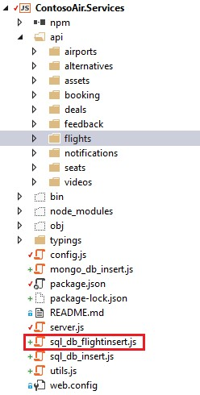
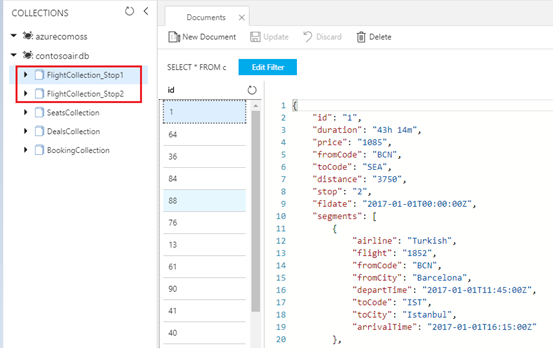

<page title="Partitioning"/>

## Scenario 4: Concept of Logical Partitioning

1. In **Azure Cosmos DB**, you can store and query schema-less data with order-of-millisecond response times at any scale.
1. Azure Cosmos DB provides **containers** for storing data called **collection.** **Containers** are logical resources and can span one or more physical partitions or servers.
1. The number of partitions is determined by Azure Cosmos DB based on the **storage** **size** and the provisioned **throughput** of the container.
1. Partition management is fully managed by **Azure Cosmos DB**, and you don't have to write complex code or manage your partitions. **Azure Cosmos DB** containers are unlimited in terms of **storage** and **throughput.**
1. When you create a collection, you can specify a  **partition key** property. **Partition key** is the JSON property (or path) within your documents that can be used by **SQL API** to distribute data among multiple partitions.
1. **SQL API** will hash the partition key value and use the hashed result to determine the partition in which the JSON document will be stored. All documents with the same partition key will be stored in the same partition.

   >_In_ **Azure Cosmos DB,** logical partitioning _gets created based on the_ **size** _of the collection i.e. more than_ **10 GB** _or the specified **throughput of the container** (throughput in terms of [request units_](https://docs.microsoft.com/en-us/azure/cosmos-db/request-units) (RU) per second)._

   >_Physical partitioning_ **Partitioning** _is completely managed by_ **Azure**_. It automatically creates a_ **Logical Partition** _based on the_ **Partition key**. But in this case, just to show you the power of **Partitioning** feature of Azure Cosmos DB, we have created the **Physical partition.** 

1. Data collection on which partitioning need to be performed is already imported in the section 1.
1. Here, we had split the collection into two based on the partition key i.e. **Stops**.
1. To verify the collection created in the database, navigate to **Azure Portal's Resource groups** option present in the favourites menu on the left side panel and select the resource group **<inject story-id="story://Content-Private/content/dfd/SP-GDA/gdaexpericence1/story_a_gda_using_cosmosdb" key="myResourceGroupName"/>** and click on **Azure Cosmos DB Account** **"<inject story-id="story://Content-Private/content/dfd/SP-GDA/gdaexpericence1/story_a_gda_using_cosmosdb" key="cosmosDBWithSQLDBName"/>"**.
1. Go to **Data Explorer** menu present under **Cosmos DB Account** blade to check the collections inserted named **FlightCollection\_Stop1** and **FlightCollection\_Stop2.**
1. Now, go back to Visual Studio and double click on file **sql\_db\_flightinsert.js** present under **ContosoAir.Services** project from **Solution Explorer**.

   
1. In the **sql\_db\_flightinsert.js** file, go to the line no. **34** and go through the code. The **createFlightsCollection** function splits the data into two collections based on the partition key.

    > **NOTE**: Selection of partition key is an important task as based on that your collection divides into partitions.

1. This code creates two physical partitions called **FlightData\_Stop1** and **FlightData\_Stop2** based on the **partition key**.

   

1. In this case the **Stop** field is set as a **partition key**.

1. Now, let's see the code snippet to retrieve the data from both the collections which were created using partition key.
1. Double click on file **flights.controller.js** file present under **api\flights** folder under **ContosoAir.Services** project from **Solution Explorer** and go to the line no **44**.
1. The defined **get** method retrieves the data from both the collections which were created using partition key.
   
   > **Note:** Selection of appropriate partitioning key is important, as based on this all the logical partition gets created. So always analyze your data before creating a partition key.

   > _In this part, you learned how the_ **physical partitioning** is created but in Azure Cosmos DB. **Logical partitioning** gets created automatically based on the **size** of the collection i.e. more than **10 GB** or the specified **throughput of the container** i.e. throughput in terms of [request units](https://docs.microsoft.com/en-us/azure/cosmos-db/request-units) (RU) per second.

   > **Partitioning** is completely managed by **Azure**. But in this case just to show you the power of **Partitioning** feature of **Azure Cosmos DB**, we have created **Physical partitioning**.  

> Awesome! In this scenario, you learned the Partitioning feature of  Azure Cosmos DB.