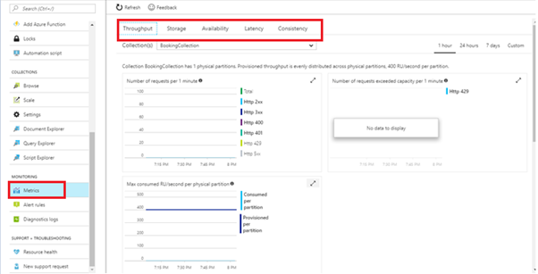
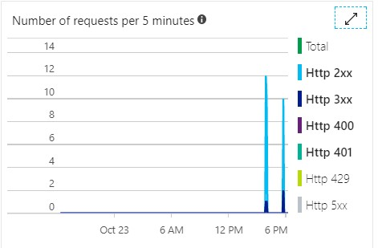
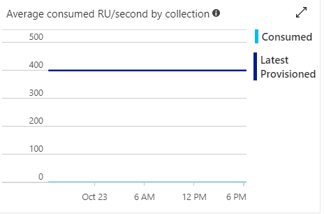
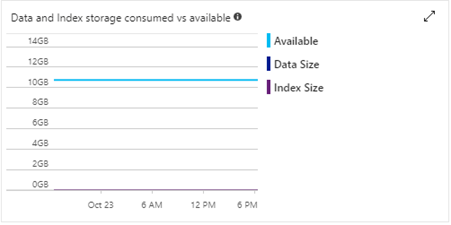
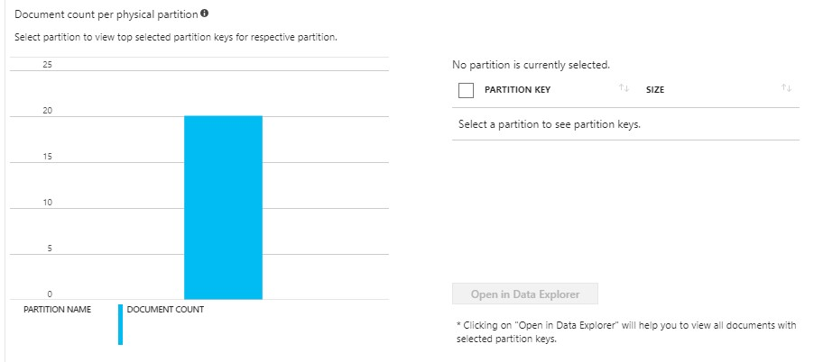
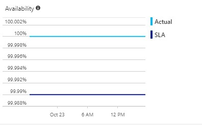
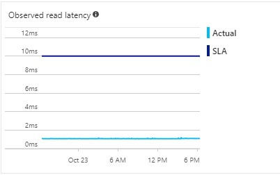
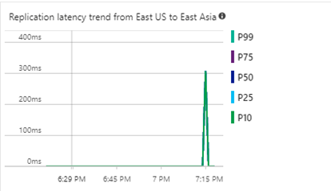
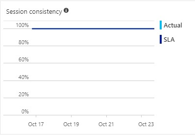

<page title="Service Level Agreements"/>

## Azure SQL API Service Level Agreements

Cloud service offering a comprehensive SLA for:

1. **Availability:** The most classical SLA. Your system will be available for more than 99.99% of the time or you get a refund.
1. **Throughput:** At a collection level, the throughput for your database collection is always executed according to the maximum throughput you provisioned.
1. **Latency:** Since speed is important, 99% of your requests will have a latency below 10ms for document read or 15ms for document write operations.
1. **Consistency:** Consistency guarantees in accordance with the consistency levels chosen for your requests.

   >_Now let's walk through different SLA's and see how the data is displayed in graphical format._

1. Click on Azure Portal's **Resource Group** option present in the favourites blade in the left side panel and click on **<inject story-id="story://Content-Private/content/dfd/SP-GDA/gdaexpericence1/story_a_gda_using_cosmosdb" key="myResourceGroupName"/>.**
1. Click on **"<inject story-id="story://Content-Private/content/dfd/SP-GDA/gdaexpericence1/story_a_gda_using_cosmosdb" key="cosmosDBWithSQLDBName"/>"** which is your **Cosmos DB Account** and then click on **Metrics** option present under **Cosmos DB Account** blade.
1. SLA's based on parameters such as **Throughput, Storage, Availability, Latency and Consistency** will be viewed.

   

#### Charts included under Throughput menu

1. Click on **Throughput** menu to view the graphs.
1. The first graph displayed is to find **Number of requests over the 1 hour period.**

   

1. The second graph is to monitor **Number of requests that failed due to exceeding throughput or storage capacity provisioned for the collection per 5 min.**
1. The third chart displays **provisioned throughput and Max Request Units per second (RU/s) consumed by a physical partition, over a given 5-minute interval, across all partitions.**

    

1. This chart **displays provisioned throughput and Max Request Units per second (RU/s) consumed by each physical partition over the last observed 1-minute interval.**

    

1. The fourth chart shows the **Average Consumed Request Units per second (RU/s) over the 5-minute period vs provisioned RU/s.**

    

    #### Charts included under Storage menu.

1. Click on **Storage** menu to view the graphs.
1. The first graph displays the **Available storage capacity for this collection, current size of the collection data, and index.**

    

1. Another graph shows the **Current size of data and index stored per physical partition.**

    

1. The third chart shows the **Current number of documents stored per physical partition**.

    

    #### Charts included under Availability menu.

1. Click on **Availability** menu to view the graphs.
1. The chart displays the **Availability is reported as % of successful request over the past hour, where successful is defined in the DocumentDB SLA.**

    

    #### Charts included under Latency menu.

1. Click on **Latency** menu to view the graphs.
1. First graph displays **the Latency for a 1KB document lookup operation observed in this account's read regions in the 99th percentile.**

    

1. Another graph displays the Latency for a 1KB document write operation observed in South Central US in the 99th percentile.

    

    #### Charts included under Consistency menu.

1. Click on **Consistency** menu to view the graphs.
1. The first graph displays **Empirical probability of a consistent read in read region as a function of time since the corresponding write commit in write region, observed over the past hour.**

    

1. This chart shows **distribution of the observed replication latency in {0}, i.e. the difference between time when the data write was committed in {1} and the time when the data became available for read in {0}.**

    

1. The third graph displays **Percent of requests that met the monotonic read guarantee and the "read your own writes" guarantee.**

    

    > For further information refer following link [Azure SQL API Service Level Agreements](https://azure.microsoft.com/en-in/blog/azure-documentdb-service-level-agreements/).

>_Excellent job! Congratulations you successfully deep dived into the features of_ **Azure Cosmos DB** _._