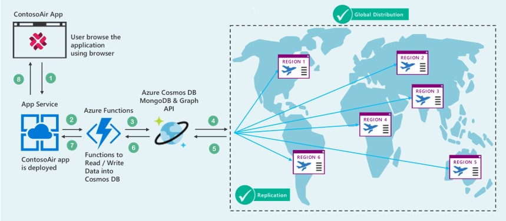

## User Story

It used to take extensive time and monotonous efforts to build a Globally Distributed Database conventionally. Also, there were some issues of **Latency** and **Consistency** in case of the data stored in a centralized location. So, to unravel this we will use the **Azure Cosmos DB**.

You will learn the **Azure Cosmos DB** features such as **turnkey global distribution**, **consistency**, **multi-model API**, **partitioning**, **failover mechanism** and **SLA** by developing **ContosoAir** app along with **SQL DB API**, **Mongo DB API** and **Azure** **Functions**.
  
    

## Components Used in Scenario

   

- **Azure Cosmos DB** is Microsoft's globally distributed, multi-model database. With the click of a button, **Azure Cosmos DB** enables you to elastically and independently scale throughput and storage across any number of Azure's geographic regions. It offers throughput, latency, availability, and consistency guarantees with comprehensive  [service level agreements](https://aka.ms/acdbsla) (SLAs), something no other database service can offer. ([Azure Cosmos DB](https://docs.microsoft.com/en-us/azure/cosmos-db/))
- **Azure Functions** is a serverless compute service that enables you to run code on-demand without having to explicitly provision or manage infrastructure. Use **Azure Functions** to run a script or piece of code in response to a variety of events. ([Azure Functions](https://docs.microsoft.com/en-us/azure/azure-functions/))
- **SQL DB API** is schema-less JSON database engine with SQL querying capabilities. ([SQL DB](https://docs.microsoft.com/en-us/azure/cosmos-db/documentdb-introduction))
- **MongoDB API** is a database service built on top of **Cosmos DB**. Compatible with existing MongoDB libraries, drivers, tools and applications. ([Mongo DB](https://docs.microsoft.com/en-us/azure/cosmos-db/mongodb-introduction))

## What you will learn from this experience

- Deployment of **Azure resources** through **Ansible playbook**.
- Easily build **globally-distributed** application without the hassle of complex, multiple-datacenter configurations.
- Walk through different **consistency levels** available in **Azure Cosmos DB.**
- Real-time example of **multi-model API** of **Azure Cosmos DB.**
- Handling **automatic regional failover** for business continuity in **Azure Cosmos DB**.
- In-depth understanding of **partitioning**.
- **SLA** (Service Level Agreement) for **Azure Cosmos DB**

  > _**Ready? Let's get started!**_

