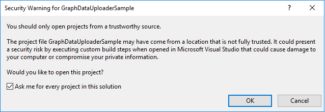
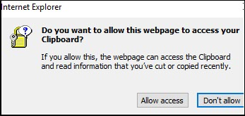

<page title="Creating Azure Cosmos DB Graph API and uploading data"/>

# Scenario 1: Creating Azure Cosmos DB Graph API and uploading data                                                         

## Part A: Accessing the Azure portal

   > _We will start with accessing_ **Azure Portal.** _To configure Azure Cosmos DB Account with_ **GraphDataUploaderTool** project, _you need to_ **Sign in** _to_ **Azure Portal.** _The steps to do the same are given below:_


1. Click on the link [http://portal.azure.com](launch://launch_azure_portal) to open Azure Portal and maximize the browser window.
1. Sign in with your Azure username and password:
    - **Username: <inject key="AzureAdUserEmail" />**
    - **Password: <inject key="AzureAdUserPassword" />**
1. Click on **Sign in** button .
1. If you see the **Stay signed in?** screen next, select the **Yes** button to continue. 
1. You may encounter a popup entitled **Welcome to Microsoft Azure** with options to **Start Tour** and **Maybe Later** –Choose **Maybe Later**. [Ignore the Step no. 4 if didn't get the popup message]

  > _Great! You are now logged in to the Azure Portal._

## Part B: Creating Collection inside the Graph DB and upload data using Visual Studio 2017

  > _Here, we will see how to create the Graph DB API and upload the data with the help of Visual Studio 2017 IDE_
  
  > _Lets start with downloading the source code for ContosoAir app and Payload data._ 
 
  > _Here you go!_

1. To download the source code launch the **Command Prompt** present on desktop and run below commands
   ```cmd
   git clone https://github.com/Click2Cloud/gdaexperience2-story-a c:\source\experience2
   ```

1. On the desktop, click the **Start** button and click **Visual Studio 2017** - it may take couple of minutes for Visual Studio to open.
1. If prompted to sign in to **Visual Studio**, click **Sign in**.
1. In the **Email or phone** field, type **<inject key="AzureAdUserEmail"/>**
1. In the Password field, type **<inject key="AzureAdUserPassword"/>**
1. Click **Sign in**
1. If prompted with the Choose your **color theme screen**, select a color theme
1. Click on **Start Visual Studio**
1. Now open **GraphDataUploaderSample.sln** file in **Visual Studio 2017** IDE present on path **C:\source\experience2\PayloadData\azure-cosmos-db-graph-api\Tools**.
  
   > **Note**: You may encounter pop up related to **Security Warning** as shown in screenshot.

   

1. Deselect checkbox for **Ask me for every project in this solution** and click on **OK** button to accept that pop up.
1. When solution is launched in **Visual Studio 2017** IDE, go to **Solution Explorer** to expand **GraphDataUploaderSample** project and open **App.config** file.
1. In this file, you will need to change the values of **endpoint** , **authKey** , **database** and **collection** with the values of your Azure Cosmos DB connection values.
  
   > _Lets see how we can get endpoint, authKey, database and collection information for our Azure Cosmos DB service from Azure Portal._
  
1. Switch back to **Azure Portal** launched in Part A and go to **Resource Group** option present in the **Favorites** menu on the left side panel.
1. Now select the resource group named **<inject story-id="story://Content-Private/content/dfd/SP-GDA/gdaexpericence2/story_a_graphapi_of_cosmosdb" key="myResourceGroupName"/>**
1. Select the Azure Cosmos DB Account named **<inject story-id="story://Content-Private/content/dfd/SP-GDA/gdaexpericence2/story_a_graphapi_of_cosmosdb" key="cosmosGraphDb"/>** and click on it.
1. Go to **Keys** option present under **<inject story-id="story://Content-Private/content/dfd/SP-GDA/gdaexpericence2/story_a_graphapi_of_cosmosdb" key="cosmosGraphDb"/>** Azure Cosmos DB Account and copy **URI** by clicking on **Click to Copy**  icon present in front of **URI** field.
   >**Note**: You may encounter pop up **Do you want to allow this webpage to access your Clipboard?**. Click on **Allow access** button to accept it.

   

1. Now switch back to **Visual Studio 2017** IDE, and paste copied **URI** to **endpoint key's value** in **App.config** file launch in step 11.
1. Again, switch to **Azure Portal** and copy **Primary Key** by clicking on **Click to Copy icon**  present in front of it and paste it in **value** field of **authKey** in **App.config** in **Visual Studio 2017** IDE.
1. Now in the **App.config** file, provide the **GraphDB** as a value for **database** variable and **CodeshareSoloserviceCollection** as a value for **collection** variable.
1. Click on **save** icon  present on top ribbon and run your project by clicking on start icon  from top ribbon.
1. This will start creating the **GraphDB** Database with collection named **CodeshareSoloserviceCollection** and upload the code share and solo service data.
1. Wait till the data uploading process gets complete. Once the process is complete, verify the output as shown in below screenshot:

   

   > **Note:** The **GraphConfig.json** file present in folder **C:\source\experience2\PayloadData\azure-cosmos-db-graph-api\Tools\GraphDataUploaderSample** contains the configuration of **Nodes** and **Edges** as we need to display Codeshare and Solo Service details in graphical format and the data which we are plotting on **nodes** and **edges** is present in **.txt files** on path given in **PathToData** attribute of respective nodes and edges.
   
   > _Congrats! You have successfully completed Azure Cosmos Graph DB and Collection creation along with data uploading procedure._