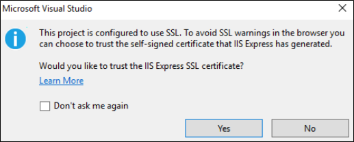
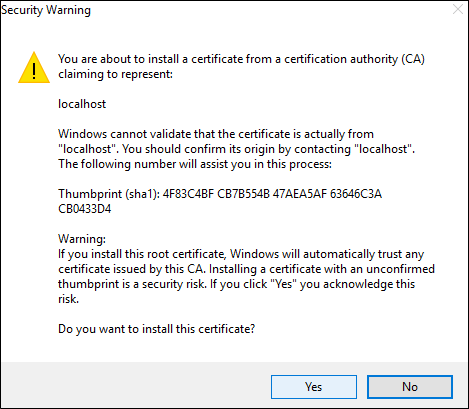
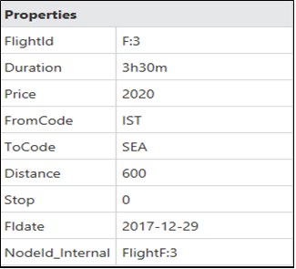
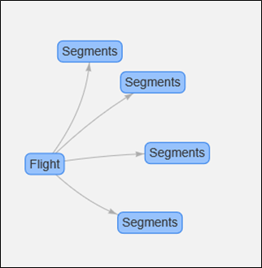
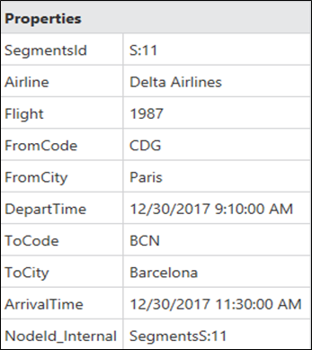

<page title="Azure Cosmos Graph DB API to display Flight and Flight Segments details in graphical format using Gremlin"/>

# Scenario 2: Azure Cosmos Graph DB API to display Flight and Flight Segments details in graphical format using Gremlin
  > _Now as you have to plot the graph for the data present in Azure Cosmos Graph DB API, there must be a solution to fetch the data from it so that we can start graph plotting._

  > _Yes, we have!_

  > _Lets explore what is Gremlin Query first to complete this scenario._

## Part A: Fetch the Flight Details using Gremlin Query from Azure Cosmos Graph DB and Graph plotting using Graph Explorer

  > _Gremlin query language is used to retrieve the data from Azure Cosmos Graph DB. So, lets start creating the Gremlin query to retrieve the Graph data and visualize the data using Graph Explorer._

1. Open **GraphExplorer.sln** file in **Visual Studio 2017** IDE present on path **C:\source\experience2\PayloadData\azure-cosmos-db-graph-api\Web**.
1. Go to **Solution Explorer** to expand **GraphExplorer** project and open **appsettings.json** file.
1. In this file, you can check the values of **endpoint** , **authKey** and **database** for Azure Cosmos DB connection, which were synced during data uploading procedure in Part B of Scenario 1.
1. Now run your project by clicking on **Internet Explorer** icon . Instead of **Internet Explorer** icon, **Microsoft Edge** icon may be present.
   > **Note** : You may encounter popup  **Would you like to trust the IIS Express SSL Certificate?** as shown in screenshot:

    

1. Click on **Yes** button to accept that pop up.
    > **Note** : Now, you will encounter popup  **Do you want to install this Certificate?** as shown in below screenshot. Click on **Yes** button to install it. 
   
    

1. You will get launched to **Graph explorer** page as displayed in screenshot.s
    
    
    
    > **Note** : It may take time to display the Graph Explorer page on your browser.
1. As per your configured database, database collections will be available in Collection dropdown.
1. Now select your created collection named **CodeshareSoloserviceCollection** from **Collection** dropdown present on right side corner.
1. Copy the below given Gremlin query in **Query** input textbox and click on **Execute** button.

   **Gremlin Query**:
   ```Query
    g.V().hasLabel('Flight')
   ```
   > **Note**: This **Gremlin query** will fetch the Flight Details and plot the graph against it on the Graph Explorer.
   
   > _Congrats! You have just fetched the Flight Details from Azure Cosmos Graph DB using Gremlin query and plotted the data in graphical format._
  
    

1. If you click on one of **Flight** icon, it will display the Flight Details in **Properties** as shown in screenshot

   

   > _Lets try another example for more understanding of Gremlin query._

1. Copy the below given Gremlin query in **Query** input textbox and click on **Execute** button.

    **Gremlin Query:**
    ```Query
     g.V().has('FlightId','1').repeat(out('FlightSegments')).until(has('id'));g.V().has('FlightId','1');g.E()
    ```

    >**Note**:
    >This Gremlin query will fetch the vertices and segments for flight having ID "1" along with all the edges and will plot the graph against it. 
    >The query contains three subqueries:

    > - **g.V().has('FlightId','1');** - This query will fetch the vertices of flight having ID 1.
    > - **g.V().has('FlightId','1').repeat(out('FlightSegments')).until(has('id'));g.V().has('FlightId','1');**  - This query will fetch the segments for the flight having ID "1".
    > - **g.E()**  - This query will fetch all the edges for the flight.

    > _Congrats! You have just fetched the Flight Details for flight having ID "1" from Azure Cosmos Graph DB using Gremlin query and plotted the data in graphical format._

    

    > _If you click on one of Segments, it will display selected Flight Details in_ **Properties** _section as shown in screenshot:_

    
