<page title="Graph plotting using Graph API (Gremlin Query) for Code Share and Solo Service Details by launching ContosoAir App"/>


# Scenario 3: Graph plotting using Graph API (Gremlin Query) for Code Share and Solo Service Details by launching ContosoAir App

   > _Now lets move to our main scenario where we need to plot graph for the Code share and Solo Service details of selected flight._
   > _We will use ContosoAir demo app for displaying Code share and Solo Service details of selected flight in graphical format._
   > _Here you go!_

## Part A - Creating collections and inserting data in Cosmos DB using Data Migration Tool

   > _Now as we need to display the flight specific Codeshare and Solo Service details to the end user, we need to first add flight details in Azure Cosmos DB (SQL API).So, lets start inserting data related to flights and their specific seats in Cosmos DB by creating collections using Azure Cosmos DB (SQL API)._

   > _Here, we will insert flight and seat details into Cosmos DB using_ **Microsoft's Data Migration Tool.**

   For more details about the migration tool, click on the given link: [Data Migration tool.](https://docs.microsoft.com/en-us/azure/cosmos-db/import-data)

1. Launch the **Data Migration Tool** by double clicking on **dtui.exe**  file present on **Desktop**.

1. After the tool is launched, click on **Source Information** menu present on the left panel.
1. Select **JSON file(s)** option from **Import from** dropdown.
1. Click on **Add Files** button.
1. Select the JSON file **FlightsCollection.json** present at the location **C:\source\experience2\PayloadData** and click **Open** button.
1. Then click **Next button** to redirect to **Target information** menu.
1. Now, switch to **Azure Portal** in which you are already logged in from Part B of scenario1.
1. Navigate to Azure Portal's **Resource Group** option present in the favorites menu on the left side panel and select your Resource **<inject story-id="story://Content-Private/content/dfd/SP-GDA/gdaexpericence2/story_a_graphapi_of_cosmosdb" key="myResourceGroupName"/>** and click on Azure Cosmos DB Account **<inject story-id="story://Content-Private/content/dfd/SP-GDA/gdaexpericence2/story_a_graphapi_of_cosmosdb" key="cosmosDbAcc"/>**.
1. Go to **Keys** option under **Azure Cosmos DB account blade** and copy the **Primary Connection String.**

   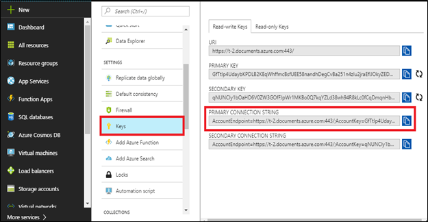

1. Switch back to **Data Migration Tool** already launched in step 1.
1. Paste the copied **Primary Connection String** in **Connection String** text box and append with **Database Name** at the end of the string in **Target information** option.

   **For e.g.**
   AccountEndpoint= https://t-2.documents.azure.com:443/;AccountKey=your\primary\key==;Database= Your Cosmos DB Account Name;.
   >**Note**: Here your database name is <inject story-id="story://Content-Private/content/dfd/SP-GDA/gdaexpericence2/story_a_graphapi_of_cosmosdb" key="cosmosDbAcc"/>

   

1. Once you are done with the Step 11, click on **Verify** button next to **Connection String** field to verify the connection string.
1. On successful verification of Connection string, success pop-up window will be displayed, then click on **OK** button.
1. On verification failure of connection string, a pop-up window will appear prompting the **failure message** , then click on **Ok** button and again verify the connection string with valid details till successful verification.
1. Enter the Collection Name **FlightsCollection** in **Collection** field.
1. Click on **Next** button. Ignore the **Advanced configuration** window and click **Next** button. Then, click on **Import** button to import the data present in **Json** file into **Cosmos DB collection.**
1. This will start the data uploading process. Wait for some time to complete the process and once the process is completed successfully, click on **New Import** button 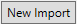.Now you will get pop up window displaying – **Do you want to reset import settings?**

   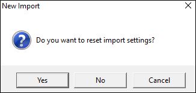

1. Click on **Yes** button and you will again be redirected to **Source Information page** of **Data Migration Tool**.

   > _Congrats you have successfully uploaded Flights data in Azure Cosmos DB (SQL API) by creating collection._

   > _Now again we need to create collection for adding Seat's details in Cosmos DB. Lets now create collection for Seats details data uploading._

1. Select **JSON file(s)** option from **Import from** dropdown present on Source Information page of Data Migration Tool.
1. Click on **Add Files** button.
1. Select the JSON file **SeatsCollection.json** present at the location **C:\source\experience2\PayloadData** and click **Open** button.
1. Then click **Next button** to redirect to **Target information** menu.
1. Now, switch to **Azure Portal** in which you are already logged in from Part B of scenario1.
1. Navigate to Azure Portal's **Resource Group** option present in the favorites menu on the left side panel and select your Resource **<inject story-id="story://Content-Private/content/dfd/SP-GDA/gdaexpericence2/story_a_graphapi_of_cosmosdb" key="myResourceGroupName"/>** and click on Azure Cosmos DB Account **<inject story-id="story://Content-Private/content/dfd/SP-GDA/gdaexpericence2/story_a_graphapi_of_cosmosdb" key="cosmosDbAcc"/>**.
1. Go to **Keys** option under **Azure Cosmos DB account** blade and **copy** the **Primary Connection String.**

   

1. Switch back to **Data Migration Tool** which is already launched.
1. Paste the copied **Primary Connection String** in **Connection String** text box and append with **Database Name** at the end of the string in **Target information** option.

    **For e.g**
     AccountEndpoint=https://t-2.documents.azure.com:443/;AccountKey=your_primary_key==;Database=Your Cosmos DB Account Name.
   >**Note** : Here your database name is <inject story-id="story://Content-Private/content/dfd/SP-GDA/gdaexpericence2/story_a_graphapi_of_cosmosdb" key="cosmosDbAcc"/>.
    
   

1. Once you are done with this Step, click on **Verify** button next to **Connection String** field to verify the connection string.
1. On successful verification of Connection string, success pop-up window will be displayed, then click on **OK** button.
1. On verification failure of connection string, a pop-up window will appear prompting the **failure message** , then click on **Ok** button and again verify the connection string with valid details till successful verification.
1. Enter the Collection Name **SeatsCollection** in **Collection** field.
1. Click on **Next** button. Ignore the **Advanced configuration** window and click **Next** button. Then, click on **Import** button to import the data present in **Json** file into **Cosmos DB collection.**
1. This will start the data uploading process. Wait for some time to complete the process and once the process is completed successfully, close the **Data Migration Tool**.

   > _Good work! You have uploaded seats data by creating collection using Azure Cosmos DB (SQL API)._

1. Now, switch to **Azure Portal** in which you are already logged in from **Part A of scenario 1**.
1. Click on Azure Portal's **Resource Group** option present in the favorites blade in the left side panel and click on **<inject story-id="story://Content-Private/content/dfd/SP-GDA/gdaexpericence2/story_a_graphapi_of_cosmosdb" key="myResourceGroupName"/>**.
1. Click on **<inject story-id="story://Content-Private/content/dfd/SP-GDA/gdaexpericence2/story_a_graphapi_of_cosmosdb" key="cosmosDbAcc"/>** which is your **Cosmos DB Account.**
1. Then click on **Data Explorer** to view the created collections which will be fetched from the **Json** file imported through Data migration tool.

   > _Now we have data related to flights and seats present in Azure Cosmos DB (SQL API), whereas Codeshare and Solo service related data is already present in Azure Cosmos graph DB API._

   > _To accomplish our main scenario, we need to connect ContosoAir app with these databases present in Resource group named <inject story-id="story://Content-Private/content/dfd/SP-GDA/gdaexpericence2/story_a_graphapi_of_cosmosdb" key="myResourceGroupName"/> as we need to display Codeshare and Solo Service details in graphical format._

   > _So, lets start using Service; the middle layer, which will provide communication in your Cosmos DB and ContosoAir application._

## Part B: Configuration of service with Cosmos DB (SQL API) and Cosmos graph DB

   > _Lets configure the service to fetch all the data from Cosmos DB (SQL API) and Cosmos graph DB API._

   > _Here you go!_

1. Open **ContosoAir.Website\_and\_Services.sln** file in **Visual Studio 2017** IDE present in location **C:\source\experience2**
1. Go to **Solution Explorer** and expand **ContosoAir.Services** project by clicking on it.
1. If **Solution Explorer** window is not visible, go to **View** menu and click on **Solution Explorer.**
1. Now open **config.js** file present inside it by double clicking on it.

   > _**Note**: In this file, we will pass configuration details for Cosmos Document DB and Graph DB API. So, lets switch to Azure portal._

1. Switch to **Azure Portal** in which you are already logged in from **Part B of scenario1**.
1. Click on **Resource** groups  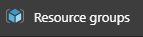 icon present in the **favorites** menu on the left side panel. Search your resource group named **<inject story-id="story://Content-Private/content/dfd/SP-GDA/gdaexpericence2/story_a_graphapi_of_cosmosdb" key="myResourceGroupName"/>** and click on it.
1. Click on **Azure Cosmos DB (SQL API)** named **<inject story-id="story://Content-Private/content/dfd/SP-GDA/gdaexpericence2/story_a_graphapi_of_cosmosdb" key="cosmosDbAcc"/>** and go to Keys 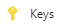 option.
1. Copy **URI** by clicking on **Click to Copy icon**  present in front of **URI** field and paste it in notepad file.
1. Also Copy **Primary Key** by clicking on **Click to Copy** icon  present in front of **Primary Key field**.
1. Paste the value in the same notepad file.
1. Now Switch back to **Visual Studio 2017** IDE and paste **URI** in value field of **DOCUMENT\_DB\_ENDPOINT** in **config.js** file.
1. Paste the **Primary Key** value in value field of **DOCUMENT\_DB\_PRIMARYKEY** in **config.js** file.
1. Now write your **Cosmos DB (SQL API)** database name **<inject story-id="story://Content-Private/content/dfd/SP-GDA/gdaexpericence2/story_a_graphapi_of_cosmosdb" key="cosmosDbAcc"/>** in value field of **DOCUMENT\_DB\_DATABASE.**
1. Pass the name of **collection** created by you to add flight details i.e. **FlightsCollection** in value field of **DOCUMENT\_DB\_Flight.**
1. Also, pass name of collection created by you to add seats details i.e. **SeatsCollection** in the value field of **DOCUMENT\_DB\_SEAT.**
1. For configuration with **Graph DB** , again switch back to Azure portal and click on **Resource groups**  icon present in the **favorites** menu on the left side panel.
1. Click on **Azure Cosmos Graph DB** named **<inject story-id="story://Content-Private/content/dfd/SP-GDA/gdaexpericence2/story_a_graphapi_of_cosmosdb" key="cosmosGraphDb"/>** and go to **Overview**  section.
1. Copy the **Gremlin Query URI** by clicking on **Click to Copy** icon present in front of **Gremlin Endpoint** and paste it in notepad.

   

    >**Note**: It may take time to display the Gremlin URI.  
    >Here you have to modify the Gremlin Query URI.
    >for eg. The Gremlin URI is : c2cgraphdb.graphs.azure.com:443/. 
    >So you need to paste only relative URI as : c2cgraphdb.graphs.azure.com

1. Now click on **Keys**  icon.
1. Copy the **Primary Key** by clicking on **Click to Copy icon**  present in front of it and paste it also in same notepad.
1. Again, switch back to **Visual Studio IDE 2017** and paste **Gremlin URI** from notepad in the value field of **GRAPH\_DB\_ENDPOINT**.
1. Paste copied **Primary Key** value in the value field of **GRAPH\_DB\_PRIMARYKEY**.
1. Write your Cosmos Graph DB name **GraphDB** in value field of **GRAPH\_DB\_DATABASE**.
1. Also, write down collection name **CodeshareSoloserviceCollection** created during data uploading of **Solo Service** and **Codeshare** mentioned in Part B of Scenario 1 in the value field of **GRAPH\_DB\_COLLECTION** and click on **save** icon  present on top ribbon. .

   > _Now lets start running the service._

1. To run the service, Go to **Solution Explorer**,right click on **ContosoAir.Services** and click on **Open Command Prompt Here** 
1. Now execute the following commands one by one in command prompt for installing all the packages and to run the API Service.
   - Write **npm install** and press **Enter** button present on Keyboard.
   - Now write **npm start** and press **Enter** button present on Keyboard.
   
   > **Note** : You may encounter popup  **Windows Firewall has blocked some features for this app** as shown in screenshot:

   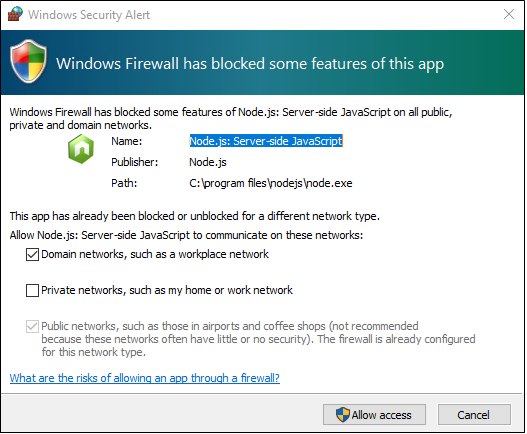

   > Click on **Cancel** button present on that pop up.
   
   > _Congrats! You have successfully configured Cosmos Document DB(SQL API) and Graph DB API with Service. Please check below screenshot:_
   
   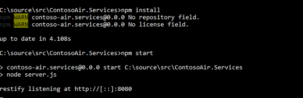

   > _Now lets configure ContosoAir Application with service._
  
1. Copy the **port number** present in output window as shown in above screenshot
1. Now switch back to **Visual Studio IDE 2017** to expand **ContosoAir.Website** project present in **Solution Explorer** and expand **src** folder present inside it.
1. Expand **environments** folder 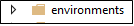 and open **environment.ts** file.
1. Replace the port number present in **api\_url** field with copied port number.

   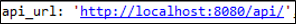

1. Go to **Solution Explorer**, right click on **ContosoAir.Website** project and select **Open Command Prompt Here**
1. Now Execute the following commands one by one in command prompt for installing all the packages and to run the Website.
   
   ```cmd 
   npm install -g @angular/cli
   ```
1. Press Enter button present on Keyboard 
     
   ```cmd
   set PATH=%PATH%;%AppData%\npm\
   ```

1. Press Enter button present on Keyboard

   ```cmd
   npm install
   ```
1. Press Enter button present on Keyboard

   ```cmd
   ng serve
   ```

1. Press Enter button present on Keyboard.
   > _Congrats! You have successfully configured ContosoAir application with Service._
   > _Please check below screenshot_

   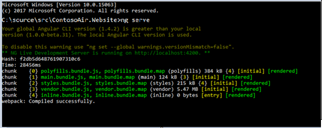

1. Now to launch the app, copy the [http://localhost:4200]() URL from output window as displayed in above screenshot.
1. Open browser present on your desktop for ex. Internet Explorer.
1. Paste the URL in the browser and press Enter.
   > _It will launch the ContosoAir app on browser. Check following screenshot:_

   

   > **Note**: You should have **Microsoft** account credentials to login and get access to **ContosoAir** website. 
   > _Great! You have launched the ContosoAir application in your browser._
 
1. Now add your flight details and click on **Find Flights** button.

   

   > _It will display the flights available for selected location as shown in screenshot_

   

1. Now if you click on **View Codeshare** link, it will display the available **Codeshare Carriers** for that respective flight as shown in screenshot:

   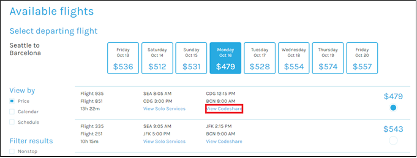

   

1. If you click on one of **node** of Codeshare, it will display Codeshare details in **Properties** as shown in screenshots:

   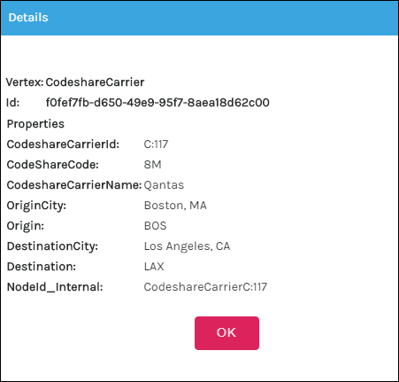

1. Similarly, if you click on **View Solo Service** link, it will display available **Solo services** in graphical format as shown in screenshot:

   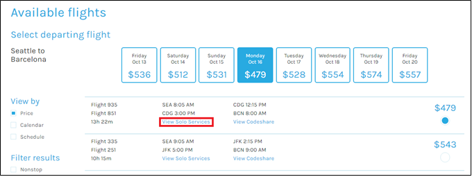

   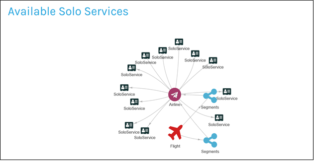

1. If you click on one of **node** of segment, it will provide its details in **Properties** as shown in screenshot:

   

   > _Great work! You have successfully displayed Codeshare and Solo Service details in graphical format using Cosmos Graph API._