<page title="Fetching information of staff serving the Flying Solo Service"/>

## Scenario 1: Fetching information of staff serving the Flying Solo Service

### Part A - Accessing the Azure portal

   > _We'll start with accessing_ **Azure Portal.** _For creating resources, you need to_ **Sign in** _to_ **Azure Portal.** _The steps to do the same are given below_


1. Click on the link [http://portal.azure.com](launch://launch_azure_portal) to open Azure Portal and maximize the browser window.
1. Sign in with your Azure **Username** and **Password**.
   - Username: **<inject key="AzureAdUserEmail" />**
   - Password: **<inject key="AzureAdUserPassword" />**
1. Click on **Sign in** button 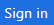.
1. If you see the **Stay signed in?** screen next, select the **Yes** button to continue. 

1. You may encounter a popup entitled **Welcome to Microsoft Azure** with options to **Start Tour** and **Maybe Later** – **Choose Maybe Later**. [Ignore the **Step 4** if didn't get the popup message.]

   > _Great! You are now logged in to the Azure Portal._

### Part B - Creating collections and inserting data in Cosmos DB using Data Migration Tool

   > _Cosmos DB Account named **<inject story-id="story://Content-Private/content/dfd/SP-GDA/gdaexpericence3/story_a_notificationservice_with_cosmosdb" key="cosmosDbAcc"/>** is already present in the Resource group named **<inject story-id="story://Content-Private/content/dfd/SP-GDA/gdaexpericence3/story_a_notificationservice_with_cosmosdb" key="myResourceGroupName"/>**_.
   > _First, let's start with downloading the source code for ContosoAir app and Payload data._ 

1. To download the source code. Open **Command prompt** by double clicking on **Command Prompt** icon  present on the desktop and copy-paste the below command.
   ```cmd
   git clone https://github.com/Click2Cloud/gdaexperience3-story-a c:\source\experience3
   ```

   > Now, let's insert some data into Cosmos DB using **Microsoft's Data Migration Tool.**
   For more details about the migration tool, click on the link [Data Migration Tool.](https://docs.microsoft.com/en-us/azure/cosmos-db/import-data)

1. Launch the **Data Migration Tool** by double clicking on **dtui.exe**  icon present on **Desktop**.
1. After the tool is launched, click on **Source Information** menu present on the left panel.
1. Select **JSON file(s)** option from **Import from** dropdown option.
1. Click on **Add Files** button.
1. Select the **JSON** file  **SoloService.json** present at the location **C:\source\experience3\payloads\SoloService.json** and click **Open** button.
1. Then click **Next** button to redirect to **Target information** menu.
1. Now, switch to **Azure Portal** in which you are already logged in from **Part A**.
1. Navigate to Azure Portal's **Resource groups** option present in the favourites menu on the left side panel and select your created resource **<inject story-id="story://Content-Private/content/dfd/SP-GDA/gdaexpericence3/story_a_notificationservice_with_cosmosdb" key="myResourceGroupName"/>** and click on Azure Cosmos DB Account **<inject story-id="story://Content-Private/content/dfd/SP-GDA/gdaexpericence3/story_a_notificationservice_with_cosmosdb" key="cosmosDbAcc"/>**.
1. Go to **Keys** option under **Azure Cosmos DB account** blade and copy the **Primary Connection String** by clicking on **copy** icon.
   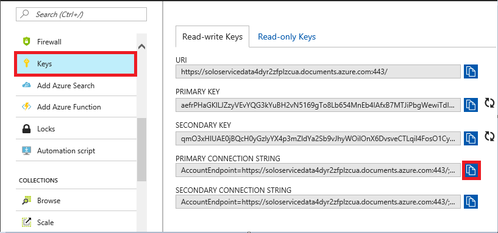
   > Create a **Notepad** file named **Credential.txt** on **Desktop** and copy the **Primary Connection String** into it and save the file.
   >**For Ex:** **Primary Connection String**=AccountEndpoint=https://XXX;Database=SoloServiceDB
   - **NOTE:** Here in our case Database name is **SoloServiceDB**. Append **Database=SoloServiceDB** at the end of Connection string as mentioned above.
   >**For Ex:** AccountEndpoint=https://soloservicedata4dyr2zfplzcua.documents.azure.com:443/;AccountKey=aefrPHaGKlLJZzyVEvYQG3kYuBH2vN5169gTo8Lb654MnEb4IAfxB7MTJiPbgWewiTdIetjux64zSTg5rYfvWQ==;Database=SoloServiceDB
1. Switch back to **Data Migration Tool** already launched in **Step 1**.
1. Paste the copied **Primary Connection String** in **Connection String** text box copied from **Credential.txt** file from **Desktop**.
   

1. Once done with the **Step 12**, click on **Verify** button next to **Connection String** field to verify the connection string.
1. On successful verification of Connection string, success pop-up window will display, then click on **OK** button.
1. On verification failure of connection string, a pop-up window will appear prompting the **failure message**, correct your Connection String and again verify the connection string till successful verification.
1. Enter **Collection Name ->SoloService** in the **Collection** field.
1. Click on **Next** button. Ignore the **Advanced configuration** window and click **Next** button. Then, click on **Import** button to import the data present in Json file into **Cosmos DB collection.**
1. This will start the data uploading process. Wait for some time to complete the process and once the process is completed successfully, close the **Migration tool**.
1. Now, switch to **Azure Portal** in which you are already logged in from **Part A**.
1. Click on Azure Portal's **Resource groups** option present in the favourites blade in the left side panel and click on **<inject story-id="story://Content-Private/content/dfd/SP-GDA/gdaexpericence3/story_a_notificationservice_with_cosmosdb" key="myResourceGroupName"/>.**
1. Click on **<inject story-id="story://Content-Private/content/dfd/SP-GDA/gdaexpericence3/story_a_notificationservice_with_cosmosdb" key="cosmosDbAcc"/>** which is your **Cosmos DB Account.**
1. Click on **Data Explorer** to view the created **collections** which will be fetched from the **Json file** imported through Data migration tool.
1. Click on created collection **SoloService** to expand. Then, click on **Documents** option under the collection to view the data imported through **Migration tool** into **Cosmos DB.**
   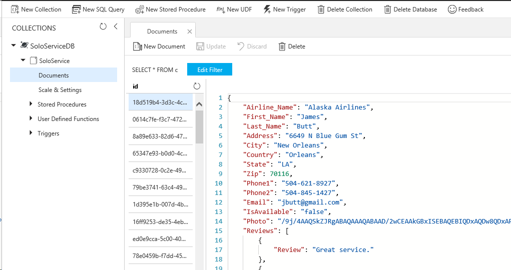
1. Follow the same scenario from step2 of **Part B** for inserting data from below files, and use the **Connection String** URL from the **Credential.txt** file you created in above steps.

   - **BookingCollection.js**
   - **FlightsCollection.js**
   - **SeatsCollection.js**

   > **NOTE:** Please enter **collection name** same as **JSON** file name without ".js" extension. 

   > _Nice work! You have successfully added_ **collections** _in your_ **Cosmos DB Account**_. Next, we will see how we can create the_ **Azure Functions**.

### Part C - Creating Azure Functions.

   > _Let's start with creation of **Azure Function App** to create **function** for Scenario 1._

1. Go to **Azure portal,** click on  icon and search for the **Function App** in the search tab and click on it to select.
   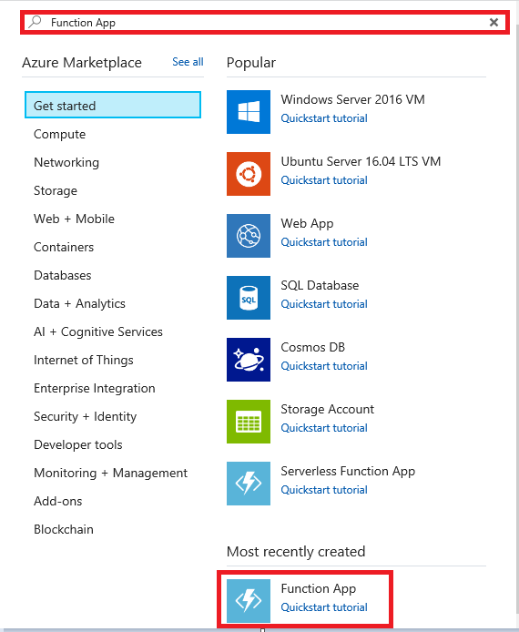
1. Click **Create** button present at the bottom of page.
1. Now, enter app name as **SoloServiceFunctionApp** in the **App name** text field.
1. Select **Use existing** radio button from **Resource Group** and select **<inject story-id="story://Content-Private/content/dfd/SP-GDA/gdaexpericence3/story_a_notificationservice_with_cosmosdb" key="myResourceGroupName"/>** Resource group from the dropdown.
1. Select **Create New** radio button, **Storage** name will be automatically generated on selecting **Create new** radio button.
1. Click on **Create** button to create Azure Function.
1. To view the deployment process, click **Notification Icon**  .

   >**NOTE:** : Please wait, It takes some time for deployment of the resources.

1. Click on **Go to resource** button  appearing after successful deployment to view the created resource.
1. Click on 
   to close the **notification** window. **OR** Click on **Resource Groups** option present in the favourites menu on the left side panel and then click on **<inject story-id="story://Content-Private/content/dfd/SP-GDA/gdaexpericence3/story_a_notificationservice_with_cosmosdb" key="myResourceGroupName"/>** to check the status of the created **Function App**.
1. Now click on **SoloServiceFunctionApp** which is your **Function App** name.
   > _Here you go! let's create Function to retrieve data of staff serving Flying Solo service._
   
11. Click on **+ sign**beside **Functions.** 
1. Click on link **Custom function**  present at the bottom of the page.
1. Click on **HttpTrigger – C#** template to select it. Name the function as **GetSoloServiceInfo** in **Name your function** textbox and click on **Create** button.
1. A function with sample default code would get created. Now, replace the **sample default code** with the code snippet given below.

   ```
    using System.Net;
    public static HttpResponseMessage Run(HttpRequestMessage req, TraceWriter log, IEnumerable<dynamic> SoloService)
    {    
  	  return req.CreateResponse(HttpStatusCode.OK, SoloService);
    }
 
   ```

   >**NOTE:** In above code snippet, **IEnumerable<dynamic> SoloService** parameter is used to fetch the list of SoloService collection type data from **Cosmos DB**. The above run method returns the result, fetched from **Cosmos DB** and **HttpStatusCode** using **CreateResponse** method.

1. Click on **Save** button. 
1. Now, click on **Integrate** option present in the **Function Apps** blade.
1. Click on **+New Input** option, select **Azure Cosmos DB** and click on **Select** button.
1. Enter **Document parameter name** as **SoloService**, **Collection name** as **SoloService** and **Database name** as **SoloServiceDB** in their respective textboxes.
1. Copy the **SQL query** given below and paste it in **SQL Query (optional**) text box.
   ```sql
   SELECT TOP 2 S.id, S.Airline_Name, S.First_Name, S.Last_Name, S.Address, S.City, S.Country, S.State, S.Zip, S.Phone1, S.Phone2, S.Email, S.Reviews, S.IsAvailable, S.Photo FROM SoloService S Where S.IsAvailable = 'true' and S.Airline_Name = 'Alaska Airlines'
   ```
   >**NOTE:** Above **SQL query** is responsible to get solo service provider details from **SoloService collection** in **Cosmos DB** like id, airline name, first name, last name, address, city, county, state, zip, phone no. 1, phone no. 2, email id, reviews, availability and photo based on their availability and airline provider. (Ignore non-mandatory fields)

20. To enter **Cosmos DB account connection,** click on **new** link given beside **Cosmos DB account connection** textbox. 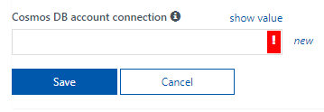
1. You will be redirected to **Document DB Account** blade , select the **Document DB Account** named as **<inject story-id="story://Content-Private/content/dfd/SP-GDA/gdaexpericence3/story_a_notificationservice_with_cosmosdb" key="cosmosDbAcc"/>**.
1. Then click **Save** button to save the changes.
1. Click on **GetSoloServiceInfo** function present in the left panel. 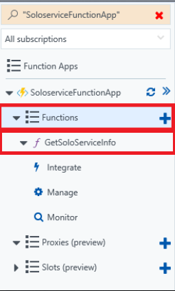
1. Click on **Test** option present on right hand side vertical panel.
1. Select **HTTP method** as **GET** from the dropdown. Then click **Run** button at the bottom. 
   >**NOTE:** 
   > - If it is showing **Status 200 OK**  message at the bottom of the page and **JSON** in the output section, the **Azure Function** is created properly.
   > - If you are getting a message  at the bottom of the page, the **Azure Funtion** is not created properly, delete the created **Function** 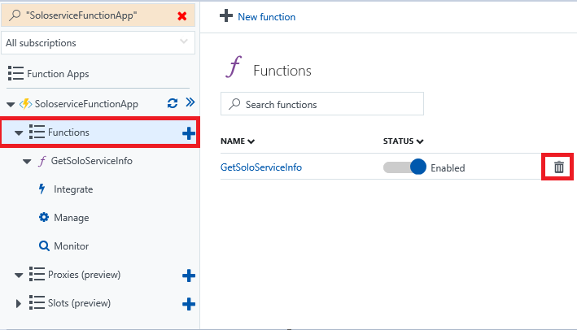 **GetSoloServiceInfo** by clicking on delete icon present under **Functions** option appearing in **Function Apps** blade.
   > - And Repeate the above steps from Step number **11**.
   > - **NOTE:** Above **SQL query** is responsible to get solo service provider details from **SoloService collection** in **Cosmos DB** like id, airline name, first name, last name, address, city, county, state, zip, phone no. 1, phone no. 2, email id, reviews, availability and photo based on their availability and airline provider. (Ignore non-mandatory fields)

   > _Here you go! You have successfully created_ **Azure Function** _to retrieve data from_ **Cosmos DB** _._

### Part D - Connecting Azure Function with ContosoAir Application.

   > _In this part, you will be connecting_ **Azure Function** _with_ **ContosoAir Application.**

1. Now, go to **Resource groups** option present on the left panel and click on **<inject story-id="story://Content-Private/content/dfd/SP-GDA/gdaexpericence3/story_a_notificationservice_with_cosmosdb" key="myResourceGroupName"/>.**
1. Click on created **Azure Function App** named **SoloServiceFunctionApp** and click on function named as **GetSoloServiceInfo**
1. You will be navigated to function editor window, you will find **</> Get function URL** link on the top right corner of the page. Click on the link 
1. On clicking **</> Get function URL,** you will get a pop up window with a URL.
1. Click on **Copy** icon  to copy the given URL.
1. It will generate one pop-up window, click on **Allow access** option. 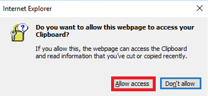
1. Go to the path **C:\source\experience3** and double click on **ContosoAir.Xamarin.UWP.sln** file to load the project code into **Visual Studio**. This may take some time.
1. If prompted to sign in to **Visual Studio**, click **Sign in**.
1. In the **Email or phone** field, type **<inject key="AzureAdUserEmail"/>**
1. In the **Password** field, type **<inject key="AzureAdUserPassword"/>**
1. Click **Sign in**
1. If prompted with the Choose your **color theme screen**, select a color theme
1. Click **Start Visual Studio**
1. Now, go to **Solution Explorer** window and expand **Contoair.client.Core (portable)** project.
1. Double click on **GlobalSettings.cs File** to open.
   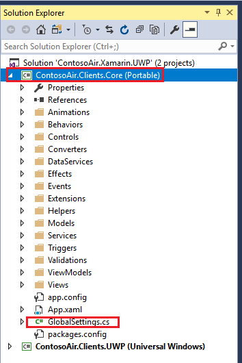
1. Paste the copied URL at **Line No. 47** in **GlobalSettings.cs** file.
   **For Ex:** - public const string GetSoloServiceInfoUrl= **"Copied URL"**;
   > **NOTE:** This URL is used to retrieve the data of ground staff in ContosoAir Application.
1. Now press **Ctrl+S** button from the keyboard to save the changes in the code.

### Part E - Launching ContosoAir App

   > _Let's see the output of all the above steps through_ **ContosoAir Application** _by launching the application._

1. Go to **Solution Explorer window**.
1. Right click on **Contoair.client.Core (portable)** project and click on **Clean** option to clean the project. Then, right click on **Contoair.client.UWP (Universal windows)** project and click on **Clean** option to clean the project.
1. On successful completion of cleaning process, now right click on **Contoair.client.Core (portable)** project and click **Build** option to build the project.
1. On successful completion of cleaning process, now right click on **Contoair.client.UWP (Universal windows)** project and click **Build** option to build the project.
1. Right click on **Contoair.client.UWP (Universal windows)** project, click on **Set as StartUp Project**.
1. Again, right click on **Contoair.client.UWP (Universal windows)** project and click on **Deploy** option. 
   > **Note:** It will take some time to deploy the project.
1. Click on **Local Machine** option appearing on the Menu bar  to launch the **ContosoAir App.**
1. You will get **Contoso Air Sign-in** popup and click on **Sign in with Microsoft** button. Here you need to provide your Microsoft account credentials.
1. Here you will get details of ground staff serving the Solo Service for the airlines.

   

1. Click on **Hamburger icon** and Select **Solo Service** option.

   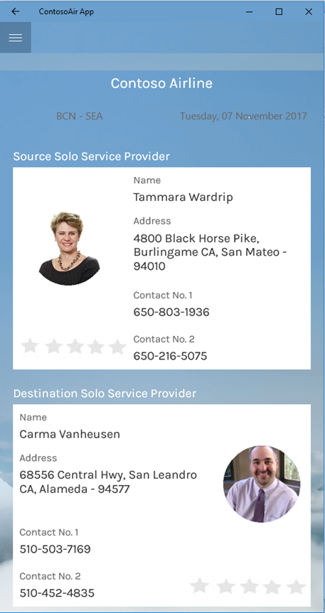

   > _Wow awesome! The data of ground staff involved in Flying solo service is retrieved using azure function._

### Part F – Playing around Cosmos DB collections.

   > _Let us now play with collections and change the availability of the staff serving Flying Solo Service._

1. Switch to **Azure Portal** as launched in **Part A.**
1. Click on Azure Portal's **Resource groups** option present in the favourites blade in the left side panel and click on **<inject story-id="story://Content-Private/content/dfd/SP-GDA/gdaexpericence3/story_a_notificationservice_with_cosmosdb" key="myResourceGroupName"/>**
1. Click on **<inject story-id="story://Content-Private/content/dfd/SP-GDA/gdaexpericence3/story_a_notificationservice_with_cosmosdb" key="cosmosDbAcc"/>** which is your **Cosmos DB Account.**
1. Then click on **Data Explorer** to view the created **collections** which will be fetched from the **JSON file** imported through **Data Migration Tool**.
1. Now, click on created collection **SoloService** to expand. Click on **Documents** option under the collection to view the data imported through **Migration Tool** into **Cosmos DB.**
1. When you click on **id**. **JSON** data will be displayed on right side panel.
1. Change **IsAvailable** parameter of **any 2** staff members from **true** to **false** and **any 2** staff members from **false** to **true** by clicking on **id** one by one and click on **Update** button 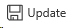 to save each change into **Cosmos DB**.
   
1. Go to **Visual Studio 2017** IDE, click on **Stop Debugging** button present on **Menu** bar .
1. Click on **Local Machine**  option present on **Menu** bar to launch the **ContosoAir App.**
   
1. Click on **Hamburger icon** and Select **Solo Service** option.
   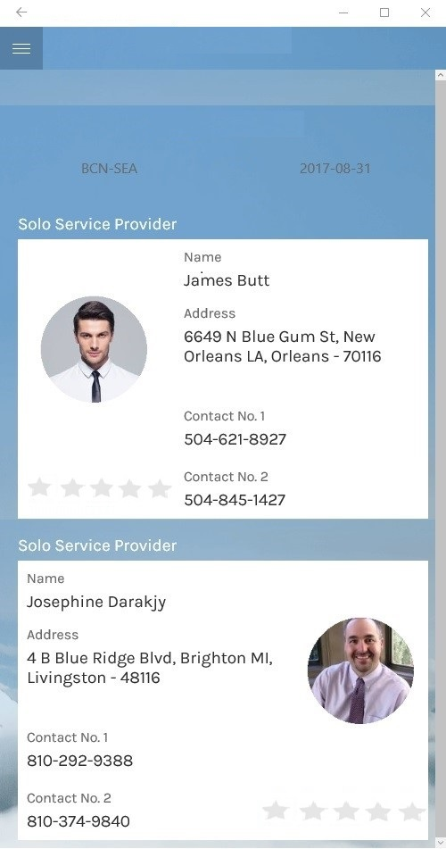
   >**NOTE:** Here you will find that you can change the list of staff serving solo service.

   > _But it would have been great if you get ratings based on reviews for that respective staff serving solo service._

   > _And yes! We can achieve this using Logic App._
