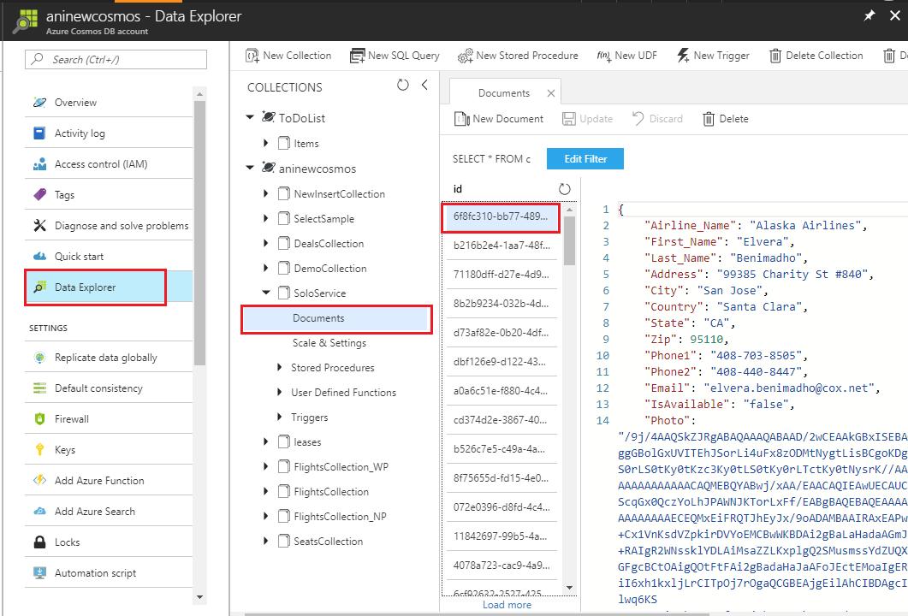
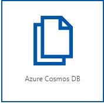

<page title="Fetching information of staff serving the Flying Solo Service"/>

## Scenario 1: Fetching information of staff serving the Flying Solo Service

### Part A - Accessing the Azure portal

   > _We'll start with accessing_ **Azure Portal.** _For creating resources, you need to_ **Sign in** _to_ **Azure Portal.** _The steps to do the same are given below_


1. Click on the link [http://portal.azure.com](launch://launch_azure_portal) to open Azure Portal and maximize the browser window.
1. Sign in with your Azure username and password:
    - **Username: <inject key="AzureAdUserEmail" />**
    - **Password: <inject key="AzureAdUserPassword" />**
   
1. Click on **Sign in** button .

1. You may encounter a popup entitled **Welcome to Microsoft Azure** with options to **Start Tour** and **Maybe Later** – **Choose Maybe Later**. [Ignore the step no. 4 if didn't get the popup message.]

   > _Great! You are now logged in to the Azure Portal._

### Part B - Creating collections/inserting data in Cosmos DB using Data Migration Tool

   > _Cosmos DB Account named <inject story-id="story://Content-Private/content/dfd/SP-GDA/gdaexpericence3/story_a_notificationservice_with_cosmosdb" key="cosmosDbAcc"/> is already present in the Resource group named <inject story-id="story://Content-Private/content/dfd/SP-GDA/gdaexpericence3/story_a_notificationservice_with_cosmosdb" key="myResourceGroupName"/>_.
   > _First,Lets start with downloading the source code for ContosoAir app and Payload data._ 

1. To download the source code launch the **Command Prompt** and run below commands
   ```cmd
      git clone https://github.com/Click2Cloud/gdaexperience3-story-a c:\source\experience3
   ```

   > Now, let's insert some data into Cosmos DB using **Microsoft's Data Migration Tool.**

   For more details about the migration tool, click on the given link: [Data Migration tool.](https://docs.microsoft.com/en-us/azure/cosmos-db/import-data)

1. Launch the **Data Migration Tool** by double clicking on **dtui.exe**  file present on **Desktop**.
1. After the tool is launched, click on **Source Information** menu present on the left panel.
1. Select **JSON file(s)** option from **Import from** dropdown.
1. Click on **Add Files** button.
1. Select the JSON file  **"SoloServiceData.json**" present at the location **"c:\source\experience3\Payloads\SoloServiceData.json"** and click **Open** button.
1. Then click **Next button** to redirect to **Target information** menu.
1. Now, switch to **Azure Portal** in which you are already logged in from **Part A**.
1. Navigate to Azure Portal's **Resource Group** option present in the favourites menu on the left side panel and select your created Resource **<inject story-id="story://Content-Private/content/dfd/SP-GDA/gdaexpericence3/story_a_notificationservice_with_cosmosdb" key="myResourceGroupName"/>** and click on Azure Cosmos DB Account **<inject story-id="story://Content-Private/content/dfd/SP-GDA/gdaexpericence3/story_a_notificationservice_with_cosmosdb" key="cosmosDbAcc"/>**.
1. Go to **Keys** option under **Azure Cosmos DB account blade** and **copy** the **Primary Connection String.**

   

1. Switch back to **Data Migration Tool** already launched in step 1.
1. Paste the copied **Primary Connection String** in **Connection String** text box and appended with **Database Name** at the end of the string in **Target information** option.

   >**For e.g.** "AccountEndpoint=https://t-2.documents.azure.com:443/;AccountKey=your\_primary\_key==;;; Database=Your Cosmos DB Account Name".

   > **Note** : Here your database name is " **<inject story-id="story://Content-Private/content/dfd/SP-GDA/gdaexpericence3/story_a_notificationservice_with_cosmosdb" key="cosmosDbAcc"/>**".

   

1. Once you are done with the Step 11, click on **Verify** button next to **Connection String** field to verify the connection string.
1. On successful verification of Connection string, success pop-up window will display, then click on **OK** button.
1. On verification failure of connection string, a pop-up window will appear prompting the **failure message** , then click on **Ok** button and again verify the connection string till successful verification.
1. Enter the **Collection Name -> "SoloServiceData"** in **Collection** field.
1. Click on **Next** button. Ignore the **Advanced configuration** window and click **Next** button. Then, click on **Import** buttonto import the data present in Json file into **Cosmos DB collection.**
1. This will start the data uploading process. Wait for some time to complete the process and once the process is completed successfully close the **migration tool**.
1. Now, switch to **Azure Portal** in which you are already logged in from **Part A**.
1. Click on Azure Portal's **Resource Group** option present in the favourites blade in the left side panel and click on **<inject story-id="story://Content-Private/content/dfd/SP-GDA/gdaexpericence3/story_a_notificationservice_with_cosmosdb" key="myResourceGroupName"/>**
1. Click on **<inject story-id="story://Content-Private/content/dfd/SP-GDA/gdaexpericence3/story_a_notificationservice_with_cosmosdb" key="cosmosDbAcc"/>** which is your **Cosmos DB Account.**
1. Then click on **Data Explorer** to view the created **collections** which will be fetched from the **Json file** imported through Data migration tool.
1. Then click on created collection **"SoloServiceData"** to expand. Then, click on **Documents** option under the collection to view the data imported through **Migration tool** into **Cosmos DB.**

   
1. Follow all the above-mentioned steps of **Part B** of this scenario for inserting data from

- BookingCollection.js
- FlightsCollection.js
- SeatsCollection.js

   > **Note:** Please enter **collection name** as JSON file name without ".js" extension. 

   > _Nice work! You have successfully added_ **collections** _in your_ **Cosmos DB Account** _. Next, we will see how we can create the_ **Azure Functions**.

### Part C - Creating Azure Functions.

   > _Let's start with creation of_ **Azure Function App** _to create_ **function** _for scenario 1._

1. Go to **Azure portal,** click on 
 icon and search for **Function App** in the search bar and press **enter** button.
 

   

1. Click on **Function App** and then click **Create** button present at the bottom of page.
1. Now, enter app name **"SoloserviceFunctionApp"** in the **App name** text field.
1. Select subscription **"**subscription**"** from **Subscription** dropdown.
1. Select **Use existing** radio button from **Resource Group** and select **<inject story-id="story://Content-Private/content/dfd/SP-GDA/gdaexpericence3/story_a_notificationservice_with_cosmosdb" key="myResourceGroupName"/>** from the dropdown.
1. Select  **"Consumption Plan"** option from **Hosting Plan** dropdown list.
1. Select location **"West Europe"** from the dropdown.
1. Select **Create New** radio button, **Storage** name will be automatically generated on selecting **Create new** radio button.
1. Click on **Create** button to create Azure Function.
1. To view the deployment process, click **Notification Icon**  .

   >**Note** : It takes some time to complete the deployment of the resources.

1. Click on **Go to resource group** button to view the successfully created resource group.
1. Click on 
 to close the **notification** window.


   **OR**

1. You can go to **Resource Groups** option present in the favourites menu on the left side panel and click on it to check the status of the created **Function App**.
1. Then click on **"SoloserviceApp**" which is your **Function App** name.

   > _Here you go! let's create Function to retrieve data of staff serving Flying Solo service._


1. Click on **+ sign**besides **Functions.**
1.  Click on link **Custom function** present at the bottom of the page.
1.  Click on **HttpTrigger – c#** template to select it. And name the function as **"GetSoloServiceInfo**" in **Name your function** textbox and click **Create** button.
1.  A function with sample default code would get created. Now, replace the **sample default code** with the code snippet given below:

    ```
    using System.Net;
    public static HttpResponseMessage Run(HttpRequestMessage req, TraceWriter log, IEnumerable<dynamic> SoloService)
    {    
  	  return req.CreateResponse(HttpStatusCode.OK, SoloService);
     }
 
    ```

    >**Note:** In above code snippet, **IEnumerable<dynamic> SoloService** is a parameter to fetch the list of SoloService collection type data from **Cosmos DB**. This method returns the result fetched from **Cosmos DB** and **HttpStatusCode** using **CreateResponse** method with the help of **HttpRequestMessagereq**.

1. Click **Save** button. Now, click on **Integrate** option given in the **Function Apps** blade.
1. Go to **Inputs,** and click **+New Input**  and click **Select** button.
1. Enter **Document parameter name** as **"SoloService"** in text box, **Database name** as **"SoloServiceCosmosDB"** and **Collection name** as **"SoloServiceData"** in respective textboxes.
1. Copy the **SQL query** given below and paste it in **SQL Query (optional**) text box.
 
   ```sql
      SELECT TOP 2     
      S.id,     S.Airline_Name,   S.First_Name,     S.Last_Name,     S.Address,     
      S.City,   S.Country,        S.State,          S.Zip,           S.Phone1,
      S.Phone2, S.Email,          S.Reviews,        S.IsAvailable,   S.Photo 
      FROM SoloService S 
      Where S.IsAvailable = 'true' and     S.Airline_Name = 'Alaska Airlines'

   ```

   >**Note:** Above **SQL query** is responsible to get solo service provider details from **SoloService collection** in **Cosmos DB** like id, airline name, first name, last name, address, city, county, state, zip, phone no. 1, phone no. 2, email id, reviews, availability and photo based on their availability and airline provider. (Ignore non-mandatory fields)


1. To enter **Cosmos DB account connection,** click on **new** link given beside **Cosmos DB account connection** textbox. 

1. You will be redirected to **Document DB Account blade** , select the **Document DB Account** named as **"soloservice"**.
1. Then click **Save** button and close the window by clicking on **cancel**
 button.
 button.

   > _Here you go! You have successfully created_ **Azure Function** _to retrieve data from_ **Cosmos DB** _._

### Part D - Connecting Azure Function with ContosoAir Application.

   > _In this part, you will be connecting_ **Azure Function** _with_ **ContosoAir Application.**

1. Now, switch to **Azure Portal** as launched in **Part A**.
1. Now, go to **Resource group** present on the left panel **,** and click on Your **Resource group** <inject story-id="story://Content-Private/content/dfd/SP-GDA/gdaexpericence3/story_a_notificationservice_with_cosmosdb" key="myResourceGroupName"/>
1. Click on created **Azure Function App** named **"SoloserviceApp"** and click on function named **"GetSoloServiceProviders".**
1. You will get navigated to function and will find **</> Get function URL** link on the top right corner of the page. Click on the link 
1. On clicking **</> Get function URL,** you will get a pop up window with a URL.
1. Click on **Copy** icon  to copy the given URL.
1. Go to the path **(c:\source\experience3\src\SoloServiceData.sln)** and double click on **ContosoAir.Xamarin.UWP.sln** file to load the project code into **Visual Studio**. This may take some time.
1. If prompted to sign in to **Visual Studio**, click **Sign in**.
1. In the **Email or phone** field, type **<inject key="AzureAdUserEmail"/>**
1. In the **Password** field, type **<inject key="AzureAdUserPassword"/>**
1. Click **Sign in**
1. If prompted with the Choose your **color theme screen**, select a color theme
1. Click **Start Visual Studio**
1. Now, go to **Solution Explorer** and expand **Contoair.client.Core (portable)** project.
1. Double click on **GlobalSettings.cs File** to open.

   

1. Paste the copied URL at **Line No. 49** in **GlobalSettings.cs** file.

   **Ex:** - public const string GetSoloServiceInfoUrl= **"Get function URL";**

   > Note: This URL is used to retrieve the data of ground staff in ContosoAir Application.

11. Now press **ctrl+S** button from the keyboard to save the changes in the code.

### Part E - Launching ContosoAir App

   > _Let's see the output of all the above steps through_ **ContosoAir Application** _by launching the application._

1. Go to **Visual Studio 2017** IDE, **Solution Explorer window** and expand **Contoair.client.Core (portable)** project.
1. Right click on **Contoair.client.Core (portable)** project and click on **Clean** option to clean the project. Then, right click on **Contoair.client.UWP (Universal windows)** project and click on **Clean** option to clean the project.
1. On successful completion of cleaning process, now right click on **Contoair.client.Core (portable)** project and click **Build** option to build the project.

   > **Note:** It will take some time to build the project.

1. Click on **Local Machine**
 option given at top to launch the **ContosoAir App.**
 option given at top to launch the **ContosoAir App.**
1. Here you will get details of ground staff serving the Solo Service for the airlines.

   

1. Click on **Hamburger icon** and Select **Solo Service** option.

   

   > _Wow awesome! The data of ground staff involved in Flying solo service is retrieved using azure function._

### Part F – Playing around Cosmos DB collections.

   > _Let us now play with collections and change the availability of the staff serving Flying Solo Service._

1. Click on Azure Portal's **Resource Group** option present in the favourites blade in the left side panel and click on **<inject story-id="story://Content-Private/content/dfd/SP-GDA/gdaexpericence3/story_a_notificationservice_with_cosmosdb" key="myResourceGroupName"/>**
1. Click on **<inject story-id="story://Content-Private/content/dfd/SP-GDA/gdaexpericence3/story_a_notificationservice_with_cosmosdb" key="cosmosDbAcc"/>** which is your **Cosmos DB Account.**
1. Then click on **Data Explorer** to view the created **collections** which will be fetched from the **JSON file** imported through **Data migration tool**.
1. Now, click on created collection **"SoloServiceData"** to expand. Then, click on **Documents** option under the collection to view the data imported through **Migration tool** into **Cosmos DB.**
1. Click on **id**. Json data will be displayed on right side panel.
1. Change the availability of the staff member from **false** to **true** or vice versa. **("IsAvailable": "false")**
1. Click on **Update** button present on the top to save the changes done in **Cosmos DB collection.**

   

1. Go to **Visual Studio 2017** IDE, **Solution Explorer** window and expand **Contoair.client.Core (portable)** project **.**
1. Right click on **Contoair.client.Core (portable)** project and click on **Clean** option to clean the project. Then, right click on **Contoair.client.UWP (Universal windows)** project and click on **Clean** option to clean the project.
1. On successful completion of cleaning process, now right click on **Contoair.client.Core (portable)** project and click **Rebuild solution** option to build the project. One the build process is complete follow steps given below.
1. Click on **Local Machine**  option given at top to launch the **ContosoAir App.**

   

1. Click on **Hamburger icon** and Select **Solo Service** option.

   

   > _But it would have been great if you get ratings based on reviews for that respective ground staff._

   > _And yes! We can achieve this using Logic App._
