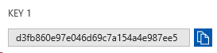
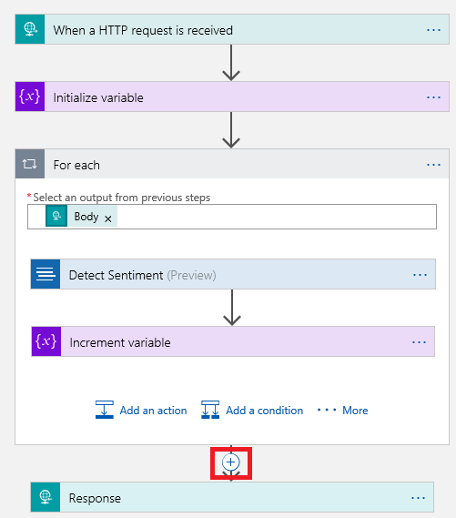
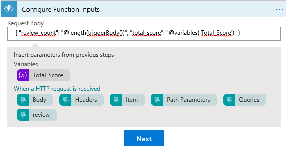
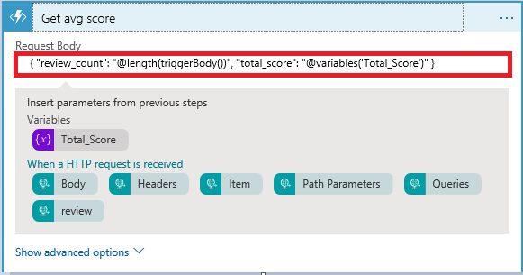
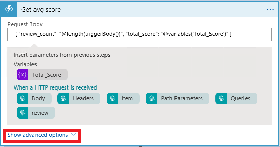
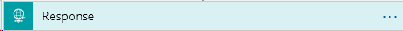
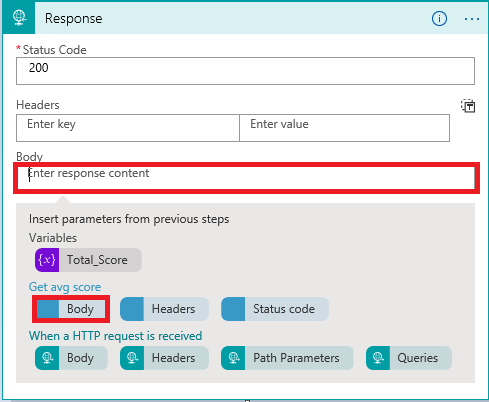
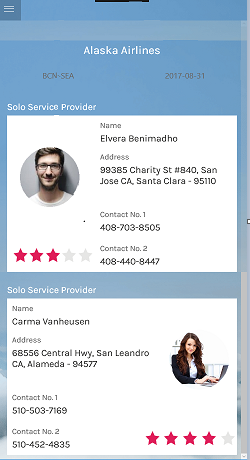

<page title="Fetching the reviews of staff serving Flying Solo Service along with star ratings"/>

   > _So, let's start with modifying the Logic App._

## Scenario 2 – Fetching the reviews of staff serving Flying Solo Service along with star ratings

### Part A – Building Logic App with integration of Text Analytics service

   > _So, here you already have Logic App created. All you need to do is integrate Azure function in existing Logic App._

1. Switch to **Azure Portal** as launched in **Part A of Scenario 1.**
1. Go to **Resource groups** option present in the favourites menu on the left side panel and select **Resource group** named **<inject story-id="story://Content-Private/content/dfd/SP-GDA/gdaexpericence3/story_a_notificationservice_with_cosmosdb" key="myResourceGroupName"/>**.
1. Go to **Cognitive Service** named **<inject story-id="story://Content-Private/content/dfd/SP-GDA/gdaexpericence3/story_a_notificationservice_with_cosmosdb" key="cognitiveService"/>** and click on **Keys** option appearing in the left side panel to copy **Key 1** by clicking on **copy icon.** 
1. It will generate one pop-up window, click on **Allow access** option. 
1. Go to **Resource groups** option present in the favourites menu on the left side panel and select **Resource group** named **<inject story-id="story://Content-Private/content/dfd/SP-GDA/gdaexpericence3/story_a_notificationservice_with_cosmosdb" key="myResourceGroupName"/>**.
1. Go to resource **TextAnalytics** with type as **API Connection,** named **<inject story-id="story://Content-Private/content/dfd/SP-GDA/gdaexpericence3/story_a_notificationservice_with_cosmosdb" key="textAnalytics"/>**. Click on **Edit API connection** option  present under **cognitiveservicestextanalytics** blade and paste copied key into **Account Key** textbox and click on **Save** button.
1. Go to **Resource groups** option present in the favourites menu on the left side panel and select **Resource group** named **<inject story-id="story://Content-Private/content/dfd/SP-GDA/gdaexpericence3/story_a_notificationservice_with_cosmosdb" key="myResourceGroupName"/>**.
1. Click on **Logic app** named **<inject story-id="story://Content-Private/content/dfd/SP-GDA/gdaexpericence3/story_a_notificationservice_with_cosmosdb" key="logicApp"/>**, click on **Logic App Designer** option  present under **Logic app** blade.
1. Move your mouse pointer between **For each** and **Response** block  and click on plus icon . Select **Add an action** option  present in between **For each** and **Response** step.
 
   

1. Search **Azure Functions** in the search box and select it by clicking on it.
1. Choose **SoloServiceFunctionApp** and click on **Create New Function** option. 
1. Add below code snippet in **Request Body.** .

   ```json
    {
	"review_count": "@length(triggerBody())",
	"total_score": "@variables('Total_Score')"
    }

   ```

   >  **NOTE:** The code snippet contains **JSON** body which we are passing to **Azure function**.
   >  It includes:
   >- **review_count** – To represent total reviews.
   >- **@length(triggerBody())** - To place total reviews count in JSON body.
   >- **total_score** – to calculate sum of all reviews.
   >- **@variable('Total_Score')** - To Place Total_score value in JSON body.

1. Click on **Next** button.
1. Enter Function name as **Get_avg_score**  and add below code snippet in code section.

   ```js
    module.exports = function (context, data) {
    var total_score = data.total_score;
    var review_count = data.review_count;
    var average_score = parseFloat(total_score)/parseFloat(review_count);
    //Response of the function to be used later.
    context.res = {
    body:  average_score
    };
    context.done();
    };
   ```

   > **NOTE** : This code snippet of **Azure function** is responsible to calculate the **average score** by accepting **total_score** and **review_count** from input data object. The calculated **average score** **(average_score)** will be returned in the body with the help of context object.

1. Click on **Create** button then on **Save** button appearing on the top.

   >_Great! You have just integrated Azure functions in Logic app._
   
1. Click on **Show advanced options** link on **Get avg score block**, select **Method** as **POST** and click on **Save** button appearing on the top. 
1. Now select **Response block** to expand it  and click on text field named **Body**. click on  and select **Body** from **Get avg score** parameter and click on **Save** button.
1. Click on **When a HTTP request is received**  block of a logic app and copy the **HTTP POST URL** by clicking on  **Copy** icon.

   > _Now, Let's start with consuming Logic app into Visual Studio._

1. Switch to **Visual Studio 2017**, click on  **Stop** **Dubugging** button.
1. Paste the copied URL ( **HTTP POST URL** ) at Line number **48** in **GlobalSettings.cs** file.
1. Now press **Ctrl+S** button from the keyboard to save the changes in the code.

   **For Ex:** - **public const string GetSoloServiceReviewUrl = "HTTP POST URL";**

   > _Here we will start creating C# code to get reviews score using Azure Function._

1. Go to **Dataservices** folder under **ContosoAir.Clients.Core** project and click on it to expand then, click on **SoloServiceProviders** and double click on **ISoloServiceProvider.cs** file.
1. Paste the given code snippet after line number **9**, at line number **10** and press **Ctrl+S** button from the keyboard to **Save** the changes .

   ```C#
   Task<string> GetReviewScore(List<Reviews> Reviews);
   ```
   >**NOTE** : Here we declare **GetReviewScore(List<Reviews> Reviews)** method in **ISoloServiceProvider.cs** interface so that we can implement it into **SoloServiceProvider.cs** class.

1. Go to **Dataservices** folder under **ContosoAir.Clients.Core** project, click on **SoloServiceProvider.cs** file.
1. Paste the below given cpde Snippet after the **function** named - **public async Task<IEnumerable<SoloService>> GetSoloServiceProviderAsync()** after line number **76** at line number **77** and press **Ctrl+S** button from the keyboard to **Save** the changes.

   ```C#
    public async Task<string> GetReviewScore(List<Reviews> Reviews)
    {
        HttpClient httpClient = CreateHttpClient();

        string serialized = await Task.Run(() => JsonConvert.SerializeObject(Reviews, _serializerSettings));
	
        HttpResponseMessage response = await httpClient.PostAsync(GetSoloServiceReviewUrl, new StringContent(serialized, Encoding.UTF8, "application/json"));

        await HandleResponse(response);

        string responseData = await response.Content.ReadAsStringAsync();

        return await Task.Run(() => (responseData));
    }
   ```
   >This Function will retrieve the information along with ratings of staff serving the Flying Solo Service from Logic App.
   > **NOTE**:
   >- The **GetReviewScore** method is responsible for calling the Logic App and to get the average score. It accepts **List of Reviews** as an input parameter and returns string containing the average score.
   >- The **List of Reviews** converted into **JSON** are stored into the **serialized** string variable using **JsonConvert.SerializeObject()** method.
   >- The method **httpClient.PostAsync()** which accepts 2 parameters viz. first -**Logic App url(GetSoloServiceReviewUrl)** and second - **StringContent** object having **JSON** input data serialized, encoding format (Encoding.UTF8) and data type ("application/json").
   >- After getting response in **responseData** variable with the help of **ReadAsStringAsync()** method, the data will get returned into calling method.

1. Now go to **ViewModels** folder under **ContosoAir.Clients.Core** project, click on it to expand and double click on **SoloServiceViewModel.cs** file.
1. Add below code after line number **65** at line number **66** in **InitializeAsync(object navigationData)** method and press **Ctrl+S** button from the keyboard to save the changes.
   ```C#
   var Source_SoloService_Score = await _soloServiceProvider.GetReviewScore(SS.Reviews);
   SoloService.Source_SoloService_Score = float.Parse(Source_SoloService_Score, CultureInfo.InvariantCulture.NumberFormat) * 5;
   ```
   >This function will display the information of source staff serving the Flying Solo Service.

   > **NOTE** : Here we are setting property **Source_SoloService_Score**, by calling **GetReviewScore()** method which accepts **Reviews** as input parameter and return average score(from 0 -1 floating number). Returned score will be converted into floating number and will be multiplied by 5 for plotting reviews in the form of star ratings on UI.

1. Add below code after line number **85** at line number **86** in the else part, and press **Ctrl+S** button from the keyboard to **Save** the changes in the code.

   ```C#
   var Dest_SoloService_Score = await _soloServiceProvider.GetReviewScore(SS.Reviews);
   SoloService.Dest_SoloService_Score = float.Parse(Dest_SoloService_Score, CultureInfo.InvariantCulture.NumberFormat) * 5;
   ```

   >This function will display the information of destination staff serving the Flying Solo Service.

   > **NOTE** : Here we are setting property **Dest_SoloService_Score**, by calling **GetReviewScore()** method which accepts Reviews as input parameter and return average score(from 0 -1 floating number). Returned score will be converted into floating number and will be multiplied by 5 for plotting reviews in the form of star ratings on UI.

### Part B – Launching ContosoAir App

   > _Now we will check the reviews of respective staff serving the Flying Solo Service using_ **ContosoAir** _App._

1. Go to **Visual Studio 2017** IDE, **Solution Explorer** window.
1. Right click on **Contoair.client.Core (portable)** project and click on **Clean** option to clean the project. Then, right click on **Contoair.client.UWP (Universal windows)** project and click on **Clean** option to clean the project.
1. On successful completion of cleaning process, now right click on **Contoair.client.Core (portable)** project and click **Build** option to build the project.
1. On successful completion of cleaning process, now right click on **Contoair.client.UWP (Universal windows)** project and click **Build** option to build the project.
1. Right click on **Contoair.client.UWP (Universal windows)** project, click on **Set as StartUp Project**.
1. Again right click on **Contoair.client.UWP (Universal windows)** project and click on **Deploy** option. 
   
   > **Note:** It will take some time to deploy the project.

1. Click on **Local Machine** option appearing on the Menu bar to launch the **ContosoAir App.**
1. Here you will get details of staff serving Flying Solo Service for the airlines with Star ratings.

   

1. Click on **Hamburger** icon and Select **Solo Service** option.

   

   > _Congrats! You have successfully retrieved the details of staff serving the Flying Solo Service along with their ratings._

   > _Now what if you want to change the reviews of staff serving the Flying Solo Service?_

   > _So, let's start implementation of this scenario by playing with Azure Cosmos DB._

### Part C – Change the reviews of staff serving the Flying Solo Service
1. Switch to Azure Portal as launched **in Part A** of **Scenario 1.**
1. Click on Azure Portal's **Resource groups** option present in the favourites blade in the left side panel and click on **<inject story-id="story://Content-Private/content/dfd/SP-GDA/gdaexpericence3/story_a_notificationservice_with_cosmosdb" key="myResourceGroupName"/>**
1. Click on **<inject story-id="story://Content-Private/content/dfd/SP-GDA/gdaexpericence3/story_a_notificationservice_with_cosmosdb" key="cosmosDbAcc"/>** which is your **Cosmos DB Account.**
1. Then click on **Data Explorer** to view the created **collections** which will be fetched from the **JSON file** imported through **Data Migration Tool**.
1. Now, click on created collection **SoloService** to expand. Click on **Documents** option under the collection to view the data imported through **Migration Tool** into **Cosmos DB.**
1. You can check details of Staff serving Flying Solo service by clicking on their respective **ID's**. 
1. When you click on **id**. **JSON** data will be displayed on right side panel.
1. Change Reviews of of **any 2** staff members manually where **IsAvailable** parameter is **true** only, click on **Update** button  to save each change into **Cosmos DB**.
1. Select on any one of the ID's to change the **Reviews** of that respective Staff member from as per your need.

   
1. Switch to **Visual Studio 2017** IDE, click on  **Stop Dubugging** button.   
1. Click on **Local Machine** option given at top to launch the **ContosoAir App**.
 
1. Here you will get details of staff serving the Flying Solo Service of respective airlines with changes in their reviews i.e. Star ratings.

   

   > _Nice work! You have successfully made changes in respective staff's review and here you can see the changes in Star ratings._