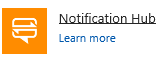
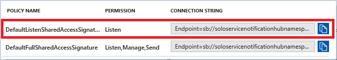
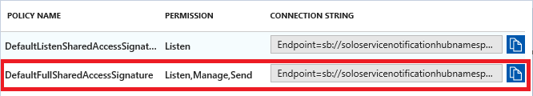
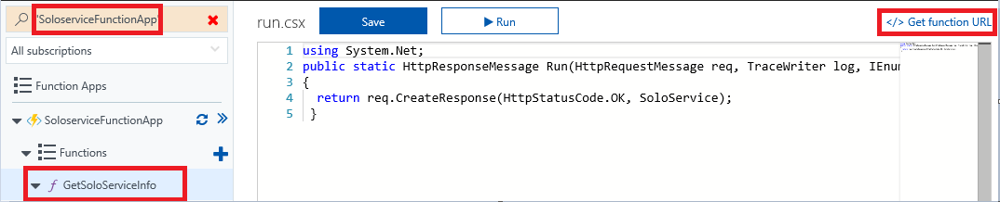
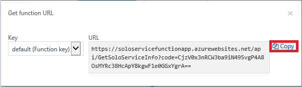
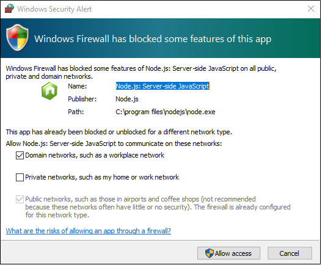
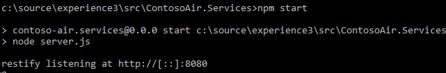
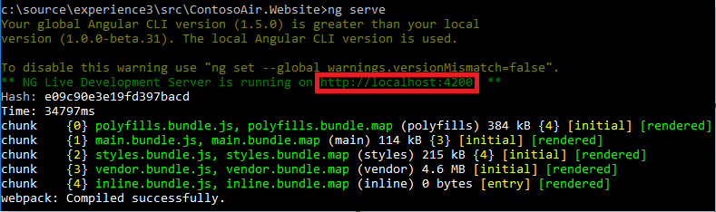
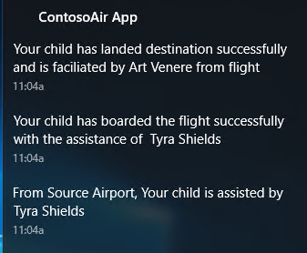

<page title="Integrating Notification API with ContosoAir Application to get the reviews of staff serving the Flying solo service through notifications"/>

## Scenario 3 – Integrating Notification API with ContosoAir app to get the reviews of staff serving the Flying solo service through notifications

### Part A – Creating Notification Hub Service

   > _Here you go! Let's start with creating Notification hub._

1. Switch to **Azure Portal** as launched in **Part A** of **Scenario 1.**
1. Click on  icon and search for **Notification Hub**  in the search bar in **Azure Marketplace** and click on it.
1. Enter name **SoloServiceNotificationHub** in the **Notification Hub** name text field.
1. Add a name space **SoloServiceNotificationHubNameSpace** in **Create a new namespace** text box.
1. Select **Use existing** radio button from **Resource Group** and select **<inject story-id="story://Content-Private/content/dfd/SP-GDA/gdaexpericence3/story_a_notificationservice_with_cosmosdb" key="myResourceGroupName"/>** Resource group from the dropdown.
1. Click on **Create** button to create Notifcation Hub.
1. To view the deployment process, click on **Notification Icon** .
   > **NOTE:** It takes some time to complete the deployment process of the resources.
1. Click on    to close the notification window once deployment process is complete.
1. Click on Azure Portal's **Resource groups** option present in the favourites blade in the left side panel and click on **<inject story-id="story://Content-Private/content/dfd/SP-GDA/gdaexpericence3/story_a_notificationservice_with_cosmosdb" key="myResourceGroupName"/>**
1. Click on **SoloServiceNotificationHub** resource created by you and select **Notification Services**  option present under **Notification Hub** blade.

1. Click on **Windows (WNS)** option and copy the given **Package SID** and **Security Key** in their respective text boxes.
   - **Package SID:**
   ```keys
    ms-app://s-1-15-2-965052657-715354177-1036002863-386522108-950863088-3653357836-1182285094
   ```    
   - **Security Key:**
   ```keys
   k+/vCn6PwMnIlOMz8AG57zv7Yz/vBGiw
   ```  
   
   >**NOTE:** **Please make sure that there is no any whitespace before or after the keys.**
1. Click on **Save** button.
1. Click on Azure Portal's **Resource groups** option present in the favourites blade in the left side panel and click on **<inject story-id="story://Content-Private/content/dfd/SP-GDA/gdaexpericence3/story_a_notificationservice_with_cosmosdb" key="myResourceGroupName"/>.**
1. Select **SoloServiceNotificationHub** resource created by you and select **Access Policies** [](img/Access_Policies.png) option present under **Notification Hub** blade.
1. Now go to **Access Policies** option present under **Notification Hub** blade.
1. Copy the link present under option **DefaultFullSharedAccessSignature** with permission as **Listen.**
   
1. Switch to **Visual Studio 2017**, click on  **Stop Dubugging** option present on the top.
1. Go to **Solution Explorer** window, open the file named **GlobalSettings.cs** from **ContosoAir.Clients.Core** ( **Portable** ) project.
1. Paste the copied Connection String from **Step** number **16** into parameter **NotificationHubConnectionString** present at line number **33**, provide **Notification Hub Name** as **SoloServiceNotificationHub** which is present at line number **34** and press **Ctrl+S** button from the keyboard to save the changes.

   ```
   public const string NotificationHubConnectionString = "XXXXX";  
   public const string NotificationHubName = "SoloServiceNotificationHub";
   ```
   > **For Ex:** public const string NotificationHubConnectionString = "Endpoint=sb://soloservicenotificationhubnamespace.servicebus.windows.net/;SharedAccessKeyName=DefaultListenSharedAccessSignature;SharedAccessKey=6bjd1QVcVfgKOixW1ttYBu3k7bNghUPIjkWAZDRXRP4=";

   > _Congrats! You have just configured the notification service._

1. Go to **Solution Explorer** window.
1. Right click on **Contoair.client.Core (portable)** project and click on **Clean** option to clean the project. Then, right click on **Contoair.client.UWP (Universal windows)** project and click on **Clean** option to clean the project.
1. On successful completion of cleaning process, now right click on **Contoair.client.Core (portable)** project and click **Build** option to build the project.
1. On successful completion of cleaning process, now right click on **Contoair.client.UWP (Universal windows)** project and click **Build** option to build the project.
1. Right click on **Contoair.client.UWP (Universal windows)** project, click on **Set as StartUp Project**.
1. Again, right click on **Contoair.client.UWP (Universal windows)** project and click on **Deploy** option. 
1. Click on **Local Machine** option appearing on the Menu bar to launch the **ContosoAir App.**
   > _Nice Work! Now you can get staff reviews along with their ratings through notifications._

### Part B – Availing Solo Service while booking the ticket

   > _In this part, we will avail Solo Service at the time of flight booking._
1. Switch to **Azure Portal** as launched in **Part A** of  **Scenario 1**.
1. Click on Azure Portal's **Resource groups** option present in the favourites blade in the left side panel and click on **<inject story-id="story://Content-Private/content/dfd/SP-GDA/gdaexpericence3/story_a_notificationservice_with_cosmosdb" key="myResourceGroupName"/>**
1. Select **SoloServiceNotificationHub** resource and select **Access Policies** [](img/Access_Policies.png) option present under **Notification Hub** blade.
1. Copy **CONNECTION STRING** present under POLICY NAME **DefaultFullSharedAccessSignature** with **PERMISSION** as **Listen, Manage, Send**.
   
1. If generating a pop-up window, click on **Allow access** option. 
1. Paste it into the file named **Credential.txt** present on the **Desktop** with proper label.
   >**For Ex:**
   - Connection String: XXXXX
   - URI : XXXXX
   - Primary Key : XXXXX
   - Function App URL : XXXX
   
1. Again switch to **Azure Portal**, go to **Resource groups** and select resource group **<inject story-id="story://Content-Private/content/dfd/SP-GDA/gdaexpericence3/story_a_notificationservice_with_cosmosdb" key="myResourceGroupName"/>**. Click on resource **<inject story-id="story://Content-Private/content/dfd/SP-GDA/gdaexpericence3/story_a_notificationservice_with_cosmosdb" key="cosmosDbAcc"/>**

1. Click on **Keys** option displayed in left panel.

1. Copy **URI**, **Primary Key** and paste it into the **Credential.txt** file present on the **Desktop** and save the file.

1. Also copy the **Azure Cosmos DB Account** resource name **<inject story-id="story://Content-Private/content/dfd/SP-GDA/gdaexpericence3/story_a_notificationservice_with_cosmosdb" key="cosmosDbAcc"/>** and paste it into the notepad file **Credential.txt** present on **Desktop** and save the file.
   

1. Again switch to **Azure Portal**, go to **Resource groups** and select resource group **<inject story-id="story://Content-Private/content/dfd/SP-GDA/gdaexpericence3/story_a_notificationservice_with_cosmosdb" key="myResourceGroupName"/>**.

1. Search for created **Function App** named **SoloserviceFunctionApp**. Click on **GetSoloSerivceInfo** function present under **Function Apps** blade.
   

1. Click on **Get function URL.** Click on **Copy** option to copy the **URL** and paste it into the file **Credentail.txt** present on the **Desktop** and save the file.
   

1. Go to folder **C:\source\experience3** and double click on **ContosoAir.Website_and_Services.sln** file to load it in seperate **Visual Studio 2017** IDE.

1. Go to **Solution Explorer** open the file named **Config.js** from **ContosoAir.Services** project.

   - Paste the copied **Connection String** from **Step 4** into **NOTIFICATION_SECRET** parameter.
   - Paste the copied **URI**from **Step 8** into **DOC_DB_ENDPOINT** parameter.
   - Paste the copied **Primary Key** from **Step 8** into **DOC_DB_PRIMARYKEY** parameter.
   - Paste the copied **Function App URL** from **Step 12** into **GET_SOLOSERVICE** parameter and press **Ctrl+S** button from the keyboard to save the file.
  
   >**NOTE:** 
   > - NOTIFICATION_SECRET: process.env.NOTIFICATION_SECRET || ''XXXXX'
   > - DOCUMENT_DB_ENDPOINT: process.env.DOC_DB_ENDPOINT || ''XXXXX'
   > - DOCUMENT_DB_PRIMARYKEY: process.env.DOC_DB_PRIMARYKEY || ''XXXXX'
   > - GET_SOLOSERVICE: process.env.GET_SOLOSERVICE || 'XXXXX'

1. Open **Command prompt** by double clicking on **Command Prompt** icon  present on the desktop.
1. Now copy-paste the below path and press enter button.
  
   ```cmd
   cd c:\source\experience3\src\ContosoAir.Services
   ```
1. Copy-paste the below commands one by one.

   ```cmd
   npm install
   ```

   ```cmd
   npm start
   ```
   > **NOTE** : You may encounter a popup  *Windows Firewall has blocked some features for this app*.

   

   > Click on *Cancel* button.

   

1. Once the above process is completed. Open another **Command prompt** window by double clicking on **Command Prompt** icon  present on the desktop.
1. Go to the path given below and press enter button.
   ```cmd
   cd c:\source\experience3\src\ContosoAir.Website
   ```
1. Execute the **commands** given below one by one.
   ```cmd
   npm install -g @angular/cli
   ```
   ```cmd
   npm install
   ```
   ```cmd
   set PATH=%PATH%;%AppData%\npm\
   ```
   ```cmd
   ng serve
   ```
   

1. Copy the **localhost URL** from the **Command Prompt** and paste it in browser, you will be redirected to **ContosoAir Website.**

   

1. You will need to login first using your **Microsoft Account Login** credentials.

   > **NOTE:** You should have Microsoft Account Credentials to Login and get access to **ContosoAir** website.

   

1. Once logged in, you will be redirected to **ContosoAir Website.** Enter **Departure date** and **Return date** in **yyyy-mm-dd** format and click on **Find Flights** button.
1. You will now be redirected to **Available flights** page. Select flights and click on **Next** button displayed at end of the page. 

   

1. Select seat of your choice and click on **Next** button displayed at end of the page. 

   

1. You will be viewing all your flight details in **Flight Summary** page, check **Apply for Solo Service** checkbox.
1. Click on **Purchase** button displayed at end of the page.

   

1. Timely notifications regarding the status of solo service provider would pop up.
   
1. To view those notifications in detail, click on the notification option present at the right bottom corner of your desktop .

 > _Awesome, here we have successfully Developed Xamarin App with Azure Cosmos DB and Notification Services_