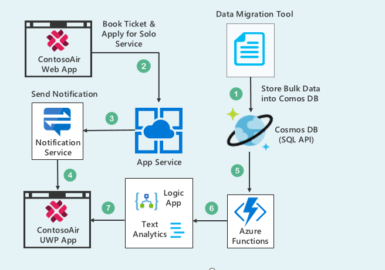

# Developing Xamarin Apps with Azure Cosmos DB and Notification Services
## User Story

Consider the user scenario. Alice, the daughter of Kevin, is a minor and willing to travel from **Seattle** to **Barcelona** and wants to avail  "**Flying Solo Service**" provided by Airline. But as a parent, Kevin needs to know and be assured that the child will be taken care of.

Using **ContosoAir app** you will come across **Azure Notification APIs**, **Text Analytics API**, **Azure Function**, **Logic App** and **Cosmos DB**. After completion of the flight booking process through **ContosoAir application** you will get the reviews of staff serving flying solo service through push notifications.

   

## Components Used in Scenario

   

- **Notification Hubs** / **Azure Notification APIs**, a multi-platform, scalable push-notification engine for quickly sending millions of messages. ([Notification API](https://docs.microsoft.com/en-us/azure/notification-hubs/notification-hubs-push-notification-overview))
- **Text Analytics API** is a cloud-based service that provides advanced natural language processing over raw text, and includes three main functions: sentiment analysis, key phrase extraction, and language detection. ([Text Analytics API](https://docs.microsoft.com/en-in/azure/cognitive-services/text-analytics/overview))
- **Azure Functions** is a serverless compute service that enables you to run code on-demand without having to explicitly provision or manage infrastructure. Use Azure Functions to run a script or piece of code in response to a variety of events. ([Azure Functions](https://docs.microsoft.com/en-us/azure/azure-functions/))
- **Logic Apps** provide a way to simplify and implement scalable integrations and workflows in the cloud. It provides a visual designer to model and automate your process as a series of steps known as a workflow. ([Logic Apps](https://docs.microsoft.com/en-us/azure/logic-apps/))
- **Azure Cosmos DB** is Microsoft's globally distributed, multi-model database. With the click of a button, Azure Cosmos DB enables you to elastically and independently scale throughput and storage across any number of Azure's geographic regions. It offers throughput, latency, availability, and consistency guarantees with comprehensive (SLAs), something no other database service can offer. ([Azure Cosmos DB](https://docs.microsoft.com/en-us/azure/cosmos-db/))

## What you will learn from this experience

- Create collections and insert data in **Cosmos DB** using **Data Migration Tool**.
- Creating **Azure Functions** to retrieve data of ground staff serving the Flying Solo service.
- Playing around code in **Visual Studio 2017** IDE to change the availability of staff serving the **Flying Solo Service.**
- Creating **Logic App** and integrating **Text Analytics.**
- Playing around code in **Visual Studio 2017** IDE to change reviews of staff serving Flying Solo Service.
- Configuration of **Notification API.**
- Playing with **ContosoAir Application** to book tickets and get timely notifications.

>  ***Ready? Let's get started!***