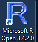
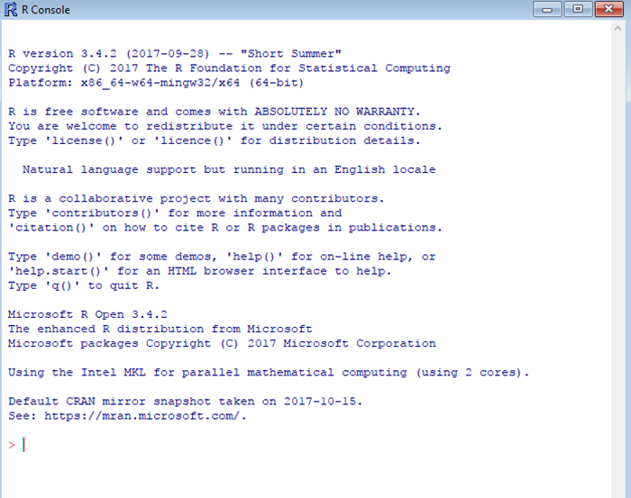
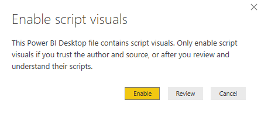
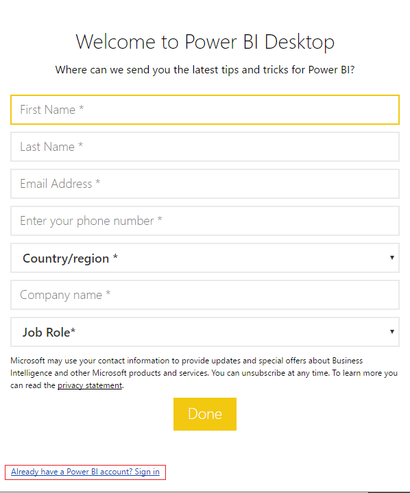
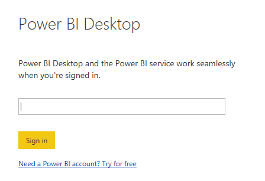
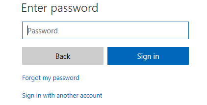
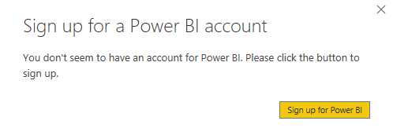
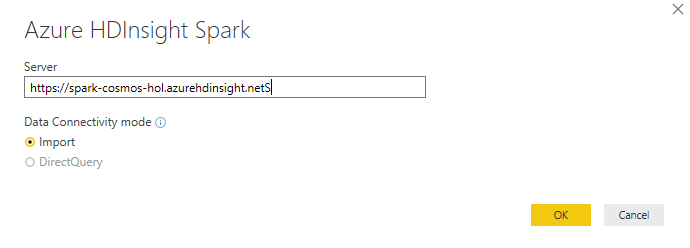
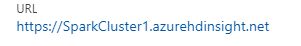
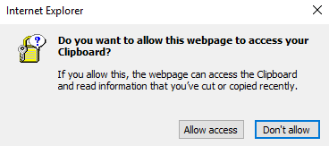

<page title="Creating interactive Power BI Dashboard and explore RScript component in Power BI"/>

## Scenario 2 -  Creating interactive Power BI Dashboard and explore RScript component in Power BI

   >_Now, let's start with creating intaractive Power BI dashboard to display flight cancellation and delay analysis using Power BI._

1. First, we will install libraries required for **R Script component** to view the **Power BI** report created using **R script**.
1. Open **Microsoft R Open 3.4.2.0**  present on desktop by double clicking on it.

   

1. Copy below given command to install packages required for **R Script component**, paste it in **R console editor** and click on Enter button.
   ```
   ipak <- function(pkg){
   new.pkg <- pkg[!(pkg %in% installed.packages()[, "Package"])]
   if (length(new.pkg))
   install.packages(new.pkg, dependencies = TRUE)
   sapply(pkg, require, character.only = TRUE)
   }
   packages <- c("colorspace", "ggExtra", "ggplot2", "ggrepel", "gridExtra")
   ipak(packages)

   ```
   >_Note: You may encounter popups during installtion of packages.Accept all popups by clicking on Yes button_.
  
1. You can now minimize the **R console editor** after package installation.
1. Now, open file **Flight_Report** present at location **C:\source** by double clicking on it.
1. After file gets opened, you may get pop up **Enable script visuals**. Click on **Enable** button to accept that pop up.
   
   

1. Now click on link **Already have a Power BI Account? Sign in** present on **Welcome to Power BI Desktop** pop up at the bottom of the page.

   

1. Now enter **Username** mentioned in **Scenario 1-Part A** to login in **Power BI desktop**.

   

1. Also add **Password** mentioned in **Scenario 1-Part A** in **Password** field and click on **Sign In** button.

   

1. Close the pop up - **Sign up for Power BI Account** by clicking on **Close** icon.
   
   

1. Now go to **Edit Queries** option present on Top Ribbon and click on **Edit Queries**.
 
   

1. Click on **flightdb** present in Query blade and then double click on **Source** option present in **Applied Steps** blade.
1. Now, you have to pass the URL of your created **Spark cluster** in **Server** field present in **Azure HDInsight Spark** pop up.

   

1. So, Navigate back to **Azure** **Portal** launched in **Part A-Scenario 1**. Go to **All** **Resources** Group and select your resource group **<inject story-id="story://Content-Private/content/dfd/SP-GDA/gdaexpericence4/story_a_spark_with_cosmosdb" key="myResourceGroupName"/>**.
1. Now click on your created **Spark Cluster** named **SparkCluster<inject story-id="story://Content-Private/content/dfd/SP-GDA/gdaexpericence4/story_a_spark_with_cosmosdb" key="myResourceGroupName"/>** and copy the URL for cluster present in **Cluster Dashboard** by clicking on **Click to Copy** icon present in front of it.  

   

   >_Note: You may encounter pop up **Do you want to allow this webpage to accept your Clipboard?**. Click on **Allow access** button_.
     
   

1. Navigate back to **Power BI dashboard** to paste the URL in **Server** field of **Azure HDInsight Spark** pop up and click on **OK** button.
1. You may get pop up to login. Here add **UserName** and **Password** mentioned in **Part B-Scenario 1** and click on **Login** button.
1. Click on **Close and Apply** option present in Top ribbon.
   >_Note: It may take time to upload the data present in flightdb and AIRLINE_ID_.

1. Now you can check graphs regarding analysis of cancelled and delayed flights on Power BI Dashboard.
   >_Note: You may get error while checking Power BI reports for Flight Delay by Origin and Flight Delay by Dest. Kindly reinstall the packages - by performing step 3 in Scenario 2_.

   >_Note: It may take time to load the graphs for Flight Delay by Origin and Flight Delay by Dest as we have created these graphs using R script component._

   >_Congrats! You have successfully created interactive Power BI dashboard where you can check cancelled and delayed flight's analysis in graphical format._
   
   
 