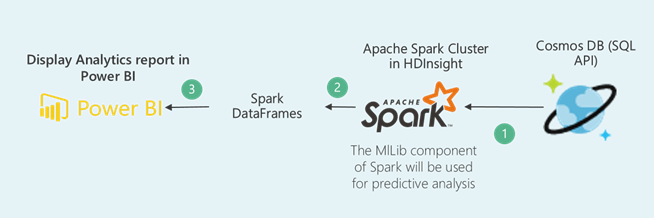

# Flight Delay analysis using Cosmos DB, Spark Cluster in HDInsight and Power BI

## User Story

Consider the user scenario, authorized ground staff member from Airline industry wants to perform analysis regarding cancelled and delayed flights as these are most remembered performance indicators of any transportation system.
So, we will represent cancelled and delayed flight analysis in graphical format to the end user using **Cosmos DB, Spark Cluster in HDInsight** and **Interactive Power BI dashboard**.

  

## Components Used in this Scenario

  

- **Azure Cosmos DB** is Microsoft's globally distributed, multi-model database. With the click of a button, Azure Cosmos DB enables you to elastically and independently scale throughput and storage across any number of Azure's geographic regions. It offers throughput, latency, availability, and consistency guarantees with comprehensive SLAs, something no other database service can offer. ([Azure Cosmos DB](https://docs.microsoft.com/en-us/azure/cosmos-db/))
- **Spark Cluster in HDInsight**  is an open-source parallel processing framework that supports in-memory processing to boost the performance of big-data analytic applications. When you provision a Spark cluster in HDInsight, you provision Azure compute resources with Spark installed and configured. The data to be processed is stored in Azure Blob storage (WASB). ([Apache Spark](http://spark.apache.org/))
- With **Azure services** and **Power BI**, you can turn your data processing efforts into analytics and reports that provide real-time insights into your business. Whether your data processing is cloud-based or on-premises, straightforward or complex, single-sourced or massively scaled, warehoused or real-time, Azure and Power BI have the built-in connectivity and integration to bring your business intelligence efforts to life. ([Power BI](https://powerbi.microsoft.com/en-us/documentation/powerbi-azure-and-power-bi/))

## What you will learn from this lab

- Creating **Spark Cluster** in **HDInsight**.
- Creating **Data frames** from the **Azure CosmosDB** Collection using **Jupyter notebook**.
- Creating interactive **Power BI Dashboard** and explore the **RScript** component in **Power BI**.

  >_Ready? Let's get started!_