<page title="Analysing emotions of the captured image through Emotion API and manually enter the feedback, then analysing the displayed message accordingly"/>

## Scenario 1: Analysing emotions of the captured image through Emotion API and manually enter the feedback, then analyzing the displayed message accordingly

### Part A - Accessing the Azure portal

> _We'll start with accessing_ **Azure Portal.** _For creating resources, you need to_ **Sign in** _to_ **Azure Portal.** _The steps to do the same is given below:_


1. Click on the link [http://portal.azure.com](launch://launch_azure_portal) to open *Azure Portal* and maximize the browser window.
1. Sign in with your **Azure username** and **password**
    - Username: **<inject key="AzureAdUserEmail" />**
    - Password: **<inject key="AzureAdUserPassword" />**
1. Click on *Sign in* button. 
1. If you see the **Stay signed in?** screen next, select the **Yes** button to continue.
1. You may encounter a popup entitled **Welcome to Microsoft Azure** with options to **Start Tour** and **Maybe Later** – Choose **Maybe Later**. [Ignore the Step no. 5, if didn't get the popup message]

> _Great! You are now logged in to the Azure Portal._

### Part B - Creating collections and inserting data in Cosmos DB using Data Migration Tool

> _But, what you will do with Cosmos DB without data? So, let's insert some data into Cosmos DB using Microsoft's Data Migration Tool._

 >_For more details about the migration tool, click on the given link [Data Migration tool.](https://docs.microsoft.com/en-us/azure/cosmos-db/import-data)_


1. To download the source code, open the command prompt window by clicking on  icon present on the **Desktop** and run below commands

   ```cmd
   git clone https://github.com/Click2Cloud/gdaexperience4-story-a.git c:\source\experience4
   cd c:\source\experience4
   ```
1. Double click on **dtui.exe**  file present on **Desktop** to launch the **Data Migration Tool**.
1. After the tool is launched, click on **Source Information** menu present on the left panel.
1. Select **JSON file(s)** option from **Import from** dropdown.
1. Click on **Add Files** button.
1. Select the JSON file **FlightData.json** present at the location **C:\source\experience4\PayloadData** and click **Open** button.
1. Then click **Next** button to go to **Target information** menu.
1. Now, switch to **Azure Portal** which you logged in **Part A**.
1. Navigate to Azure Portal's **Resource Group** option present in the favourites menu on the left side panel and select resource group named **<inject story-id="story://Content-Private/content/dfd/SP-GDA/gdaexpericence5/story_a_azurefunction_with_cosmosdb" key="myResourceGroupName"/>** and click on Azure Cosmos DB Account **<inject story-id="story://Content-Private/content/dfd/SP-GDA/gdaexpericence5/story_a_azurefunction_with_cosmosdb" key="cosmosDbAcc"/>**.
1. Go to **Keys** option under **Azure Cosmos DB account** blade and **copy** the **PRIMARY CONNECTION STRING**.

   

1. If you see below popup, then click on **Allow access** button.

   

1. Switch back to **Data Migration Tool** already launched in **step 1**.
1. Paste the copied **Primary Connection String** in **Connection String** text box and append the **Database Name** at the end of the string in **Target information** option. Please refer the below screenshot.

   **For e.g.** 
    AccountEndpoint=https://your_cosmosdb_endpoint/;AccountKey=your\_primary\_key== ;**Database=<inject story-id="story://Content-Private/content/dfd/SP-GDA/gdaexpericence5/story_a_azurefunction_with_cosmosdb" key="cosmosDbAcc"/>**
   
   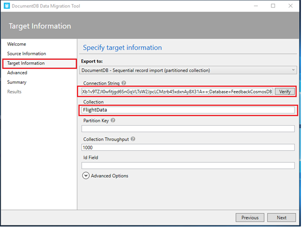

1. Next, click on **Verify** button next to **Connection String** field to verify the connection string.
1. On successful verification of the connection string, success pop-up window will display, then click on **OK** button.
1. On verification failure of the connection string, a pop-up window will appear prompting the **failure message**, then click on **OK** button and again verify the connection string till successful verification.
1. Enter the **Collection** value as **FlightData**.
1. Click on **Next -> Next -> Import** to import the data present in JSON file into Cosmos DB collection.
1. This will start the data uploading process. Wait for some time to complete the process.
1. Once the process is complete, close the **Data migration tool** by pressing **X** icon on the top right corner of the window.
1. Now, switch to **Azure Portal** launched in **Part A**.
1. Click on Azure Portal's **Resource Group** option present in the favourites blade in the left side panel and click on **<inject story-id="story://Content-Private/content/dfd/SP-GDA/gdaexpericence5/story_a_azurefunction_with_cosmosdb" key="myResourceGroupName"/>.**
1. Click on **<inject story-id="story://Content-Private/content/dfd/SP-GDA/gdaexpericence5/story_a_azurefunction_with_cosmosdb" key="cosmosDbAcc"/>** which is your **Cosmos DB Account.**
1. Then click on **Data Explorer** to view the created collections
1. The **FlightData** collection is available under the **COLLECTIONS** section which is created while importing the data through **Data migration tool**.
1. Now, click on **FlightData** collection to expand it and then, click on **Documents** option under the collection to view the data imported through **Data Migration tool**.

   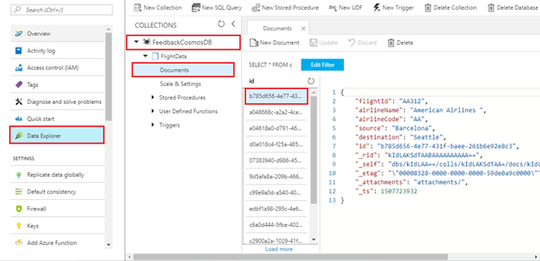

> _Nice work! You have successfully created collections in your Cosmos DB. Next, we will see how we can create the Azure Functions._

### Part C - Creating Azure Functions.

> _Let's start with the creation of Azure Function App in this scenario._

1. Go to **Azure portal,** click on  icon and search for **Function App** in the search bar and press **enter** button.

   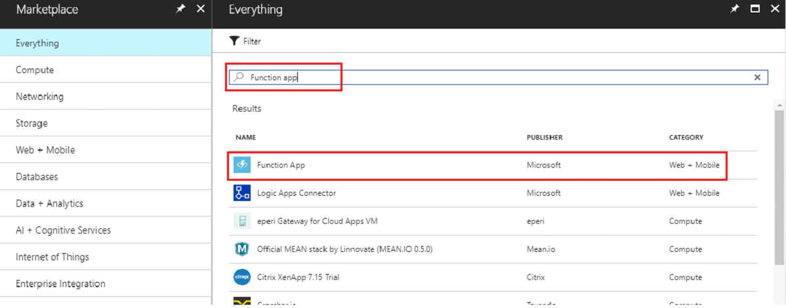

1. Click on **Function App** in the **Results** section and then click **Create** button present at the bottom of the page.
1. Now, enter app name as **FeedbackApp<inject story-id="story://Content-Private/content/dfd/SP-GDA/gdaexpericence5/story_a_azurefunction_with_cosmosdb" key="myResourceGroupName"/>** in the **App name** text field.
1. Select subscription from **Subscription** drop down.
1. Select **Use existing** radio button from **Resource Group** and select **<inject story-id="story://Content-Private/content/dfd/SP-GDA/gdaexpericence5/story_a_azurefunction_with_cosmosdb" key="myResourceGroupName"/>** from the drop down.
1. Select **Consumption Plan** option for **Hosting Plan** drop down list.
1. Select Location **West US** from the drop down.
1. Select **Create New** radio button available under **Storage**, **Storage** name will be automatically generated by selecting **Create new** radio button.
1. Click on **Create** button to create Azure Function.
1. To view the deployment process, click **Notification Icon** 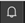
  
   >**Note**: It takes some time to complete the deployment process.

1. Click on **Go to resource** button to view the successfully created resource group.
1. Click on  icon to close the **notification** window.
1. Then click on **FeedbackApp<inject story-id="story://Content-Private/content/dfd/SP-GDA/gdaexpericence5/story_a_azurefunction_with_cosmosdb" key="myResourceGroupName"/>** available in the **Function App** section.

   > _Here you go! let's create Function to retrieve data of flights._


1. Click on **+ sign**  besides **Functions**.
1. Click on **Custom function** link present at the bottom of  page in **Get started on your own** section.

   

1. Select **HttpTrigger – C#.**
1. Enter **selectFlightData** in **Name** field.
1. Click on **Create** button.
1. This will create the **selectFlightData** with default code.
1. Now, replace the sample default code with the code snippet given below:

   **Code Snippet:**
   ```.net
   using System.Net;

   public static HttpResponseMessage Run(HttpRequestMessage req, TraceWriter log, IEnumerable<dynamic> flightDataValue)
   {
       return req.CreateResponse(HttpStatusCode.OK, flightDataValue);
   }
   ```

   > In above code snippet, **IEnumerable&lt;dynamic> SelectDealsData** is a parameter used to fetch the list of **FlightData** collection from Cosmos DB. This method returns the result fetched from Cosmos DB along with **HttpStatusCode** with the help of **CreateResponse** method.

1. Click **Save** button. 
1. Now, click on **Integrate** option given in the **Function Apps** blade.
1. Go to **Inputs,** and click **+New Input** 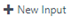 .Then click on **Azure Cosmos DB**, click on **Select** button at the bottom of page.
1. Enter **Document parameter name** as **flightDataValue** in text box, **Database name** as **<inject story-id="story://Content-Private/content/dfd/SP-GDA/gdaexpericence5/story_a_azurefunction_with_cosmosdb" key="cosmosDbAcc"/>** and **Collection name** as **FlightData** in respective textboxes.
1. Copy the **SQL query** given below and paste it into the **SQL Query (optional)** text box.

   **Code Snippet:**
   ```sql
   select c.flightId, c.airlineName, c.airlineCode, c.source,c.destination, c.flightDate from c
   ```
   <br>

   > **Note:** Above SQL query is responsible to get Flight Data from **FlightData** collection in **FeedbackCosmosDB** database like id, airline name, airline code, source, destination. (Ignore non-mandatory fields)

1. To enter **Cosmos DB account connection,** click on **new** link given beside **Azure Cosmos DB account connection** textbox. 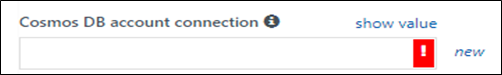
1. You will be redirected to **SQL DB Account** blade, select the Document DB Account named as **<inject story-id="story://Content-Private/content/dfd/SP-GDA/gdaexpericence5/story_a_azurefunction_with_cosmosdb" key="cosmosDbAcc"/>**.
1. If **SQL DB Account** name is not displayed, refresh the portal and search for your **SQL DB Account** name again.
1. Then click **Save** button.
1. Now, click on **selectFlightData** function available under **Function Apps** blade.
1. Click on **Test** tab displayed in the extream right corner of the window.
1. In **Test** blade, select the **HTTP method** as **GET.**
1. Click on **Run** button displayed at the bottom.
1. The **output** message should display **Status: 200 OK**.

   > _Here you go! You have successfully created_ **Azure Function** _to retrieve data from_ **Cosmos DB**_. Now let's create one more Function to insert the feedback data._

1. Go to **Resource groups**+, select your created resource group  **<inject story-id="story://Content-Private/content/dfd/SP-GDA/gdaexpericence5/story_a_azurefunction_with_cosmosdb" key="myResourceGroupName"/>**.
1. Click on the **FeedbackApp<inject story-id="story://Content-Private/content/dfd/SP-GDA/gdaexpericence5/story_a_azurefunction_with_cosmosdb" key="myResourceGroupName"/>** **function App**
1. Then click on **+ sign**  beside **Functions**.
1. Select **HttpTrigger – C#.**
1. Enter **InsertFeedbackData** in **Name** field and click on **Create** button.
1. A function with default sample code would be created. Now, replace the sample code with the given code.
   ```json
   #r "Newtonsoft.Json"
   using System;
   using Newtonsoft.Json;
   using Newtonsoft.Json.Linq;

   public static void Run(string req, out object insertFlightFeedbackData, TraceWriter log)
   {
       log.Info($"C# Queue trigger function processed: {req}");
       dynamic contoso = JObject.Parse(req);

       insertFlightFeedbackData = new {
           flightId = contoso.flightId,
           feedbackText = contoso.feedbackText,
           ratingOnEmotion = contoso.ratingOnEmotion,
           textAnalyticScore = contoso.textAnalyticScore
    };
    }
   ```
   > **Note:** In above code snippet, the out parameter **insertFlightFeedbackData** is a parameter used to insert the JSON data into **FlightFeedbackData** collection. This method returns the status code 200, if the function gets executed successfully.

1. Click **Save** button.
1. Navigate to **Integrate** available under **InsertFeedbackData** function.
1. Now, go to **Outputs** and click on **New Output** and select **Azure Cosmos DB.**
1. Copy the given parameter name **insertFlightFeedbackData** and paste it in **Document Parameter Name** text box.
1. Enter same **Database name** as **<inject story-id="story://Content-Private/content/dfd/SP-GDA/gdaexpericence5/story_a_azurefunction_with_cosmosdb" key="cosmosDbAcc"/>**.
1. Enter **Collection name** as **FlightFeedbackData**.
1. Check **If true, creates the Cosmos DB Database and collection** checkbox.
1. Select your **Cosmos DB account connection** from dropdown.

   

1. Click on **Save** button.
1. Now, to test the function, click on **InsertFeedbackData** function available in **Functions** blade.
1. Select the **Test** tab displayed in extream right corner of the window.
1. In **Test** blade, select **HTTP method** as **POST**.
1. Replace the below snippet in **Request body** section.
   ```json
    {
        "flightId": "AA126",
        "feedbackText": "flight are good and service also",
        "ratingOnEmotion": 4,
        "textAnalyticScore": 0.925633462654865
    }
   ```
   > **Note:** This is the type of JSON used to insert the feedback data into Cosmos DB.

1. Click on **Run** button  displayed in bottom.
1. Verify the output in **Output** area.
1. To verify collection creation, go to **<inject story-id="story://Content-Private/content/dfd/SP-GDA/gdaexpericence5/story_a_azurefunction_with_cosmosdb" key="myResourceGroupName"/>** resource group.
1. Click on created **<inject story-id="story://Content-Private/content/dfd/SP-GDA/gdaexpericence5/story_a_azurefunction_with_cosmosdb" key="cosmosDbAcc"/>**.
1. Click on the **Data Explorer,** the respective information of the created database name and collections will be displayed.

> _Congratulations! You have successfully created_ **Azure Function** _to insert feedback data._

### Part D - Connecting ContosoAir Application with Azure Function.

> _In this part, you will be connecting the ContosoAir Application with Azure Function_.

1. Now, switch to **Azure Portal** as launched in **Part A**.
1. Now, go to **Resource group** present on the left panel, and click on your Resource group **<inject story-id="story://Content-Private/content/dfd/SP-GDA/gdaexpericence5/story_a_azurefunction_with_cosmosdb" key="myResourceGroupName"/>.**
1. Click on created **Azure Function -> FeedbackApp<inject story-id="story://Content-Private/content/dfd/SP-GDA/gdaexpericence5/story_a_azurefunction_with_cosmosdb" key="myResourceGroupName"/>**.
1. Click on function -> **selectFlightData**.
1. You will get navigated to function and will find **</> Get function URL** link on the top right corner of the page. Click on the link 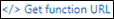
1. On clicking **</> Get function URL,** you will get a pop up window with a URL.
1. Click on **Copy** icon  to copy the given URL.
1. Allow access for copying text pop up would be displayed, click on **Allow access** button.

   

1. Open the **C:\source\experience4** folder in **File Explorer** and double click on **ContosoAir.Xamarin.sln** file to load the project in **Visual Studio 2017**. This may take some time.
1. If prompted to sign in to **Visual Studio**, click **Sign in** button.
1. In the **Email or phone** field, type **<inject key="AzureAdUserEmail"/>**.
1. In the **Password** field, type **<inject key="AzureAdUserPassword"/>**.
1. Click **Sign in**.
1. If prompted to **Choose your color theme** screen, click on **Start Visual Studio**.
1. Now, go to **Solution Explorer** and expand **ContoAir.Client.Core (Portable)** project.
1. Double click on **GlobalSettings.cs File** to open.
1. Paste the copied function URL at **Line No. 44** in **GlobalSettings.cs** file.

   **E.g.**: - public const string GetFlightDetailsUrl= **"Get function URL";**

    > **Note**: This URL is used to retrieve the data of flight in ContosoAir Application.

### Part E– Connecting Cognitive Service – Emotion API with ContosoAir App

> _In this part, you will be connecting_ Cognitive Service – Emotion API _with ContosoAir Application._

1. Switch to **Azure Portal**.
1. Go to **Resource groups** and select your created Resource Group.
1. Select the Emotion API **<inject story-id="story://Content-Private/content/dfd/SP-GDA/gdaexpericence5/story_a_azurefunction_with_cosmosdb" key="cognitiveServiceEmotionAPI"/>** resource created at the time of deployment.
1. Go to the **Keys** menu of **Resource Management** section and copy **Key1.**
1. Allow access for copying text pop up would be displayed, click on **Allow access** button.

   
 
1. Switch to **GlobalSettings.cs** file opened by you in **Part D**.
1. Paste the copied **Key1** in **GlobalSettings.cs** file at **Line No. 15** .

   **Ex: -** public const string CognitiveServiceKey= **"Key1";**

   > **Note:** This URL is used to retrieve the data of flight in ContosoAir Application.

### Part F – Building Logic App with connector

> _In this part, you will be building logic app with connector_.

1. Go to **Resource groups** in the Azure Portal and select your created resource group **<inject story-id="story://Content-Private/content/dfd/SP-GDA/gdaexpericence5/story_a_azurefunction_with_cosmosdb" key="myResourceGroupName"/>**.
1. Click on Cognitive Services **<inject story-id="story://Content-Private/content/dfd/SP-GDA/gdaexpericence5/story_a_azurefunction_with_cosmosdb" key="cognitiveServiceTextAnalyticsAPI"/>**, copy the **Key 1** and **Name** from **key** section.
1. Allow access for copying text pop up would be displayed, click on **Allow access** button.

   

1. Paste values in notepad file.
1. Go to **Resource groups** again and now select your created resource group **<inject story-id="story://Content-Private/content/dfd/SP-GDA/gdaexpericence5/story_a_azurefunction_with_cosmosdb" key="myResourceGroupName"/>** and click on created Logic App **<inject story-id="story://Content-Private/content/dfd/SP-GDA/gdaexpericence5/story_a_azurefunction_with_cosmosdb" key="logicApp"/>**.
1. After going to **Logic App** **<inject story-id="story://Content-Private/content/dfd/SP-GDA/gdaexpericence5/story_a_azurefunction_with_cosmosdb" key="logicApp"/>**,  click on **Logic App Designer** menu under **Development Tools**.
1. After launching the **Logic App Designer**, some of the templates would be already deployed in Logic App.

   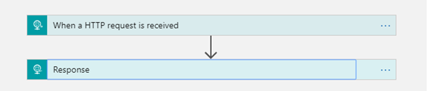

1. Click on  icon displayed on arrow after pointing the cursor to arrow and then proceed further by clicking on **Add an Action.**
1. In the search bar, search for **Text Analytics** and click on **Text Analytics – Detect Sentiments** present in **Action** section.
1. Provide the **Connection Name** of your choice and paste the copied key in **Account Key** fields.
1. Click on **Create** button.
1. Click on **Add dynamic content** button.
1. Click on **Text** field text box and select **feedbackText** and click on **Save** button present on top right corner.
1. Again, click on  icon displayed on arrow in between **Detect Sentiment** and **Response** template and then proceed further by clicking on **Add an Action.**
1. Search for **Azure Function**.
1. Click on **Azure Function** listed under **Connectors**.
1. Select the Function App **FeedbackApp<inject story-id="story://Content-Private/content/dfd/SP-GDA/gdaexpericence5/story_a_azurefunction_with_cosmosdb" key="myResourceGroupName"/>** and click on it.
1. Select above **Azure Function InsertFeedbackData** listed in Actions.
1. In **Request Body** field, add the **JSON** Snippet.
   ```json
    {
        "flightId": ,
        "feedbackText": ,
        "ratingOnEmotion": ,
        "textAnalyticScore":
    }
   ```

   > **Note:** The above JSON is used to insert feedback in Cosmos DB. It is blank as we have to map the respective dynamic contents.

1. Click anywhere in text box after pasting the JSON.
1. **Insert parameters from previous steps** blade below the **Request Body** textbox, will display all the dynamic contents.
1. Then select respective dynamic contents for JSON fields as per mentioned below.

   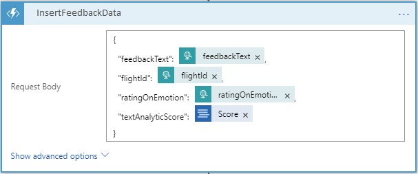

1. Click on **Save** button.
1. For acknowledgement, under **response** blade, in **Body** field, add dynamic field like 
1. Click on **Save** button.
1. Finally, the **Logic App** will look like

   

> _Great Job! You have successfully created_ **Logic App** _with_ **Connector** _._

### Part G -  Connecting Logic App with ContosoAir Application

> _In this part, you will be connecting logic app with ContosoAir Application._

1. Switch to **Azure Portal**.
1. Go to **Resource group** **<inject story-id="story://Content-Private/content/dfd/SP-GDA/gdaexpericence5/story_a_azurefunction_with_cosmosdb" key="myResourceGroupName"/>**.
1. Go to your created Logic App **<inject story-id="story://Content-Private/content/dfd/SP-GDA/gdaexpericence5/story_a_azurefunction_with_cosmosdb" key="logicApp"/>**.
1. Go to **Logic App Designer.**
1. Click on **When a HTTP Request is received.**
1. Copy the **HTTP POST URL.**
1. Switch to **GlobalSettings.cs** file opened by you in **Part D**.
1. Paste the copied **HTTP POST URL** in Step 6 at **Line No. 45** in **GlobalSettings.cs** file.

   **E.g.: -** public const string LogicAppUrl= "**HTTP POST URL**";

   > **Note:** This URL is used to insert the data of feedback in **Cosmos DB**.

### Part H - Launching ContosoAir application

> _Let's see the output of all the above steps through ContosoAir Application by launching the application._

1. Switch to **Visual Studio 2017**.
1. Right click on **ContosoAir.Clients.Core (Portable)** project and then select the **Clean** option. Wait till clean project completes.
1. Now again right click on **ContosoAir.Clients.Core(Portable)** and click on **Build**.
1. It will take some time to **Build** the project.
1. Now navigate to **ContosoAir.Clients.UWP**, then right click and select **Clean.**
1. Now again right click on **ContosoAir.Clients.UWP** and click on **Build**.
1. It will take some time to **Build** it.
   > **NOTE**: In case the build process failed, the **Rebuild** the project by selecting the **Rebuild** option.
1. Now navigate to **ContosoAir.Clients.UWP**, then right click and select **Set as StartUp Project**.
1. After the build is successful, deploy **ContosoAir.Clients.UWP** folder by right clicking the folder and select **deploy.**
   > **Note**: - Deployment process will require some time to deploy resource.

1. Click on **Local Machine**  option given at top to launch the **ContosoAir App.**
1. Click on **Sign in with Microsoft** button. 
1. Login with your credentials.
1. Click on **Hamburger icon** and Select **Contact** option.
 
   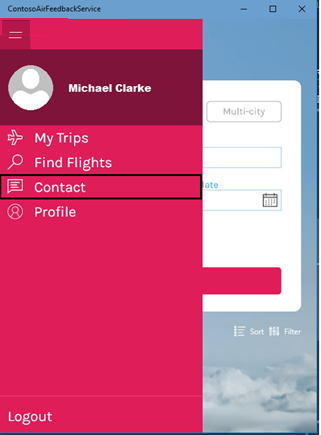

1. Click on **Feedback** link.

   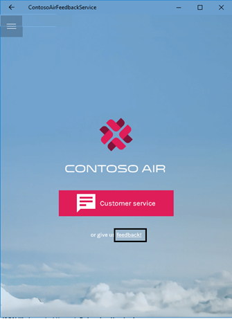

1. The **Feedback** form is displayed.

   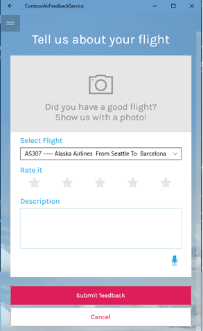

> _Wow awesome! The feedback form will be displayed with dynamic flight ids._

### Part I – Playing around the ContosoAir Application.

> _Let us now play around the ContosoAir application by performing some changes._

1. Wait for the **feedback** form to appear.
1. Click on the **Camera** icon.
1. Capture the image by posing your image within the displayed green box.
1. Respective ratings according to the emotions of the captured image will be populated in **Rate it** field.

   > **Note:** After capturing image, it will take some time to populate ratings.

1. Select the flight for which feedback is provided.
1. Enter the **Description** by manually entering it with the help of the keyboard.
1. Click on **Submit feedback** button.
1. Depending on customer feedback, the message would be displayed on window.
1. If the **customer** is **satisfied** with the service, **Thank You** message would appear.
1. If the customer is **unsatisfied** with the service, message for **special offers** would appear on the screen.

> _But it would have been great if you get ratings based on the speech which would be displayed in description field._
    _And yes! We can achieve that using Bing Speech API._
    _So, let's start with Bing Speech API._
