<page title="Fetching information of delayed flights"/>

## Scenario 1: Fetching information of delayed flights

### Part A - Accessing the Azure portal

   > _We'll start with accessing_ **Azure Portal.** _For creating resources, you need to_ **Sign in** _to_ **Azure Portal.** _The steps to do the same are given below_


1. Click on the link [http://portal.azure.com](launch://launch_azure_portal) to open Azure Portal and maximize the browser window.
1. Sign in with your Azure username and password:
    - **Username: <inject key="AzureAdUserEmail" />**
    - **Password: <inject key="AzureAdUserPassword" />**
   
1. Click on **Sign in** button 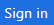.

1. If you see the **Stay signed in?** screen next, select the **Yes** button to continue.

1. You may encounter a popup entitled **Welcome to Microsoft Azure** with options to **Start Tour** and **Maybe Later** – **Choose Maybe Later**. [Ignore the step no. 4 if didn't get the popup message.]

   > _Great! You are now logged in to the Azure Portal._

### Part B - Creating collections/inserting data in Cosmos DB using Data Migration Tool

   > **Cosmos DB Account** named **<inject story-id="story://Content-Private/content/dfd/SP-GDA/gdaexpericence6/story_a_azure_notification_for_gate_change" key="cosmosDBAcc"/>** _is already present in the_ **Resource group** _named_ **<inject story-id="story://Content-Private/content/dfd/SP-GDA/gdaexpericence6/story_a_azure_notification_for_gate_change" key="myResourceGroupName"/>**.
   > _First, Lets start with downloading the source code for ContosoAir app and Payload data._ 

1. To download the source code, launch the **Command Prompt** and run below commands
   ```cmd
   git clone https://github.com/Click2Cloud/gdaexperience7-story-a c:\source\experience7
   ```

    > Now, let's insert some data into Cosmos DB using **Microsoft's** **Data Migration Tool.**
    > For more details about the migration tool, click on the given link: [Data Migration tool.](https://docs.microsoft.com/en-us/azure/cosmos-db/import-data)

1. Launch the **Data Migration Tool** by double clicking on **dtui.exe** file present on **Desktop**.
1. After the tool is launched, click on **Source Information** menu present on the left panel.
1. Select **JSON file(s)** option from **Import from** dropdown.
1. Click on **Add Files** button.
1. Select the JSON file  **BookingCollection.json** present at the location **c:\source\experience7\Payloads\BookingCollection.json** and click **Open** button.
1. Then click **Next button** to redirect to **Target information** menu.
1. Now, switch to **Azure Portal** in which you are already logged in from **Part A**.
1. Navigate to Azure Portal's **Resource Group** option present in the favourites menu on the left side panel and select your created Resource **<inject story-id="story://Content-Private/content/dfd/SP-GDA/gdaexpericence6/story_a_azure_notification_for_gate_change" key="myResourceGroupName"/>** and click on Azure Cosmos DB Account **<inject story-id="story://Content-Private/content/dfd/SP-GDA/gdaexpericence6/story_a_azure_notification_for_gate_change" key="cosmosDBAcc"/>**.
1. Go to **Keys** option under **Azure Cosmos DB account blade** and **copy** the **Primary Connection String.**

   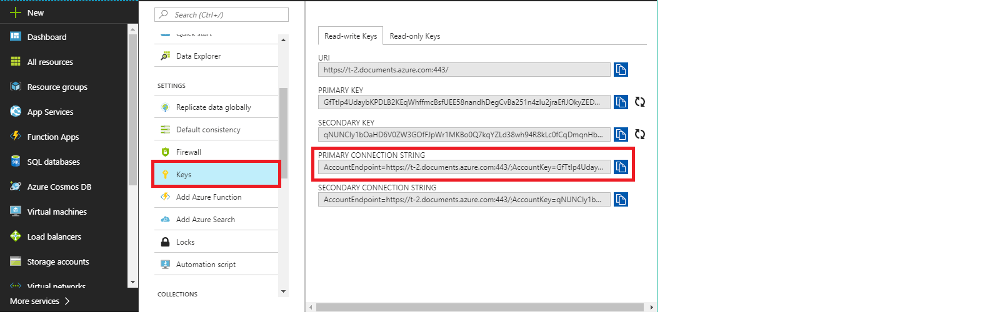

1. Allow access for copying text pop up would be displayed, click on **Allow access** button.

   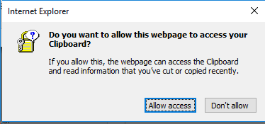
   
1. Switch back to **Data Migration Tool** already launched in step 1.
1. Paste the copied **Primary Connection String** in **Connection String** text box and appended with **Database=<inject story-id="story://Content-Private/content/dfd/SP-GDA/gdaexpericence6/story_a_azure_notification_for_gate_change" key="cosmosDBAcc"/>** at the end of the string in **Target information** option.

    >**For e.g.**
    > "AccountEndpoint=https://t-2.documents.azure.com:443/;AccountKey=your\_primary\_key==;Database=YourCosmosDBAccountNamee".

    > **Note**: Here your database name is " **<inject story-id="story://Content-Private/content/dfd/SP-GDA/gdaexpericence6/story_a_azure_notification_for_gate_change" key="cosmosDBAcc"/>**".

    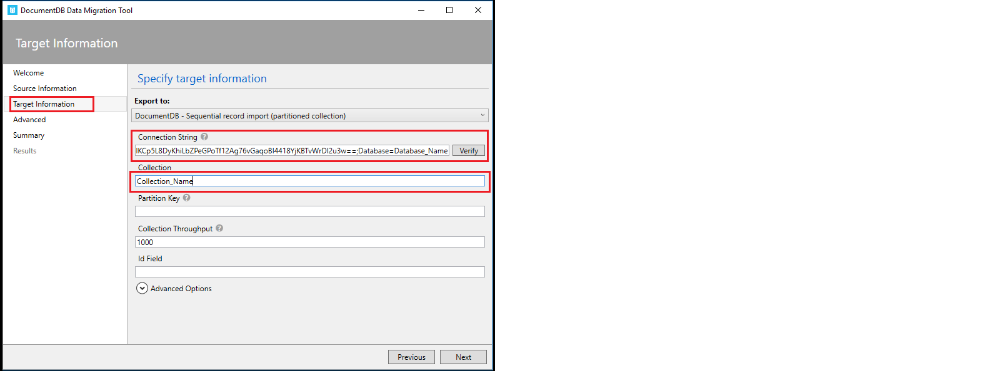

1. Once you are done with above step, click on **Verify** button next to **Connection String** field to verify the connection string.
1. On successful verification of Connection string, success pop-up window will display, then click on **OK** button.
1. On verification failure of connection string, a pop-up window will appear prompting the **failure message**, then click on **Ok** button and again verify the connection string till successful verification.
1. Enter the **Collection Name -> BookingCollection** in **Collection** field.
1. Click on **Next** button. Ignore the **Advanced configuration** window and click **Next** button. Then, click on **Import** button to import the data present in Json file into **Cosmos DB collection.**
1. This will start the data uploading process. Wait for some time to complete the process and once the process is completed successfully close the **migration tool**.
1. Now, switch to **Azure Portal** in which you are already logged in from **Part A**.
1. Click on Azure Portal's **Resource Group** option present in the favourites blade in the left side panel and click on **<inject story-id="story://Content-Private/content/dfd/SP-GDA/gdaexpericence6/story_a_azure_notification_for_gate_change" key="myResourceGroupName"/>**
1. Click on **<inject story-id="story://Content-Private/content/dfd/SP-GDA/gdaexpericence6/story_a_azure_notification_for_gate_change" key="cosmosDBAcc"/>** which is your **Cosmos DB Account.**
1. Then click on **Data Explorer** to view the created **collections** which will be fetched from the **Json file** imported through Data migration tool.
1. Then click on created collection **BookingCollection** to expand. Then, click on **Documents** option under the collection to view the data imported through **Migration tool** into **Cosmos DB.**

    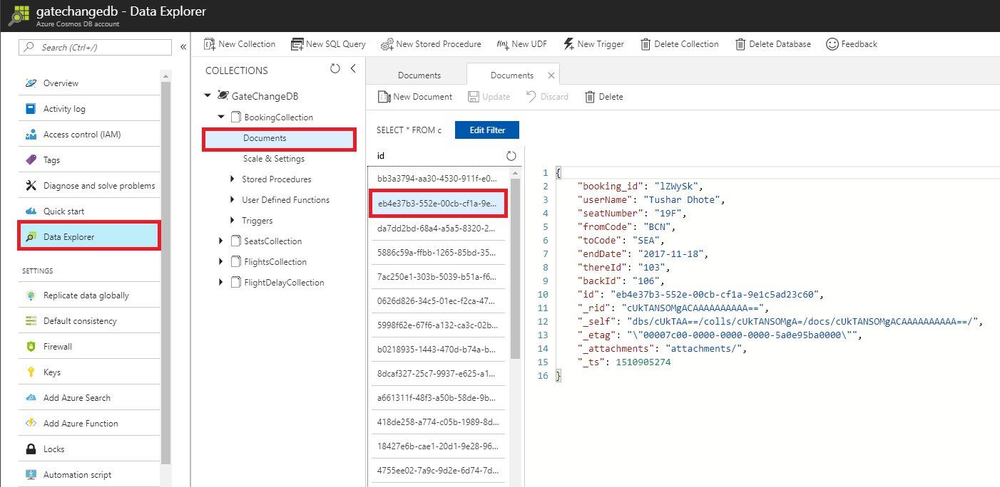

1. Follow the same scenario from step2 of Part B for inserting data from
       
   - FlightsCollection.js
   - SeatsCollection.js
   - FlightDelayCollection.js

    > **Note:** Please enter **collection name** as JSON file name without ".js" extension. 

    > _Nice work! You have successfully added_ **collections** _in your_ **Cosmos DB Account**_. Next, we will see how we can create the_ **Azure Functions**.

### Part C - Creating Azure Functions.

   > _Let's start with creation of_ **Azure Function App** _to create_ **function** _for fetching flight details._

1. Go to **Azure portal,** click on  icon and search for **Function App** in the search bar and press **enter** button.
 
   

1. Click on **Function App** and then click **Create** button present at the bottom of page.
1. Now, enter app name **GateChangeFuncApp-<inject story-id="story://Content-Private/content/dfd/SP-GDA/gdaexpericence6/story_a_azure_notification_for_gate_change" key="myResourceGroupName"/>** in the **App name** text field.
1. Select subscription from **Subscription** dropdown.
1. Select **Use existing** radio button from **Resource Group** and select **<inject story-id="story://Content-Private/content/dfd/SP-GDA/gdaexpericence6/story_a_azure_notification_for_gate_change" key="myResourceGroupName"/>** from the dropdown.
1. Select  **"Consumption Plan"** option from **Hosting Plan** dropdown list.
1. Select location **"West Europe"** from the dropdown.
1. Select **Create New** radio button, **Storage** name will be automatically generated on selecting **Create new** radio button.
1. Click on **Create** button to create Azure Function.
1. To view the deployment process, click **Notification Icon**  **.**

   >**Note**: It takes some time to complete the deployment of the resources.
   
1. Click on **Go to resource group** button to view the successfully created resource group.
1. Click on 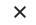 to close the **notification** window.

   >**Note**: Or, you can follow below two steps

1. Click on **Resource Groups** option present in the favourites menu on the left side panel and then click on **<inject story-id="story://Content-Private/content/dfd/SP-GDA/gdaexpericence6/story_a_azure_notification_for_gate_change" key="myResourceGroupName"/>**.
1. Then click on **GateChangeFuncApp-<inject story-id="story://Content-Private/content/dfd/SP-GDA/gdaexpericence6/story_a_azure_notification_for_gate_change" key="myResourceGroupName"/>** which is your **Function App** name.

   > _Here you go! let's create Function to retrieve the details of departing and returning flights._

1. Click on **+ sign**  besides **Functions**.
1. Click on link **Custom function** present at the bottom of the page.

   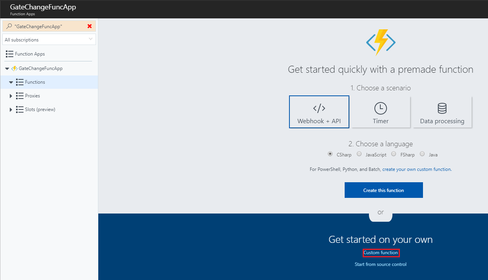

1. Click on **HttpTrigger – c#** template to select it. And name the function as **GetFlightsData** in **Name your function** textbox and click **Create** button.
1. A function with sample default code would get created. Now, replace the **sample default code** with the code snippet given below:

   ```c#
    using System.Net;

    public static HttpResponseMessage Run(HttpRequestMessage req, TraceWriter log, IEnumerable<dynamic> FlightsCollection)
    {
        return req.CreateResponse(HttpStatusCode.OK, FlightsCollection);
    }
 
   ```

    >**Note:** In above code snippet, **IEnumerable < dynamic > FlightsCollection** is a parameter to fetch the list of flights collection type data from **Cosmos DB**. This method returns the result fetched from **Cosmos DB** and **HttpStatusCode** using **CreateResponse** method with the help of **HttpRequestMessagereq**.

1. Click **Save** button. Now, click on **Integrate** option given in the **Function Apps** blade.
1. Select **Selected methods** from **Allowed HTTP methods** dropdown.
1. In **Triggers blade**, paste the below snippet in **Route template** field.

    ```
    flights/{thereId}/{backId}
    ```
1. In **Selected HTTP methods** check **GET** and uncheck all other options.
1. Click on **Save** button.
1. Go to **Inputs,** click on **+New Input**, select **Azure Cosmos DB**  and then click on **Select** button.
1. Enter **Document parameter name** as **FlightsCollection**, **Database name** as **<inject story-id="story://Content-Private/content/dfd/SP-GDA/gdaexpericence6/story_a_azure_notification_for_gate_change" key="cosmosDBAcc"/>** and **Collection name** as **FlightsCollection** in respective textboxes.
1. Copy the **SQL query** given below and paste it in **SQL Query (optional**) text box.
 
    ```SQL
    SELECT * FROM FlightsCollection F WHERE F.id IN ({thereId}, {backId})
    ```

    >**Note:** Above **SQL query** is responsible to get flights details from **FlightsCollection** in **Cosmos DB** based on flight id.

1. To enter **Cosmos DB account connection,** click on **new** link given beside **Cosmos DB account connection** textbox. 
   
    

1. You will be redirected to **Document DB Account blade**, select the **Document DB Account** named as **<inject story-id="story://Content-Private/content/dfd/SP-GDA/gdaexpericence6/story_a_azure_notification_for_gate_change" key="cosmosDBAcc"/>**.
1. Then click **Save** button and close the window by clicking on **close** button which is present at top most right corner.
1. To verify whether your Azure Function is created successfully, click on **GetFlightsData** function and navigate to **Test** blade displayed on right hand corner of the page.
   
    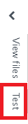

1. Select **GET** from **HTTP method** and enter 1 and 3 in **backId**, **thereId** textboxes respectively and click on **Run** button.
1. Check the output in **Output** textbox and check for status code **Status: 200 OK**.

    

1. If status code is other than 200, it means that your function is not created successfully. Then, again go to **Functions** and delete the created function and follow above mentioned steps from **15** through **32**.

    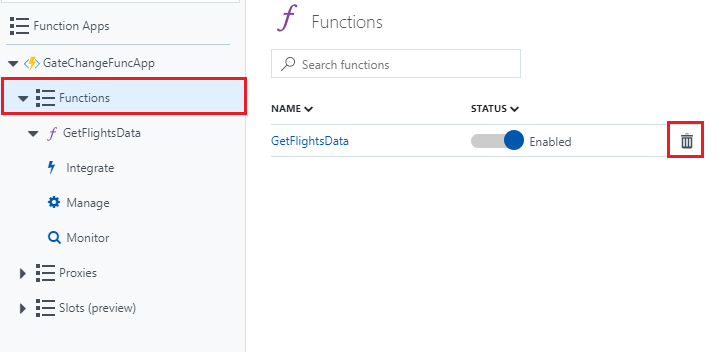

1. Click on **GetFlightsData** function and click on **</> Get function URL** button. 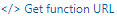
1. Copy the URL displayed by clicking on Copy button and paste it in a notepad file.

    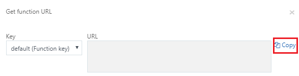

1. Allow access for copying text pop up would be displayed, click on **Allow access** button.

   

   > _Here you go! You have successfully created_ **Azure Function** _to retrieve flight details from_ **Cosmos DB** _._

### Part D – Creating Notification Hub service

   > _Here you go! Let's start with creating Notification hub._

1. Switch to **Azure Portal** as launched in **Part A of Scenario 1**.
1. Go to **Azure portal,** click on  icon and search for **Notification Hub** in the search bar in **Azure Marketplace**.
1. Click on **Create** button present at the bottom of the page.
1. Enter name **GateChangeNotificationHub** in the **Notification Hub** name text field.
1. Add a name space **GateChangeNotificationNameSpace** in **Create a new namespace** text box.
1. Select **Use existing** radio button from **Resource Group** and select **<inject story-id="story://Content-Private/content/dfd/SP-GDA/gdaexpericence6/story_a_azure_notification_for_gate_change" key="myResourceGroupName"/>** Resource group from the dropdown.
1. Click on **Create** button to create Notification Hub.
1. To view the deployment process, click on **Notification Icon** .
   > **NOTE:** It takes some time to complete the deployment process of the resources.
1. Click on  to close the notification window once deployment process is complete.
1. Click on Azure Portal's **Resource groups** option present in the favourites blade in the left side panel and click on **<inject story-id="story://Content-Private/content/dfd/SP-GDA/gdaexpericence6/story_a_azure_notification_for_gate_change" key="myResourceGroupName"/>**
1. Select **GateChangeNotificationHub** resource created by you and select **Notification Services** 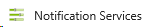 option present under **Notification Hub** blade.

1. Click on **Windows (WNS)** option and copy the given **Package SID** and **Security Key** in their respective text boxes.
   - **Package SID:**
   ```keys
   ms-app://s-1-15-2-965052657-715354177-1036002863-386522108-950863088-3653357836-1182285094
   ```    
   - **Security Key:**
   ```keys
   k+/vCn6PwMnIlOMz8AG57zv7Yz/vBGiw
   ```  
   

1. Click on **Save** button.
1. Click on Azure Portal's **Resource groups** option present in the favourites blade in the left side panel and click on **<inject story-id="story://Content-Private/content/dfd/SP-GDA/gdaexpericence6/story_a_azure_notification_for_gate_change" key="myResourceGroupName"/>**.
1. Select **GateChangeNotificationHub** resource created by you and select **Access Policies** [](img/Access_Policies.png) option present under **Notification Hub** blade.
1. Now go to **Access Policies** option present under **Notification Hub** blade.
1. Copy the link present under option **DefaultFullSharedAccessSignature** with permission as **Listen, Manage and Send.**

   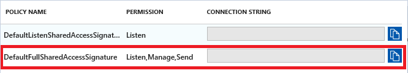

1. Double click on the **ContosoAir.Website_and_Services.sln** solution file present on path **c:\source\experience7** it will load the project code into **Visual Studio 2017**. This may take some time.
1. If prompted to sign in to **Visual Studio**, click **Sign in**.
1. In the **Email or phone** field, type **<inject key="AzureAdUserEmail"/>**.
1. In the **Password** field, type **<inject key="AzureAdUserPassword"/>**.
1. Click **Sign in**.
1. If prompted with the Choose your **color theme screen**, select a color theme.
1. Go to **Solution Explorer** window, open **config.js** available in **ContosoAir.Services** Project.
 
   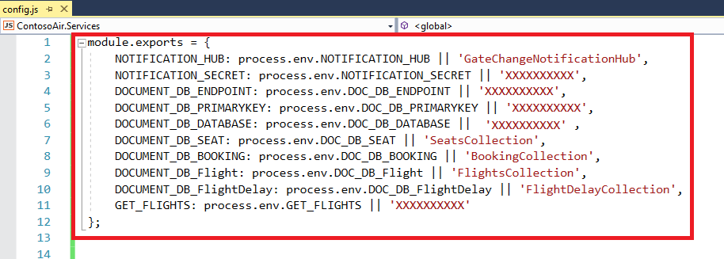

1. Paste the copied link in line number 3 in the place of **XXXXXXXXXX**.

          NOTIFICATION_SECRET: process.env.NOTIFICATION_SECRET || XXXXXXXXXX
 
1. Go to your created **Azure Cosmos DB Account** resource.
1. Click on **Keys** section displayed in left panel.
1. In Read-write Keys section, copy **URI** and **Primary Key** fields.
  
   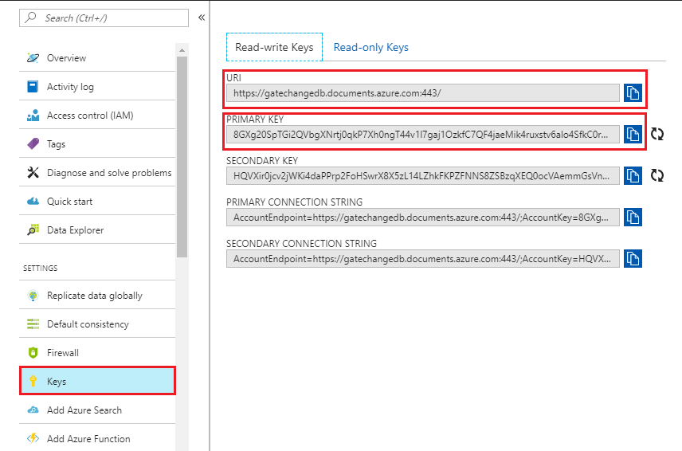

1. Paste it in a notepad file.  
1. Paste the copied **URI** and **Primary Key** from notepad file to below mentioned fields respectively in place of **XXXXXXXXXX**. Paste **Database Name** **<inject story-id="story://Content-Private/content/dfd/SP-GDA/gdaexpericence6/story_a_azure_notification_for_gate_change" key="cosmosDBAcc"/>** in **DOCUMENT_DB_DATABASE** parameter in place of **XXXXXXXXXX**.

          DOCUMENT_DB_ENDPOINT: process.env.DOC_DB_ENDPOINT || 'XXXXXXXXXX'

          DOCUMENT_DB_PRIMARYKEY: process.env.DOC_DB_PRIMARYKEY || 'XXXXXXXXXX'

          DOCUMENT_DB_DATABASE: process.env.DOC_DB_DATABASE || 'XXXXXXXXXX'

1. Paste the copied **Azure Function URL** from notepad file in **Step no 36 - Part C** to below mentioned field in place of **XXXXXXXXXX**.

          GET_FLIGHTS: process.env.GET_FLIGHTS || 'XXXXXXXXXX'

1. Save the changes using **ctrl+s**.
1. Now, switch to **Azure Portal** as launched in **Part A of Scenario 1.**
1. Go to **Access Policies** option present under **Notification Hub** blade.
1. Copy the link present under option **DefaultListenSharedAccessSignature** with permission **Listen** and paste it into notepad file.

   

1. Now, double click on the **ContosoAir.Xamarin.UWP.sln** solution file present on path **c:\source\experience7** it will launch **Visual Studio 2017**.
1. Go to **Solution Explorer** window, open the file named **GlobalSettings.cs** from **ContosoAir.Clients.Core** ( **Portable** ) project.
1. Paste the copied Connection String from step number **35** into parameter **NotificationHubConnectionString** present at line number **32**, provide **Notification Hub Name** as **GateChangeNotificationHub** which is present at line number **33** and press **Ctrl+S** button to save the changes.

   ```
   public const string NotificationHubConnectionString = "XXXXXXXXXX";  
   public const string NotificationHubName = "GateChangeNotificationHub";
   ```
   > **For Ex:** public const string NotificationHubConnectionString = "Endpoint=sb://GateChangeNotificationHubnamespace.servicebus.windows.net/;SharedAccessKeyName=DefaultFullSharedAccessSignature;SharedAccessKey=CJV0DotjQHPcjBXSfIb1eE2BQbHbhwk9P2Qj5a43kQ8=";

   > _Congrats! You have just configured the notification service._

1. Go to **Solution Explorer** window.
1. Right click on **Contoair.client.Core (portable)** project and click on **Clean** option to clean the project. Then, right click on **Contoair.client.UWP (Universal windows)** project and click on **Clean** option to clean the project.
1. On successful completion of cleaning process, now right click on **Contoair.client.Core (portable)** project and click **Build** option to build the project.
1. On successful completion of cleaning process, now right click on **Contoair.client.UWP (Universal windows)** project and click **Build** option to build the project.
1. Right click on **Contoair.client.UWP (Universal windows)** project, click on **Set as StartUp Project**.
1. Again right click on **Contoair.client.UWP (Universal windows)** project and click on **Deploy** option. 
1. Click on **Local Machine**  option appearing on the Menu bar to launch the **ContosoAir App.**
   > Nice Work! Now you can receive notification of gate change.
1. Open **Command prompt** by double clicking on **Command Prompt** icon  present on the desktop.
1. Go to **Command Prompt** and go to path given below

   ```cmd
   cd C:\source\experience7\src\ContosoAir.Services
   ```
1. Then execute the **commands** given below one by one.
   ```cmd
   npm install
   ```
    > **Note:** To install all the required packages.

   ```cmd   
    npm start
   ```
    > **Note:** To start services.

    

1. Once the above process is completed. Then go to path given below in new **Command prompt** instance**.**

    ```cmd
     cd C:\source\experience7\src\ContosoAir.Website
    ```
1. Then execute the **commands** given below one by one.

   ```cmd
   npm install -g @angular/cli
   npm install
   set PATH=%PATH%;%AppData%\npm\
   ```
    > **Note:** To install all the required packages.
    ```cmd
     ng serve
    ```

    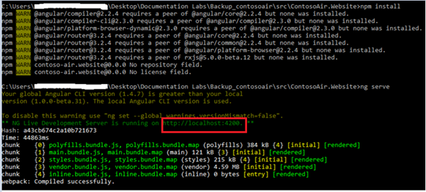

1. Copy the **localhost URL** from the **Command Prompt** and paste it in browser, you will be redirected to **ContosoAir Website.**

    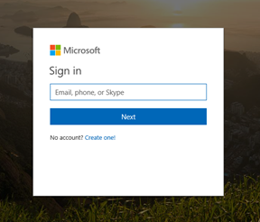

1. You will have to login first using your **Microsoft Account Login** credentials.

    > **Note:** You should have Microsoft Account Credentials to Login and get access to **ContosoAir** website.

    

1. Once you get logged in, you will be redirected to **ContosoAir Website.** Enter **Departure date** and **Return date** in **yyyy-mm-dd** format and click **Find Flights** button.
1. You will now be redirected to **Available flights** page. Select flights and click on **Next** button displayed at end of the page. 

    

1. Select seat of your choice and click on **Next** button displayed at end of the page. 

    

1. You will be viewing all your flight details in **Flight Summary** page.
1. Click on **Purchase** button displayed at end of the page.  

    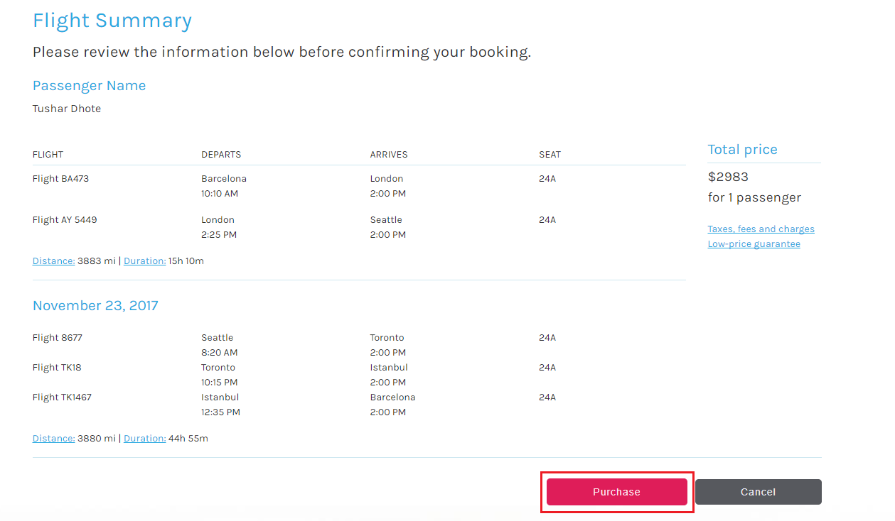

1. Timely notifications regarding the gate change information would pop up.

    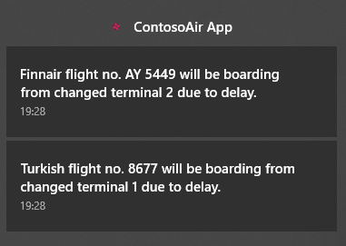
