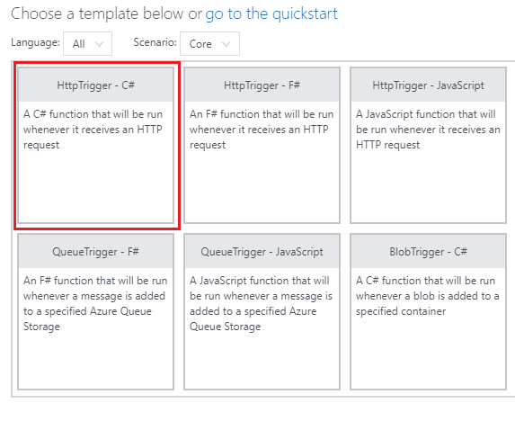

<page title="Displaying Gate Change detailed information in ContosoAir App"/>
   

## Scenario 2 – Displaying Gate Change detailed information in ContosoAir App


### Part A - Creating Azure Functions.

1. You can go to **Resource Groups** option present in the favourites menu on the left side panel and click on it to check the status of the created **Function App**.
1. Then click on **GateChangeFuncApp** which is your **Function App** name.

   > _Here you go! let's create Function to retrieve the details of departing and returning flights._

1. Click on **+ sign**besides **Functions**.

   

1. Click on **HttpTrigger – c#** template to select it. And name the function as **GetFightsDelayData** in **Name your function** textbox and click **Create** button.
1. A function with sample default code would get created. Now, replace the **sample default code** with the code snippet given below:

    ```c#
    using System.Net;

    public static HttpResponseMessage Run(HttpRequestMessage req, TraceWriter log, IEnumerable<dynamic> FlightDelayCollection)
    {
        return req.CreateResponse(HttpStatusCode.OK, FlightDelayCollection);
    }
 
    ```

   >**Note:** In above code snippet, **IEnumerable < dynamic > FlightDelayCollection** is a parameter to fetch the list of delayed flights collection type data from **Cosmos DB**. This method returns the result fetched from **Cosmos DB** and **HttpStatusCode** using **CreateResponse** method with the help of **HttpRequestMessagereq**.

1. Click **Save** button. Now, click on **Integrate** option given in the **Function Apps** blade.
1. Select **Selected methods** from **Allowed HTTP methods** dropdown.
1. In **Triggers blade**, paste the below snippet in **Route template** field.
   ```
   flightdelay/{username}
   ```
1. In **Selected HTTP methods** check **GET** and uncheck all other options.
1. Click on **Save** button.
1. Go to **Inputs,** click on **+New Input**, select **Azure Cosmos DB** and then click on **Select** button.
1. Enter **Document parameter name** as **FlightDelayCollection**, **Database name** as **<inject story-id="story://Content-Private/content/dfd/SP-GDA/gdaexpericence6/story_a_azure_notification_for_gate_change" key="cosmosDBAcc"/>** and **Collection name** as **FlightDelayCollection** in respective textboxes.
1. Copy the **SQL query** given below and paste it in **SQL Query (optional**) text box.
 
   ```SQL
   SELECT TOP 1 * FROM FlightDelayCollection F WHERE F.userName = {username}
   ```

   >**Note:** Above **SQL query** is responsible to get delayed flights details from **FlightDelayCollection** in **Cosmos DB** based on userName.

1. To enter **Cosmos DB account connection,** click on **new** link given beside **Cosmos DB account connection** textbox. 
   
   
1. You will be redirected to **Document DB Account blade**, select the **Document DB Account** named as **<inject story-id="story://Content-Private/content/dfd/SP-GDA/gdaexpericence6/story_a_azure_notification_for_gate_change" key="cosmosDBAcc"/>**.
1. Then click **Save** button and close the window by clicking on **cancel** button.

1. Click on **GetFightsDelayData** function and click on **</> Get function URL** button. 
1. Copy the URL displayed by clicking on Copy button and paste it in a notepad file.

   

1. Allow access for copying text pop up would be displayed, click on **Allow access** button.

   

   > _Here you go! You have successfully created_ **Azure Function** _to retrieve flight details from_ **Cosmos DB** _._

### Part B - Connecting Azure Function with ContosoAir Application.

   > _In this part, you will be connecting_ **Azure Function** _with_ **ContosoAir Application.**

1. Go to **Visual Studio** where **ContosoAir.Xamarin.UWP.sln** project is opened. Click on Stop Debugging icon  present on Top Ribbon.
1. Now, go to **Solution Explorer** and expand **Contoair.client.Core (portable)** project.
1. Double click on **GlobalSettings.cs File** to open.

   

1. Paste the copied URL at **Line No. 45** in **GlobalSettings.cs** file.

   **Ex:** - public const string FlightDelayInfoUrl= **Get function URL;**

   > Note: This URL is used to retrieve the data of ground staff in ContosoAir Application.

1. Now press **ctrl+S** button from the keyboard to save the changes in the code.
1. Go to **Dataservices** folder and click on it to expand it then, click on **GateChange** and double click on **IGateChangeService.cs** file.
1. Paste the given code snippet below in line number 8.

   ```c#
    Task<IEnumerable<FlightDelay>> GetDelayedFlightsAsync(string UserName); 
   ```

   >**Note**: Here we declare **GetDelayedFlightsAsync(string UserName)** method in **IGateChangeService.cs** interface so that we can implement it into **GateChangeService.cs** class.

1. Go to **Dataservices** folder and click on it to expand it then, click on **GateChange** and double click on **GateChangeService.cs** file.
1. Paste the below given Code Snippet after line number 56.

   ```c#
      public async Task<IEnumerable<FlightDelay>> GetDelayedFlightsAsync(string UserName)
      {
          FlightDelayInfoUrl = FlightDelayInfoUrl.Replace("{username}", UserName);

          HttpClient httpClient = CreateHttpClient();

          HttpResponseMessage response = await httpClient.GetAsync(FlightDelayInfoUrl);

          await HandleResponse(response);

          string responseData = await response.Content.ReadAsStringAsync();

          return await Task.Run(() => JsonConvert.DeserializeObject<IEnumerable<FlightDelay>>(responseData, _serializerSettings));
      }
   ```

   This Function will retrieve the delayed flight information from CosmosDB using Azure Function.

    > **Note**:
    >- The **public async Task<IEnumerable<FlightDelay>> GetDelayedFlightsAsync(string UserName)** method is responsible for retrieving delayed flight information. It accepts **UserName (string UserName)** as an input parameter and return FlightDelay type data.
    >- Here we will call Azure function using **httpClient.GetAsync()** method which accepts one parameter i.e. -**Azure Function url(FlightDelayInfoUrl)**.
    >- After getting response in  **responseData** variable with the help of **ReadAsStringAsync()** method, we will return response to calling method.

1. Now go to **View Model** folder and click on it to expand and double click on **GateChangeViewModel.cs** file.
1. Replace the method named **InitializeAsync(object navigationData)** , with below code snippet after line no. 43.

   ```c#
    public override async Task InitializeAsync(object navigationData)
    {
        try
        {
            FlightDelayDetails flight_delay_details = new FlightDelayDetails();
            flight_delay_details.LodingIcon = true;
            FlightDelayDetails = flight_delay_details;

            var profile = await _authenticationService.GetProfileAsync();

            if (profile != null)
            {
                Profile = profile;
                var _gateChangeData = await _gateChangeService.GetDelayedFlightsAsync(Profile.Name);

                if (_gateChangeData != null)
                {
                    int i = 0;
                    foreach (FlightDelay FD in _gateChangeData)
                    {
                        foreach (Flights F in FD.Flights)
                        {
                            if (i == 0)
                            {
                                foreach (Segments S in F.Segments)
                                {
                                    if (S.IsDelay == true)
                                    {
                                        flightDelayDetails.DepartingFlightId = S.Flight;
                                        flightDelayDetails.DepartingFlightName = "Departing Flight " + S.FromCode + " - " + S.ToCode + " (" + S.Flight + ")";
                                        flightDelayDetails.DepartingFlightSorce = S.FromCity + " (" + S.FromCode + ")";
                                        flightDelayDetails.DepartingFlightDest = S.ToCity + " (" + S.ToCode + ")";

                                        flightDelayDetails.DepartingFlightDTimeBD = FormatDateTime(S.DepartTime);
                                        flightDelayDetails.DepartingFlightDTimeAD = FormatDateTime(S.AfterDelay);
                                        flightDelayDetails.DepartingFlightATime = FormatDateTime(S.ArrivalTime);
                                        flightDelayDetails.DepartingFlightChangedGate = S.Terminal;
                                        flightDelayDetails.DepartingFlightDelayBy = S.DelayBy;
                                        flightDelayDetails.DepartingFlightMsg = "This notification is to inform you that your terminal for boarding flight " + S.FromCode + " - " + S.ToCode + " (" + S.Flight + ")" + " has been changed to " + S.Terminal + ". Sorry for the inconvenience.";
                                        i++;
                                    }
                                }
                            }
                            else
                            {
                                foreach (Segments S in F.Segments)
                                {
                                    if (S.IsDelay == true)
                                    {
                                        flightDelayDetails.ReturnFlightId = S.Flight;
                                        flightDelayDetails.ReturnFlightName = "Return Flight " + S.FromCode + " - " + S.ToCode + " (" + S.Flight + ")";
                                        flightDelayDetails.ReturnFlightSorce = S.FromCity + " (" + S.FromCode + ")";
                                        flightDelayDetails.ReturnFlightDest = S.ToCity + " (" + S.ToCode + ")";
                                        flightDelayDetails.ReturnFlightDTimeBD = FormatDateTime(S.DepartTime);
                                        flightDelayDetails.ReturnFlightDTimeAD = FormatDateTime(S.AfterDelay);
                                        flightDelayDetails.ReturnFlightATime = FormatDateTime(S.ArrivalTime);
                                        flightDelayDetails.ReturnFlightChangedGate = S.Terminal;
                                        flightDelayDetails.ReturnFlightDelayBy = S.DelayBy;
                                        flightDelayDetails.ReturnFlightMsg = "This notification is to inform you that your terminal for boarding flight " + S.FromCode + " - " + S.ToCode + " (" + S.Flight + ")" + " has been changed to " + S.Terminal + ". Sorry for the inconvenience.";
                                    }
                                }
                            }
                        }

                    }
                    flightDelayDetails.LodingIcon = false;
                    FlightDelayDetails = flightDelayDetails;
                }
            }


               
        }
        catch (Exception ex)
        {
            System.Diagnostics.Debug.WriteLine($"Error loading solo service data: {ex}");
        }
    }
   ```

This function will display the information of source staff serving the Flying Solo Service.

   > **Note**: Here we are retrieving delayed flight information and accordingly set **flightDelayDetails** class properties, like **DepartingFlightName**, **DepartingFlightSorce**, **DepartingFlightDest**, **DepartingFlightChangedGate**, **ReturnFlightName**, **ReturnFlightSorce**, **ReturnFlightDest** etc. to display it on UI of UWP App.


### Part C - Launching ContosoAir App

   > _Let's see the output of all the above steps through_ **ContosoAir Application** _by launching the application._

> **Note**: Login with same email id used while log in to ContosoAir Website.

1. Go to **Visual Studio 2017** IDE, **Solution Explorer window** and expand **Contoair.client.Core (portable)** project.
1. Right click on **Contoair.client.Core (portable)** project and click on **Clean** option to clean the project. Then, right click on **Contoair.client.UWP (Universal windows)** project and click on **Clean** option to clean the project.
1. On successful completion of cleaning process, now right click on **Contoair.client.Core (portable)** project and click **Build** option to build the project.

   > **Note:** It will take some time to build the project.

1. Click on **Local Machine**  option given at top to launch the **ContosoAir App.**
1. Here you will get details of delayed flights.

   

1. Click on **Hamburger icon** and Select **Gate Change Info** option.

   

   > _Wow awesome! The data of delayed flights with changed terminal is retrieved using azure function._
